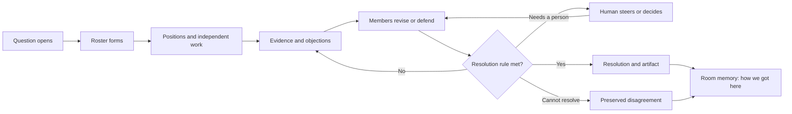

# Roster: the collective-judgment workspace

Status: implemented refactor baseline  
Product name: Roster  
Release boundary: breaking v2

## Executive decision

Do not copy Buzz's product surface or bee metaphor.

Buzz's clearest achievement is co-presence: people, named agents, repositories, and work visibly share a room. Roster should match that social legibility while owning a different outcome:

> Buzz creates co-presence. Roster creates convergence.

The product should feel like a live collective mind, not a task runner. People and agents should visibly propose, challenge, investigate, revise, and resolve. Tasks remain important, but they move behind the conversation as implementation detail.

Replay and provability should not disappear. They should become the invisible structure that makes a conclusion trustworthy:

> The surface feels live. Underneath, every decision is exact.

The three product layers are:

1. **Frontstage — the room:** named participants, conversation, presence, handoffs, steering, and visible disagreement.
2. **Shared judgment — the resolution:** the current motion, positions, evidence, common ground, open objections, and the outcome.
3. **Trust layer — how we got here:** exact replay, receipts, runtime epochs, conflicts, and certification, revealed when useful.

The first release should truthfully be positioned as one person working with persistent agent teams. The current production architecture is single-user and does not yet support application-user RBAC or tenant isolation. Multi-human rooms are a later product milestone, not a launch claim.

## The problem this refactor corrects

The foundations supported a richer product than the old interface communicated.

The previous presentation taught users to see a job system:

- The README opens with model-driven, bounded, and replayable orchestration, then introduces tasks, limits, receipts, runtimes, and reconstruction before the lived experience.
- Global navigation puts operational surfaces before rooms.
- The UI system requires a full replay control above the work on every primary page.
- Several examples label a dashboard or activity ledger as `Messages`; the social shell changes the frame without changing the underlying interaction.
- The generic orchestration board foregrounds agents, active tasks, tokens, the task frontier, composition, and receipt types.
- Example participants are often aggregate roles such as Explorers or Critics rather than durable named nodes.
- Coding has a genuine conversation model, but the other domains have not inherited it.

That created a specific credibility gap:

> The product says "room," but the dominant object is still a run.

The repository already states the better architectural principle: receipts are the internal ledger, not the product boundary. This plan makes the interface conform to that principle.

## What to learn from Buzz

Buzz's public story is emotionally simple: people and agents build together in the same persistent social place. Named agents have presence, use mentions, divide work conversationally, and return results to the room. The product shows meaningful activity and hides operational noise behind progressive disclosure.

Roster should borrow:

- the room as the default scene;
- recognizable, named agent participants;
- visible agent-to-agent communication and delegation;
- short, legible conversational turns;
- artifacts, evidence, reviews, and code changes embedded in context;
- presence, attention, and continuity;
- product screenshots that explain themselves without architecture narration;
- a public narrative about a human outcome, not infrastructure.

Roster should not borrow:

- bee or hive branding;
- a Slack clone as the product boundary;
- a race to add DMs, huddles, culture features, Git hosting, and universal search;
- conversational activity as a substitute for accepted state;
- social agreement as a substitute for an explicit resolution rule.

## The differentiated foundation

Buzz should be described fairly. It already has persistent signed identity, signed event history, agent delegation, audit features, shared rooms, memory, Git integration, and cost telemetry. The defensible distinction is not that Buzz lacks those categories; it is the semantics and authority of Roster's coordination model.

| Buzz's public model | Roster's advantage |
| --- | --- |
| Persistent signed participant identity | Durable `WorkspaceNode` identity separated from runtime, process, session, sandbox, lease, model, and worker |
| Signed event history and selected tamper-evident audit | Ordered control receipts that reconstruct orchestration state and support deterministic replay |
| Prompt- and mention-led delegation | Scheduler-owned tasks, leases, bounded expansion, retries, runtime epochs, budgets, and certification |
| Shared conversational room and canvases | Typed, bounded, multi-writer shared workspace entries with explicit conflict semantics |
| Visible agent progress | Provider-neutral execution envelopes plus authoritative artifact acceptance |
| Social agreement in a shared room | Typed proposals, responses, endorsements, objections, evidence, human resolution, and preserved dissent |
| Agent runtime sessions | Logical members that survive runtime rebinding |
| Usage and cost telemetry | Roster-owned enforceable budget boundaries |

Buzz's agent design explicitly favors isolated sessions with no runtime coupling or shared state. Roster can turn its stronger shared judgment and control model into the user-visible product without leading with its implementation.

## Positioning

### Category

Use **collective-judgment workspace** as the internal category definition.

The product is not primarily:

- a multi-agent framework;
- an agent chat application;
- a task dashboard;
- a replay viewer;
- a formal proof tool.

It is a place where a person and agent teams can form around a question, do independent work, challenge one another, and reach an inspectable resolution.

### Working copy

Until real multi-human support exists:

> **Where you and agent teams reason together.**

Hero:

> **Think together. Disagree clearly. Converge with confidence.**

Subhead:

> Open a room around a question. Roster assembles the right agents, keeps evidence and objections visible, and turns the conversation into a decision.

Trust line:

> **Every conclusion keeps its why.**

After multi-human identity, authorization, and tenancy ship, the category line can expand to:

> **Where people and agents reach decisions together.**

### Brand decision

**Roster** is the product, framework, package, CLI, and shared vocabulary. A
roster is both the durable group in a room and the framework that connects its
members. Mathematical theorem terminology remains scoped to the proof example;
it is not a product brand.

## Product language

The vocabulary should describe collaboration before machinery.

| User-facing concept | Meaning |
| --- | --- |
| Room | Persistent place around a question, project, or artifact |
| Member | A human or durable agent node in a room |
| Question | What the room is trying to decide or produce |
| Roster | The dynamic group assembled for the question |
| Contribution | A proposal, finding, evidence item, critique, or artifact |
| Motion | The current proposed answer, plan, or artifact frontier |
| Position | Support, object, abstain, or counter |
| Common ground | Claims or constraints the room currently accepts |
| Open objection | A specific unresolved challenge to the motion |
| Evidence gap | A claim that still needs support |
| Resolution rule | How this room is allowed to finish |
| Resolution | The accepted outcome, or an explicitly preserved unresolved outcome |
| Room memory | The human-readable history of how the resolution emerged |
| Work | Assignments, dependencies, runtime state, budgets, and artifacts |

Keep `task`, `lease`, `receipt`, `frontier`, `runtime epoch`, and adapter names inside Work, Inspect, or developer surfaces.

Avoid a percentage-based "consensus meter." It implies mathematical confidence that the system does not possess and rewards performative agreement. Use categorical state:

> **Exploring → Contested → Aligning → Resolved**

Always show the exact open objections and evidence gaps beside the state.

Not every room must reach unanimity. Its resolution rule may require:

- human approval;
- verifier certification;
- unanimous support;
- a quorum;
- selection among competing artifacts;
- completion with preserved minority notes;
- an explicit unresolved outcome.

## The target room experience

The room must answer four questions within five seconds:

1. What are we trying to decide?
2. Who is here, and what are they doing?
3. Where do they agree or disagree?
4. How can I steer them?

### Default layout

**Header**

- room name and question;
- state: Exploring, Contested, Aligning, or Resolved;
- small participant stack with actual node identities;
- one attention state such as `Needs you`, `2 open objections`, or `Resolved`;
- a quiet `How we got here` control.

**Conversation**

- durable, authored messages from people and named agent nodes;
- first-person, concise summaries that faithfully project typed entries;
- visible mentions, replies, handoffs, proposals, challenges, revisions, and decisions;
- inline evidence, artifact, patch, and review cards;
- collapsed summaries for repetitive operational activity;
- a composer that stays available while work is active.

**Current understanding**

- the current motion;
- common ground;
- participant positions;
- open objections;
- evidence gaps;
- active working groups;
- the resolution rule.

**Work**

- assignments and dependencies;
- active runtimes and status;
- artifacts and branches;
- budgets and resource use;
- expandable tool and task activity;
- raw operational detail for diagnosis.

**How we got here**

- superseded proposals;
- evidence and source lineage;
- which contribution caused a revision;
- preserved dissent;
- exact replay;
- receipts, topology, runtime, and certification detail.

### Meaningful room events

The main stream should prefer:

- joined;
- asked;
- proposed;
- challenged;
- supplied evidence;
- handed off;
- recruited;
- revised;
- supported;
- objected;
- requested human input;
- resolved;
- published.

Task starts, heartbeats, leases, retries, token updates, and repeated tool calls should collapse into a single expandable `Work activity` item unless they need human attention.

### Social actions versus control actions

Social reactions may return as lightweight room events, but they must never select an authoritative winner.

- `👍`, `❤️`, `🎉`, and `👀` are social feedback.
- `Support`, `Object`, `Need evidence`, `Abstain`, `Counter`, and `Withdraw` are semantic positions.
- Acceptance still follows the explicit room resolution rule.

This preserves semantic conflicts and avoids using arrival order or popularity as acceptance.

## The product loop

The visible magic is not that agents produce many messages. It is that new evidence changes a position and the room makes that change legible.

## Information architecture

### Primary navigation

Use:

- **Rooms** — current and recent collaboration;
- **Attention** — questions, objections, approvals, failures, and budget decisions that need the user;
- **History** — completed rooms and human-readable room memory.

Move these into an `Inspect`, `Lab`, or developer area:

- Command Center;
- Simulation Lab;
- Queue;
- architecture catalog;
- raw Replay;
- runtime and adapter diagnostics.

The landing route should be the room lobby or an experience-led first-run page, not the operational monitor.

### Current-to-target transformation

| Current emphasis | Target emphasis |
| --- | --- |
| Run | Persistent room |
| Task frontier | Current question and understanding |
| Aggregate agent count | Named members with presence |
| Pipeline phase | Collective state and open objections |
| Dashboard presented as Messages | Real authored conversation |
| Replay bar above every page | Contextual `How we got here` |
| Tokens, leases, retries | Meaningful activity with detail on demand |
| Final output | Resolution plus the reasoning that changed it |
| Configuration-heavy start form | One outcome prompt; advanced settings hidden |
| Technical navigation | Rooms, Attention, History |

## Architecture guardrails

This repositioning changes the projection, not the authority model.

- `WorkspaceNode` remains the canonical logical participant.
- Social identity must project from real node state and must not invent presence.
- Runtime adapters continue to own only inner-loop execution.
- Roster continues to own topology, tasks, receipts, budgets, shared frontiers, conflicts, and certification.
- Ordered control state remains in receipts.
- Independently authored bounded entries remain in the shared-workspace CRDT.
- Source trees and large artifacts remain in Git or object storage.
- Messages and reactions never become implicit acceptance.
- Semantic conflicts remain explicit until an authorized rule resolves them.
- Orchestration v2 is node-native throughout: `DomainPack.nodes`,
  `OrchestrationState.nodes`, `maxNodes`, `NodeDemand` /
  `materializeNodeDemand`, `node.spawned`, `node.retired`, and `nodeId` across
  plans, tasks, artifacts, and composition.
- Deprecated agent-named registry aliases, old orchestration payload fallbacks,
  and Coding dual-read paths are not part of the product contract.
- A friendly narrative event must always link back to the exact structured source it projects.

## Canonical launch demo

Coding should be the first reference experience because it already has real authored conversation, dynamic participants, proposals, responses, evidence, resolution status, endorsement, and exact Git frontiers.

### Question

> Should we merge this reconnection fix as written, or replace it with generation fencing? Preserve offline recovery and prevent duplicate fan-out.

### Cast

- Hermes Agent 1 — implementation advocate;
- Hermes Agent 2 — failure analyst;
- Codex or Pi — independent verifier;
- the user — engineering lead.

Hermes support must be implemented and demonstrated before naming it as a shipped integration. The Nous quote is user-provided social proof, not evidence of a partnership.

### 75–90 second storyboard

1. A room opens around the question and shows its resolution rule.
2. Named members join with distinct roles and agent labels.
3. The two Hermes agents take different positions and cite different evidence.
4. They visibly divide investigation and ask the verifier for an independent check.
5. The verifier attaches a failing reconnect trace.
6. One Hermes agent says what changed and revises its position.
7. The user adds a live constraint: offline recovery cannot regress.
8. A revised motion appears with supporters and one remaining objection.
9. New evidence clears the objection.
10. The room resolves with a patch, tests, minority notes if any, and a short explanation.
11. `How we got here` rewinds directly to the trace that changed the room's mind.

Create a second 20–30 second technical clip in which an agent runtime dies or is rebound and the same logical member returns with its identity, role, conversation, and obligations intact.

This demo communicates the architecture through a human event:

> The team disagreed, learned, recovered, and earned a decision.

## Make replay a distribution feature

Replay currently consumes permanent screen space. Its more valuable role is to create trustworthy, shareable stories.

Use progressive assurance:

1. **Resolution summary** — what the room decided and what remains open.
2. **Positions and evidence** — who changed, why, and which dissent remains.
3. **Exact reconstruction** — receipts, runtime epochs, topology, conflicts, and raw replay.

Ship two shareable outputs:

- **Resolution card:** a read-only summary containing the question, outcome, members, key evidence, open dissent, and artifact.
- **Decision replay:** a short, cinematic sequence centered on the moments that changed the outcome, with a path to the exact record.

This converts provenance from a UI tax into the product's trust and distribution engine.

## Marketing and social presence

### Narrative

Recommended launch essay:

> **The room isn't the team**

Opening thesis:

> Putting agents in one room solves visibility. It does not solve judgment. Teams challenge assumptions, revise proposals, preserve dissent, and know when a decision has earned acceptance.

Lead with live collaboration. Reveal receipts, CRDTs, replay, certification, leases, and budgets later as the reason the collaboration is dependable.

Suggested section order for the website and README:

1. hero with the canonical room clip;
2. a one-sentence product loop;
3. a real moment in which evidence changes an agent's position;
4. three outcomes: assemble, deliberate, resolve;
5. integrations and provider-neutral runtimes;
6. `How we got here` trust story;
7. quick start or hosted trial;
8. architecture and developer details.

### Recurring content motif

Own:

> **The moment the room changes its mind.**

Content series:

- **Watch an agent change its mind** — 20–40 second clips;
- **Dissent of the week** — an objection that prevented a bad result;
- **One question, three runtimes** — provider-neutral collaboration;
- **The Roster formed itself** — recruitment and working-group formation;
- **Same member, new runtime** — identity surviving rebinding;
- **How we got here** — a short resolution rewind;
- **Under the floorboards** — replay, CRDT, leases, bounds, and certification.

Keep deep architecture content to roughly one post in five. It supports the promise; it is not the promise.

### Launch sequence

1. Teaser: named agents disagreeing, with no infrastructure explanation.
2. Manifesto: `The room isn't the team`.
3. Full canonical decision demo.
4. Product/open-source launch with a reliable quick start or hosted fixture.
5. Two-Hermes clip, followed by outreach to Nous for an optional co-post.
6. A real failure story in which an objection changed the result.
7. Template launch: architecture decision, research synthesis, and design review.

Every public post should link to something inspectable or runnable: a room template, a public resolution card, a decision replay, or a one-command scenario.

Do not imply a Nous relationship until one exists.

## Delivery plan

### Phase 0 — Decide and instrument, weeks 1–2

**Product**

- complete the external name/domain/trademark screen;
- lock the vocabulary and the one-sentence promise;
- select the canonical coding decision scenario;
- define the resolution object and the categorical room states;
- specify honest `works now / next / thesis` product claims.

**Surface**

- move Rooms ahead of operational navigation;
- rewrite the first README screen around the room and demo;
- remove the documentation rule requiring a full replay bar above every primary surface;
- design the room, Current understanding, and contextual history states.

**Measurement**

- add activation events for room creation, first visible member activity, first human steering action, first cross-participant response, first revision, and resolution;
- prepare five-second screenshot and ten-second comprehension tests.

**Exit criteria**

- a new viewer can identify the question, participants, disagreement, and steering control from a static mock;
- all public claims distinguish shipped single-user collaboration from future multi-human rooms;
- the brand decision is made or explicitly blocks external launch investment.

### Phase 1 — Make conversation real, weeks 2–4

Use Coding as the reference implementation, then extract only the shared primitives that the other domains need.

**Build**

- render actual named `WorkspaceNode` participants and truthful presence;
- make durable authored messages the `Messages` surface in every room;
- keep the composer available during active work;
- project typed domain entries and receipts into concise narrative events;
- attach evidence, artifact, review, and patch cards inline;
- collapse operational noise into expandable Work activity;
- put native domain artifacts in Work rather than Messages;
- move raw replay and orchestration metrics to contextual history or Inspect.

**Likely repository surfaces**

- `src/views/agent-shell.ts`;
- `src/views/page-menu.ts`;
- `src/views/monitor.ts`;
- `src/views/coding.ts`;
- `src/views/theorem.ts`;
- `src/views/writer.ts`;
- `src/views/canvas.ts`;
- `src/browser/roster-renderers.ts`;
- `docs/ui-system.md`;
- `docs/workspace-nodes.md`.

**Exit criteria**

- no primary `Messages` tab contains an orchestration dashboard masquerading as conversation;
- every visible participant maps to a real durable node or an explicitly identified human/system participant;
- a user can redirect work from the room without changing screens;
- task and tool noise does not dominate the conversation.

### Phase 2 — Make convergence visible, weeks 4–7

**Build**

- add a reusable Current understanding projection;
- show the motion, positions, common ground, open objections, evidence gaps, and resolution rule;
- add explicit `Support`, `Object`, `Need evidence`, `Abstain`, `Counter`, `Revise`, and `Withdraw` actions;
- make working-group formation and recruitment visible;
- allow live human constraints and redirects at safe boundaries;
- preserve minority notes and unresolved subjects after completion;
- link every narrative card to its exact structured entry or control receipt.

**Architecture**

- reuse Coding's proposal, response, resolution, and endorsement model where semantics match;
- keep domain-specific resolution policies for competition, writing, theorem proving, and canvas certification;
- add provider-neutral shared abstractions before runtime-specific UI;
- update `docs/workspace-nodes.md` for any public node or entry-boundary change.

**Exit criteria**

- at least one canonical room visibly moves from Contested to Resolved because a participant revised its position after evidence;
- a resolution cannot hide an unresolved exclusive conflict;
- replay reconstructs the same final state and preserved dissent;
- social reactions, if present, cannot alter authoritative acceptance.

### Phase 3 — Add continuity and sharing, weeks 7–9

**Build**

- persistent member profiles and room membership;
- mentions, reply context, thinking/working status, unread state, and room continuation;
- scoped social reactions;
- attention inbox for objections, questions, approvals, failures, and budget decisions;
- shareable read-only resolution cards;
- short decision replay links;
- member continuity through runtime rebinding;
- semantic activity summaries for large rosters.

**Exit criteria**

- leaving and returning feels like re-entering a persistent room, not reopening a run log;
- a runtime can be replaced without presenting a new logical member;
- a shared resolution is understandable without exposing raw receipts;
- every summarized event remains traceable to exact history.

### Phase 4 — Launch readiness, weeks 9–12

**Product**

- provide a reliable `roster up` path, hosted sandbox, or no-key fixture;
- reach the first visible "alive" moment in under two minutes;
- finish the canonical demo and social asset pack;
- publish the manifesto and honest capability table;
- prepare room templates for coding decisions, research synthesis, and design review.

**Community**

- validate a Hermes adapter or bridge before recording the two-Hermes demo;
- invite runtime communities to reproduce one-question/multiple-runtime rooms;
- ask Nous about a co-post only after a working integration exists.

**Exit criteria**

- a clean install reaches a successful room without architecture knowledge;
- the launch clip is understandable with audio muted;
- public resolution links make the differentiator inspectable;
- GitHub star-to-successful-room conversion can be measured.

### Phase 5 — True multiplayer, post-launch

Do not collapse this into social styling. Real multi-human rooms require:

- application-user identity;
- invitations and membership;
- authorization boundaries;
- tenant/workspace isolation;
- human presence and authorship;
- notification and attention semantics;
- conflict and resolution authority across multiple people;
- audit and replay behavior that respects access control.

Only after this milestone should the headline imply a conventional multi-person team product.

## Validation and metrics

### North star

> **Collaborative resolutions per active workspace per week**

A collaborative resolution requires:

- at least two independently authored contributions;
- an evidence-backed proposal, finding, or artifact;
- an explicit cross-participant response such as steering, objection, endorsement, or revision;
- a terminal resolution or explicitly preserved unresolved outcome.

### Product comprehension

- In a five-second screenshot test, at least 80% describe people and agents discussing or deciding, not a task dashboard.
- Within ten seconds, at least 70% can identify the question, participants, open objection, and steering control.
- Time to first visible member activity is below 15 seconds in a started room.
- Time from clean install to first runnable room is below five minutes; the launch target is an "alive" moment below two minutes.

### Collaboration quality

- 30–40% of successful canonical sessions contain a proposal or plan revised because of peer or human input.
- Track agent-to-agent handoffs, human steering, objections, revisions, preserved dissent, room continuation, and resolution share rate.
- Measure how often a user opens `How we got here` from a resolution versus from a failure.
- Measure whether users can correctly explain why a room resolved.

### Engineering invariants

- 100% deterministic reconstruction for supported control state;
- 100% explicit handling of incompatible exclusive claims;
- no invented participant presence;
- no social reaction serving as semantic acceptance;
- bounded task expansion, concurrency, retry, runtime epoch, and cost behavior.

These are quality gates, not growth metrics.

## Risks and countermeasures

### Social veneer

**Risk:** existing dashboards are relabeled as Messages.

**Countermeasure:** require authored conversation, truthful identities, a persistent composer, and a separate Work surface before calling a page room-first.

### Consensus theater

**Risk:** agents chatter or agree performatively.

**Countermeasure:** show exact evidence, require explicit positions and resolution rules, and record which input caused a revision.

### False unanimity

**Risk:** a positive consensus state hides dissent.

**Countermeasure:** preserve minority notes and exclusive conflicts; allow verifier, human, quorum, selection, and unresolved outcomes.

### Noise

**Risk:** a large roster floods the main stream.

**Countermeasure:** group activity by working group, collapse raw execution, and surface only handoffs, challenges, evidence, revisions, failures, and decisions.

### Trust hidden too deeply

**Risk:** removing the replay bar makes the differentiator invisible.

**Countermeasure:** put a quiet verified-history affordance on every motion, evidence card, artifact, and resolution; make shareable decision replay a headline feature.

### Chat-clone scope explosion

**Risk:** product work chases Buzz's breadth.

**Countermeasure:** exclude broad DMs, huddles, company search, culture tooling, and Git hosting from this horizon. The wedge is bounded deliberation and resolution.

### Anthropomorphic confusion

**Risk:** users mistake agent presence for human authority or independent personhood.

**Countermeasure:** keep agent labels, owner/authorization context, role, and inspectable runtime details clear.

### Activation friction

**Risk:** a strong concept remains trapped behind infrastructure setup.

**Countermeasure:** make the canonical fixture reliable without keys and prioritize time-to-first-alive-room before launch.

### Brand collision

**Risk:** marketing investment compounds naming confusion.

**Countermeasure:** complete the brand screen in Phase 0 and keep the working name provisional until then.

## Explicit non-goals for this horizon

- copying Buzz's visual identity or bee language;
- becoming a general company chat product;
- building a Git hosting platform;
- displaying every tool call in the conversation;
- replacing authoritative shared entries with prose messages;
- allowing reactions or message order to resolve semantic conflicts;
- forcing all coordination architectures into unanimous consensus;
- claiming multi-human collaboration before identity and authorization exist;
- weakening replay, certification, budgets, or bounded orchestration to simplify the demo.

## Source map

### Repository

- `README.md` — current infrastructure-first public story;
- `src/views/page-menu.ts` — current navigation hierarchy;
- `src/views/agent-shell.ts` — shared room shell and Messages/Work behavior;
- `src/views/orchestration.ts` — task-first orchestration projection;
- `src/views/coding.ts` — strongest existing room and consensus projection;
- `src/domains/coding-conversation.ts` — durable messages and routing;
- `src/domains/coding-collaboration.ts` — proposals, responses, resolution, and endorsement;
- `src/domains/coding-room.ts` — social projection and reactions;
- `src/engine/workspace/node.ts` — durable node identity;
- `src/engine/orchestration/validation-council.ts` — independent validation and deterministic resolution;
- `docs/orchestration-kernel.md` — receipts are the ledger, not the product boundary;
- `docs/workspace-nodes.md` — room-first social projection and node/runtime separation;
- `docs/ui-system.md` — current replay-first layout contract;
- `docs/production-architecture.md` — current single-user product boundary.

### External

- [Buzz launch essay](https://engineering.block.xyz/blog/buzz)
- [Buzz repository](https://github.com/block/buzz)
- [Buzz product vision](https://github.com/block/buzz/blob/main/VISION.md)
- [Buzz projects vision](https://github.com/block/buzz/blob/main/VISION_PROJECTS.md)
- [Buzz activity vision](https://github.com/block/buzz/blob/main/VISION_ACTIVITY.md)
- [Buzz agent vision](https://github.com/block/buzz/blob/main/VISION_AGENT.md)
- [Buzz architecture](https://github.com/block/buzz/blob/main/ARCHITECTURE.md)
- [Roster.ai](https://www.roster.ai/)
- [Theorem AI](https://www.theoremai.app/)
