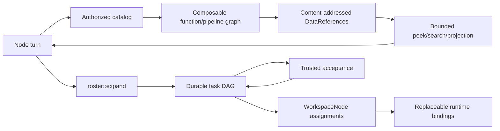

# Composable Agent Runtime

Status: approved architecture; refactor in progress.

This document defines Roster's core execution architecture for coding agents,
composable tools, recursive language model (RLM) context, dynamic delegation,
and durable authorization. It is the migration plan for consolidating the
current execution surfaces without creating another scheduler or allowing a
runtime adapter to become an authority.

## Decision

Roster will expose one provider-neutral agent operating environment:

```text
selected skills
      +
bounded context handles
      +
authorized catalog and workspace tools
      +
an exact execution grant
      =
one node execution surface
```

Codex, Claude, Pi, Hermes, Roster-native, command, A2A, and package-owned
runtimes execute the same logical node/task contract. A runtime may translate
that contract into a native tool protocol, but it does not select membership,
expand the durable graph, grant authority, reserve budget, accept output, or
certify a frontier.

Composable functions and RLM are the inner-loop substrate. The dynamic task DAG
is the durable control substrate. The shared-workspace ledger is the
convergent collaboration substrate. These remain distinct:



## Why this is a core refactor

The repository already has the essential parts:

- a provider-neutral node execution envelope;
- content-addressed skills;
- code-mode context handles and `roster-tool`;
- catalog search, pinned invocation, and host-side pipelines;
- task-fenced shared-workspace reads and publications;
- bounded graph expansion;
- runtime placement and monotonic binding epochs;
- task budgets, leases, retries, and accepted outcomes.

The remaining problem is fragmentation. Skill selection is domain-specific,
function access is recomputed at several boundaries, context/tool/skill
projection is not represented as one durable authority, and not every runtime
has the same interactive RLM transport. The refactor consolidates those
surfaces while preserving the existing authorities.

## Semantic model

The useful functional model is:

```text
Tool<A, B> = Ref<A> -> Effect<Ref<B>>
```

`Ref<T>` is a typed, content-addressed value in Roster's host-private data
plane. `Effect` carries failure, authorization, cost, trace, cancellation, and
side-effect semantics. Pure tools compose normally. Effectful tools compose
through an explicit pipeline whose effective authority is the intersection of
the caller grant and every step requirement.

The category-theoretic analogy is deliberately bounded:

- objects are typed values or versioned artifact frontiers;
- morphisms are typed tool or task transformations;
- parallel independent branches form an operational monoidal product;
- reviews, comparisons, repairs, and evidence act like 2-morphisms between
  alternative transformation paths.

Arbitrary model calls are nondeterministic and do not form a lawful category.
Roster therefore records immutable outputs and explicit comparisons rather
than assuming that rebracketing model calls preserves semantic equality.

## The agent-facing surface

Agents receive a small stable meta-tool surface, not the whole worker mesh:

```text
context.list
context.peek
context.search
context.materialize

catalog.search
catalog.describe
catalog.call
pipeline.execute

workspace.read
workspace.publish

graph.expand
attention.request
```

The current wire names may remain compact (`roster-tool list`,
`roster::catalog.search`, `roster::catalog.invoke`, and `roster::expand`).
Names are less important than the following invariants:

1. Large inputs and results remain behind typed references by default.
2. Search and observation are bounded.
3. Tool schemas are disclosed only after bounded discovery.
4. Provider ID, function version, and provider epoch are pinned before invoke.
5. Pipeline steps pass references without model round trips.
6. A pipeline can narrow authority but cannot widen it.
7. Independent reasoning, paid work, retries, leases, human attention, and
   accepted results cross into the durable task DAG.

## Skills

A skill teaches behavior; it never grants authority. Roster owns a
content-addressed skill registry and selects an exact bounded skill set for one
task from:

```text
base operating skills
∩ node role and capabilities
∩ task capability
∩ repository evidence
∩ runtime compatibility
∩ execution authority
```

Selection occurs before provider dispatch. Unknown, duplicate, or excessive
skill selections fail closed. Selected skill bodies and hashes are immutable
members of the execution envelope and therefore participate in the execution
identity. Runtime-specific skill flags may supplement this common envelope but
must not replace it as the provider-neutral contract.

## Context and RLM

The model is a planner and selective observer, not the storage layer.

Every context handle must carry:

- a stable handle;
- a type or media type;
- a content hash;
- a byte length;
- provenance tied to the admitted task context.

Tools should accept a context reference directly:

```json
{
  "source": {
    "$rosterContext": "context_0123456789abcdef0123456789ab",
    "pointer": "/changedFiles"
  }
}
```

Tool results return another reference by default. `peek`, `search`,
`materialize`, or a typed projection deliberately reveals a bounded portion.
Credentials, private locators, and host-only metadata never enter a model
handle.

## Durable execution authority

The final cutover introduces one ordered `TaskExecutionGrant` for every
dispatched task. A model may produce a risk assessment, but only deterministic
Roster policy or an exact human authorization may produce the grant.

The grant binds:

- policy version;
- run, task, node, attempt, and lease fence;
- task definition hash;
- frontier, topology, catalog, and runtime-binding versions;
- selected skill hashes;
- projected tool IDs and versions;
- callable function grants, scopes, and allowed effects;
- side-effect classification and provider budget.

The grant is stored with the authoritative pre-start task context transition.
Changing any bound field requires a new grant. Replay uses the recorded grant;
it does not call a classifier again.

Authorization, leases, budgets, and grants use ordered receipts/reducers. Peer
risk findings may use the shared workspace, but CRDT arrival order never grants
authority.

## Admission and degraded operation

Admission is deterministic first:

| Request | Classifier unavailable |
| --- | --- |
| Read-only operation already covered by policy | continue |
| Previously granted bounded task | continue from recorded grant |
| New ambiguous workspace mutation | defer |
| External or non-repeatable effect | require exact policy or human grant |
| Provider process unavailable | rebind the logical node, then re-admit |

Classifier failure is never interpreted as approval. A classifier is an
optional risk assessor, not a scheduler or authority.

## Runtime support

| Runtime | Common envelope | Exact skills | Interactive RLM tools |
| --- | --- | --- | --- |
| Roster native | yes | yes | host callback |
| Codex CLI | yes | yes | `roster-tool` |
| Claude Code | yes | yes | `roster-tool` |
| Pi | yes | yes, plus native paths | `roster-tool` |
| Hermes | yes | yes | `roster-tool` |
| Command | yes | yes | no; one request/result |
| A2A | yes | yes | no; transport extension required |
| Package-owned | yes | yes | adapter-declared |

Command and A2A remain valid bounded workers. They must not pretend to support
interactive code mode. A future interactive transport is a new adapter
capability, not a hidden side channel.

## Refactor plan

### Phase 1: central skill projection — implemented

- Add a core content-addressed skill registry.
- Add deterministic task-time skill selection to `RosterPlatform`.
- Project selected skills through the common node execution envelope.
- Keep `executionOptions` unable to inject authoritative skills or tools.
- Test selection, immutability, unknown IDs, bounds, and envelope parity.

The implementation also introduces
`roster.node-execution-surface.v1`, a content-addressed capability bundle inside
the v5 node execution envelope. It is now the single transport boundary for
selected skills, projected tools, task-fenced workspace context, and code-mode
RLM limits. Tool and skill identities must be unique within a surface.

### Phase 2: execution grant — core cutover implemented

- `TaskRiskAssessment`, `TaskAdmissionDecision`, and `TaskExecutionGrant` are
  provider-neutral core contracts.
- `roster.task-context-manifest.v2` durably embeds the exact grant in the atomic
  task-start transition.
- Function access is snapshotted once. Tool invocation, task-scoped workspace
  reads/publications, and graph expansion enforce that same grant.
- Function effects and task-scoped workspace operations are independently
  selectable, so graph mutation does not inherently grant artifact publication.
- `roster.node-execution.v5` carries the grant to Roster-native, Codex, Claude,
  Pi, Hermes, command, A2A, and package-owned adapters. Older schemas are
  not dual-read.
- Direct process-local runtime calls receive a deterministic grant restricted
  to their exact projected surface; durable platform execution must supply the
  reducer-admitted grant.

The remaining attention lifecycle—requested, deferred, human-granted, and
denied receipts plus product projections—belongs to Phase 4. A human-backed
grant already requires an exact authorization ID; no mutable approval or
classifier result is inferred during replay.

### Phase 3: reference-first composable tools

- Make context-reference input a first-class function schema convention.
- Return `DataReference` handles by default for non-trivial worker results.
- Consolidate duplicated context operations behind the code-mode mailbox.
- Add typed projection, caching, provenance, cost, and trace composition.
- Preserve the rule that durable enqueue becomes a normal Roster task.

### Phase 4: delegation and attention

- Provide a small provider-neutral delegation facade over `roster::expand`.
- Add `attention.request` as a request-only tool.
- Show planning, deferred, awaiting authority, admitted, leased, running, and
  acceptance states in product projections.
- Keep node creation separate from task creation: reuse an existing logical
  node unless a capability/provenance boundary requires `NodeDemand`.

### Phase 5: adapter and domain cutover — adapter parity proven; domain cleanup pending

- Exercise the same capability surface through Codex, Claude, Pi, and Hermes.
  This parity is covered by the v5 runtime smoke tests, including the exact
  grant projection.
- Keep command/A2A bounded and explicitly non-interactive.
- Migrate Coding coordination and repository skills to central selection.
- Migrate Writer, Theorem, and Canvas without changing their domain acceptance
  semantics.
- Remove superseded domain-local skill injection and access recomputation only
  after all call sites use the core surface.

## Validation

The refactor is complete only when tests prove:

- exact skill selection and envelope hashing;
- identical provider-neutral semantics across coding CLI adapters;
- bounded context observation and reference passing;
- pipeline authority intersection;
- graph expansion bounds and idempotency;
- stale frontier, fence, catalog, and binding rejection;
- exact grant replay without reclassification;
- human approval cannot authorize a changed task;
- classifier outage preserves read-only work and defers ambiguous mutation;
- runtime rebinding preserves logical node identity but requires matching
  execution authority;
- command/A2A reject unsupported interactive code mode;
- output remains a draft until trusted acceptance.

Run focused tests during each phase and finish every orchestration/runtime
cutover with:

```bash
npm run verify
```

## Definition of done

There is one public node execution contract, one durable task graph, one
function catalog, one context-reference model, one skill registry, and one
execution-grant authority. All supported runtimes consume the same logical
surface. Domain packages select capabilities and acceptance policies; they do
not reimplement orchestration, tool authorization, RLM context, or runtime
placement.
