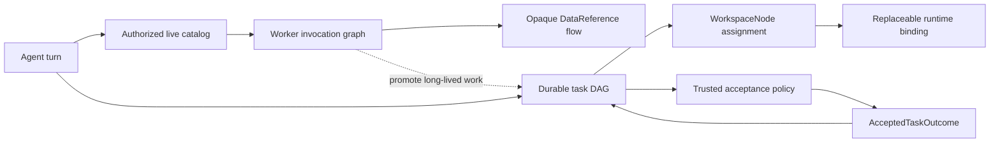

# Dynamic Agent Platform

Roster platform v3 is a breaking platform boundary for building agents whose
work graph cannot be known in advance. It combines durable multi-agent
coordination with a discoverable worker mesh, without treating every function
call as a durable task or putting every intermediate value into a model
prompt.

The central rule is simple: **Roster owns coordination; workers own
execution.** A model, CLI, browser worker, queue worker, or application worker
may perform one bounded operation. None of them can independently redefine
task acceptance, lease authority, budgets, or the durable graph.

## Three graphs, three jobs



These graphs are related, but they are intentionally not collapsed into one
abstraction:

1. **The durable task DAG** represents independently schedulable reasoning or
   side-effecting work. It owns dependencies, joins, retries, leases, fencing,
   budgets, acceptance, cancellation, and dynamic expansion.
2. **The worker invocation graph** represents function calls across registered
   providers. It owns discovery, schemas, authorization, provider epochs,
   heartbeat health, invocation mode, and per-call tracing.
3. **The opaque value-flow graph** moves immutable `DataReference` values
   directly between worker steps. It owns content hashes, media types, byte
   bounds, storage placement, and bounded final previews.

A small transform such as `split`, `filter`, or `join` belongs in a worker
pipeline. A long-running operation that needs an independent retry, lease,
budget reservation, human visibility, or accepted result belongs in the task
DAG. This distinction keeps the durable graph meaningful and the model context
small.

## Durable dynamic task DAG

`DynamicTaskDefinition` is the canonical executable task contract. It binds one
logical `WorkspaceNode` and capability to:

- a semantic key and content-derived definition hash;
- exact frontier, topology, catalog, input, and data-reference versions;
- an explicit join policy and dependency conditions;
- a handler and trusted acceptance policy;
- a natural-text, JSON, artifact, or no-result contract;
- bounded retries, timeout, cost estimate, and side-effect semantics.

Dependencies normally require an **accepted** outcome, not merely a successful
process exit. `all-success`, `all-terminal`, `any-success`, and quorum joins
give continuations explicit failure behavior. If a join becomes impossible,
the dependent task is skipped instead of remaining queued forever.

Dynamic expansion is an atomic graph transition:

1. an actively leased coordinating task discovers `roster::expand` through
   `roster::catalog.search` and calls it with the `call` operation on
   `roster::catalog.invoke`;
2. Roster validates node assignments, capabilities, depth, fan-out, task count,
   semantic-key uniqueness, dependencies, and budgets;
3. Roster publishes at least one child plus one explicit continuation;
4. the parent becomes waiting/delegated and releases its lease in the same
   transition;
5. the continuation unlocks according to its declared join policy.

Releasing the parent lease is essential: a run with `maxInflight: 1` can still
make progress after expansion. The expansion key is stable across lease fences.
An exact replay returns the committed expansion; a replay with changed content
is rejected. Expansion submits the execution's stable dispatcher owner together
with the projected fence; it does not require durable snapshots to expose a
process-local lease-owner field.

The SDK includes a storage-neutral `TaskGraphControl`, an in-memory control
implementation, and a dispatcher for tests, local applications, and embedding.
Every `RosterPlatformExecution` must receive its task-graph control,
`DataReferenceStore`, and task-fenced `createTaskContext` factory explicitly;
there are no hidden in-memory execution planes. A durable task graph is
accepted only with a durable data-reference store, because replayable accepted
outcomes cannot point at process-local values.
`SpacetimeTaskGraphControl` implements that same contract from replay-complete
Spacetime projections: full accepted outcomes, expansion specifications, and
artifact-to-`DataReference` mappings. Production durability is provided by
the SpacetimeDB `roster_*` tables, events, scheduled lease expiry/retry wakeups, and
reducers such as `ensureRosterExecution`, `enqueueRosterTask`,
`expandAndDelegateRosterTask`, `claimRosterTask`,
`acceptRosterTaskOutcome`, `failRosterTask`, and
fenced `cancelRosterTask`.

Runtime placement is resolved before roots and expanded children are admitted.
The resolved binding epoch is part of each task's definition hash. Immediately
before execution Roster resolves placement again and rejects the task if the
current epoch differs, so queued work cannot silently move to a replacement
process, session, sandbox, or runtime profile.

## Accepted outcomes, not trusted model output

A runtime result is a draft. It becomes durable success only after the task's
trusted acceptance policy produces an `AcceptedTaskOutcome` matching the exact:

- task and node;
- attempt and definition hash;
- input, frontier, topology, and catalog versions;
- acceptance-policy ID and version;
- accepted artifact identities and usage.

Only accepted dependencies unlock normal downstream work. Domain policies may
validate and normalize drafts before acceptance. Artifact and completion
receipts are projected only after the authoritative acceptance transition
succeeds. Runtime adapters
cannot certify an artifact, choose a semantic conflict winner, mutate topology,
or spend outside Roster's execution policy.

Evidence remains available as a workspace entry or accepted artifact, but it is
not a universal response format. A task returns natural text by default. JSON
is required only when a consumer genuinely needs a schema, while artifact mode
is used for domain-owned or large outputs. This keeps coordination metadata
precise without forcing every agent response through a verbose evidence
wrapper.

## Task-fenced shared context

`SharedWorkspaceLedger` is a bounded Yjs-backed blackboard for independently
authored messages, findings, evidence, decisions, proposals, and artifact
references. `createRosterTaskContext` adds the missing authority boundary:

- reads and publishes are checked against the active task lease fence;
- reads can select bounded kinds, subjects, or entry IDs;
- writes carry the exact run, task, node, frontier, topology, catalog, and
  input versions;
- a stale task or replaced runtime cannot continue publishing;
- append entries coexist, while incompatible exclusive decisions become
  explicit conflicts rather than using arrival order as the winner.

Use receipts for ordered control state, this ledger for bounded concurrent
contributions, and Git or object storage for source trees and large artifacts.

The required `RosterPlatformExecution.createTaskContext` plane is evaluated for
every dispatched node turn with the exact task lease and snapshotted runtime
binding epoch. Native workers receive the resulting `RosterTaskContext`
directly; every node runtime also receives bounded
`roster::workspace.read` and `roster::workspace.publish` functions. A replaced
lease therefore invalidates both direct context use and model-visible shared
workspace access.

## Live workers, functions, and triggers

`RosterFunctionDirectory` separates stable function descriptors from
replaceable providers. Each descriptor declares schemas, a capability,
effects, scopes, idempotency, and timeout. Providers bind at a monotonic epoch
and may publish heartbeat timestamps and TTLs. Assignment capabilities and
callable-function grants are separate: a coordinator can compose an explicitly
granted browser or functional worker without pretending to be assignable to
that worker's logical task role.

The v3 RLM execution plane treats the live function catalog as an external
environment. Every agent sees exactly two stable virtual functions:

- `roster::catalog.search` returns at most 32 compact authorized matches;
- `roster::catalog.invoke` performs `describe`, `call`, or `pipeline` against
  one task-local search snapshot.

`describe` reveals the exact schema for only one elected match. `call` invokes
one pinned worker. `pipeline` composes pinned workers over opaque
`DataReference` values. Adding hundreds of live workers therefore does not
increase the prompt tool surface: worker IDs and schemas enter context only
after a bounded search elects them.

A catalog version pins the function versions and selected provider epochs used
by a task or pipeline. A stale catalog is rejected instead of silently routing
a replay to a different worker. Search snapshots belong to one bound task, so
another task cannot reuse a discovered catalog version as ambient authority.
Pinned agent calls are awaited or void only. Durable enqueue uses a trigger or
dynamic task admission, because deferring a call cannot truthfully preserve an
ephemeral provider lease without a new scheduling receipt.

This is the RLM split used by the platform:

- long task input, memory, and worker results live behind context handles or
  content-addressed references and are inspected selectively;
- the worker catalog lives behind bounded search and pinned invoke;
- deterministic transforms recurse through a worker pipeline without model
  round trips;
- independent reasoning recurses through bounded dynamic DAG expansion, where
  multiple nodes contribute to shared context before an explicit join.

RLM controls context exposure; the dynamic DAG controls swarm topology. Neither
one replaces the other.

`RosterTriggerRouter` maps direct, HTTP, schedule, queue, state, stream, or
custom events to those same function contracts. Trigger delivery is bounded
and idempotent by event ID within one router process. An `enqueue` target crosses into Roster's
durable task authority; direct worker invocation does not acquire scheduling or
acceptance powers. Router delivery memory is process-local, so a durable
platform execution rejects enabled awaited or void triggers. Durable triggers
must enqueue work; the graph's deterministic task identity then supplies the
replay boundary.

Every node turn carries W3C-compatible trace and span IDs. Task dispatch,
function invocation, pipeline steps, triggers, queues, runtimes, and
application workers can therefore participate in one OpenTelemetry (OTEL) trace
without sharing one process.

## Worker pipelines and context efficiency

The `pipeline` operation on `roster::catalog.invoke` delegates internally to
`WorkerPipelineExecutor`, which pins an authorized catalog snapshot before it
starts.
It materializes each value only inside the trusted data plane, invokes the
selected worker, writes the result back as an immutable `DataReference`, and
passes that reference to the next step.

Step authority is the intersection of the caller's scopes/effects and the
step's requested scopes/effects. A pipeline can narrow authority but cannot
become a confused deputy. Step count, individual value bytes, cumulative
transferred bytes, reference metadata, step time, wall time, and preview size
are all bounded.

For a pipeline such as:

```text
web::fetch → fp::get → fp::split → fp::filter → fp::join
```

the document and intermediate arrays do not enter the model context. The model
receives the final bounded preview and can retain the final reference. Roster
also records content-addressed step receipts with function/provider versions
for inspection and trace correlation.

## Function-mesh boundary

The worker/function/trigger composition lets workers register functions in one
discoverable directory and compose them without routing every intermediate
value through the model.

Roster adds a separate durable coordination authority around that idea:

| Function-mesh behavior | Roster platform-v3 boundary |
| --- | --- |
| Workers register discoverable functions | Descriptors are stable; live providers have epochs and heartbeats |
| Triggers route calls | Direct calls stay functions; enqueue crosses into the durable DAG |
| Workers pass values to workers | `DataReference` keeps bounded intermediates out of model context |
| One trace spans the mesh | Task, function, pipeline, trigger, and runtime spans share trace context |
| Harness composes capabilities | Roster additionally owns leases, fencing, retries, joins, budgets, accepted outcomes, and replay |

When the relevant workers are registered, an agent can discover browser or
functional-programming capabilities from the live catalog and compose them at
runtime. This is not a promise that a model will always discover the optimal
pipeline. The platform makes that behavior available, authorized, observable,
and cheap enough to be useful; planner quality and the installed worker set
still matter.

Canvas and Coding use the same durable expansion transition for first-party
phase fan-out. Each admitted phase is represented as a leased phase
coordinator, its dynamically materialized children, and an explicit accepted
join. This removes the earlier condition where the generic task DAG existed
but first-party code merely enqueued unrelated phase roots.

## Build a platform

The primary platform-v3 authoring surface is `defineRosterPlatform` plus one or
more `createRosterRootTask` calls:

```ts
import {
  attachNative,
  defineRosterMember,
} from "roster/runtime";
import {
  createRosterRootTask,
  defineRosterPlatform,
  InMemoryTaskGraphControl,
  taskGraphTask,
} from "roster/orchestration";
import { InMemoryDataReferenceStore } from "roster/capabilities";
import {
  createRosterTaskContext,
  SharedWorkspaceLedger,
} from "roster/workspace";

const coordinator = defineRosterMember({
  id: "coordinator",
  name: "Mira",
  role: "coordinate and synthesize",
  capabilities: ["coordinate"],
  attachment: attachNative({ profile: "coordinator" }),
});

const researcher = defineRosterMember({
  id: "researcher",
  name: "Sol",
  role: "research",
  capabilities: ["research"],
  attachment: attachNative({ profile: "researcher" }),
});

export const platform = defineRosterPlatform({
  id: "research-platform",
  version: "3",
  policyVersion: "research-policy-v1",
  coordinatorId: coordinator.id,
  capabilities: [
    { id: "coordinate", description: "Decompose and synthesize work." },
    { id: "research", description: "Investigate a bounded question." },
  ],
  nodes: [coordinator, researcher],
  policy: {
    maxTasks: 64,
    maxDepth: 5,
    maxFanout: 8,
    maxInflight: 4,
    maxReady: 32,
    maxBlocked: 48,
    maxAttempts: 3,
    maxContextBytes: 8 * 1024 * 1024,
    maxCostMicros: 5_000_000,
    maxTokens: 250_000,
    maxWallTimeMs: 15 * 60_000,
  },
});

const root = createRosterRootTask({
  taskId: "coordinate-question",
  semanticKey: "question-v1",
  nodeId: coordinator.id,
  capability: "coordinate",
  objective: "Answer the question; expand into specialists only when useful.",
  inputs: {
    inputVersions: { question: "sha256:…" },
    dataReferences: [],
    frontierVersion: "frontier-1",
    topologyVersion: "topology-1",
    catalogVersion: "catalog-1",
  },
  // Natural text is the default. Declare mode: "json" only for a real schema.
});

// These process-local planes are explicit and suitable for this runnable local
// example. Production uses a durable TaskGraphControl and a durable
// DataReferenceStore together.
const taskGraph = new InMemoryTaskGraphControl();
const dataReferences = new InMemoryDataReferenceStore();
const workspace = new SharedWorkspaceLedger("workspace/run-1");

const execution = platform.createExecution({
  runId: "run-1",
  seedTasks: [root],
  taskGraph,
  dataReferences,
  createTaskContext: ({ runId, node, definition, lease }) =>
    createRosterTaskContext({
      node,
      ledger: workspace,
      fence: {
        runId,
        taskId: definition.taskId,
        nodeId: node.id,
        fence: BigInt(lease.fence),
        frontierVersion: definition.inputs.frontierVersion,
        topologyVersion: definition.inputs.topologyVersion,
        catalogVersion: definition.inputs.catalogVersion,
        runtimeBindingEpoch: definition.runtimeBindingEpoch,
        inputVersions: definition.inputs.inputVersions,
      },
      authority: {
        assertActive: async () => {
          const record = taskGraphTask(
            await taskGraph.snapshot(),
            definition.taskId,
          );
          if (
            !record
            || (record.status !== "leased" && record.status !== "running")
            || record.leaseOwner !== lease.owner
            || record.leaseFence !== lease.fence
          ) {
            throw new Error("stale task workspace fence");
          }
        },
      },
    }),
  nativeExecute: async ({ definition, taskContext }) => {
    await taskContext.readWorkspace();
    return `Completed ${definition.objective}`;
  },
});

const state = await execution.dispatchUntilQuiescent();
```

Register function descriptors and workers on the platform definition to expose
domain capabilities. Use `execution.functions.projectCatalog(...)` for a
versioned authorized host snapshot, `execution.executePipeline(...)` for opaque
worker composition, and `execution.route(...)` for reactive triggers. An agent
turn searches through `roster::catalog.search` and makes a provider-pinned call
through the `call` operation on `roster::catalog.invoke`. A coordinator with
`roster:graph:expand` can therefore discover and invoke `roster::expand` to
publish bounded child work plus its continuation.

## What materially improves

Compared with a static first-party plan or synchronous recursive subcall, the
platform now provides:

- graph shape that can respond to the actual question while remaining bounded;
- parallel specialist tasks with exact joins and accepted-input provenance;
- a constant two-function catalog surface even as the live swarm grows;
- no parent-slot deadlock during delegation;
- cross-worker pipelines that avoid model-context amplification;
- live capability discovery without hard-coding every provider in the harness;
- runtime replacement without changing agent identity or durable history;
- natural agent responses where structure is unnecessary;
- one trace across models, workers, queues, state, policy, and application code;
- deterministic replay boundaries even when the live worker mesh changes.

The improvement is architectural, not magical: better workers and planners can
now produce better emergent compositions, while Roster prevents that
adaptability from turning into unbounded or unauditable execution.
