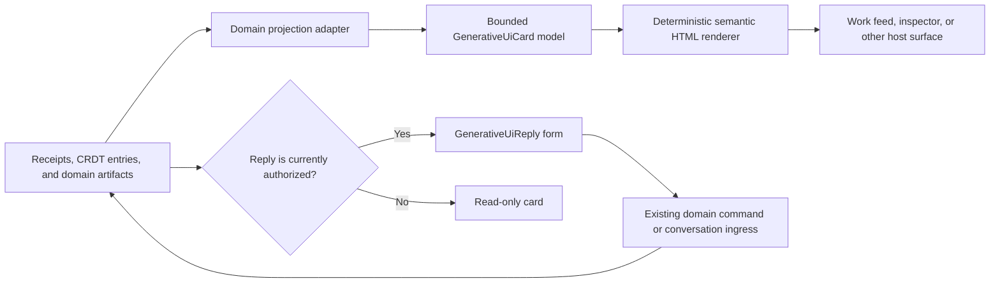
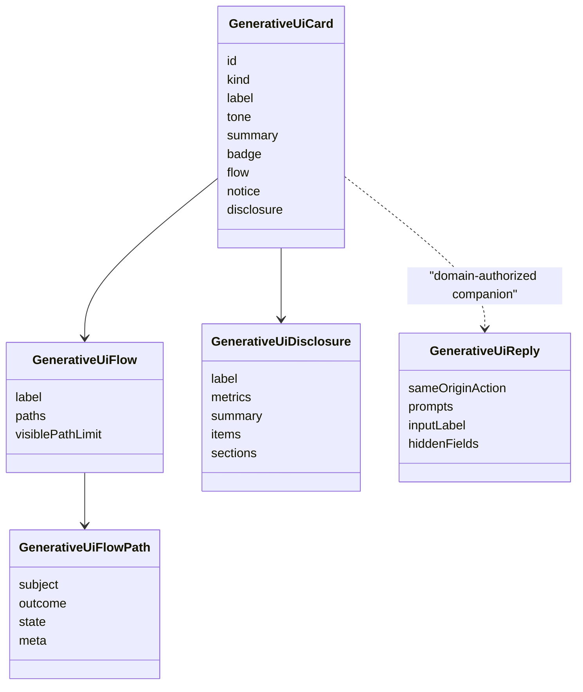

# Generative UI

Roster treats generative UI as a deterministic projection of durable domain
state. A model or worker may author bounded content, but it does not author
browser HTML, choose an executable action, or become a UI state authority.

`src/views/generative-ui.ts` defines the shared presentation contract. Coding
is the first adopter: its peer proposals, responses, resolutions, and
endorsements map into the same card model, while Coding-specific receipts and
collaboration schemas remain unchanged.

## Boundary



The layers have separate responsibilities:

- The domain projection decides what a proposal, conflict, result, or human
  request means. It reads only authoritative state.
- `GenerativeUiCard` supplies presentation primitives: a summary, semantic
  badge, bounded directed flow, notice, evidence disclosure, and structured
  detail sections.
- `generativeUiCardHtml` escapes authored text, enforces collection limits, and
  renders accessible server HTML without executing generated code.
- The host surface provides theme variables, placement, polling, and state
  restoration. It does not reinterpret the card's domain meaning.
- `GenerativeUiReply` is an affordance, not an authorization. A domain may
  construct it only after its own receipt-derived policy permits a reply.

## Standard card model



Stable semantic primitives are preferable to domain-specific visual payloads.
A dependency plan, review finding, theorem branch, or Canvas decision can use
the same flow and disclosure primitives without sharing its domain reducer.
New visual forms should be added only when the information relationship cannot
be expressed by the existing primitives.

The renderer deliberately does not accept arbitrary HTML, CSS, scripts,
callbacks, remote components, or model-selected form actions. Text is escaped,
same-origin actions are validated, field names and semantic tokens are bounded,
and long collections are capped. Domain artifacts retain the exact complete
record outside this presentation projection.

## Inline replies

Coding exposes an inline reply form only for the two receipt-derived states that
already allow human input:

1. a pre-execution clarification route; or
2. an exhausted ambiguous peer resolution with valid resolver provenance.

The inline form posts to the existing `/coding/run` conversation ingress with
the exact workspace, conversation, and review policy. Its browser enhancement
forwards the text through the existing streaming composer queue, so retries,
external identities, continuation routing, and safe task-boundary delivery are
unchanged. Without JavaScript, the native form posts to the same route.

Runtime failures, stale ambiguities, active continuations, proposal questions,
and ordinary peer responses never receive a generated reply action. Rendering
a warning or an unresolved path alone is insufficient to authorize input.

The Coding poller preserves inline reply text, selection, focus, and stable
disclosure state while replacing the receipt-derived projection. A one-second
status refresh therefore cannot erase an answer being composed.

## Adoption rules

Use the framework for a new generated surface when all of these are true:

- the content comes from a validated domain projection;
- the card has a stable content- or receipt-derived ID;
- the information fits a bounded summary plus optional evidence;
- semantic state maps to the standard tones and flow states; and
- any action already exists as an authorized domain command.

Keep a domain-specific renderer when the artifact is inherently spatial or
specialized, such as a code diff, theorem proof state, or Canvas scene. Those
surfaces may still embed standard cards for decisions, findings, and human
requests.

Do not let a renderer schedule work, mutate topology, resolve conflicts, accept
artifacts, infer certification, or write collaboration state. Those remain
Roster and domain responsibilities.

## Validation

`tests/smoke/generative-ui.test.ts` covers escaping, semantic structure,
collection bounds, responsive CSS, reduced motion, same-origin actions, and
native reply forms. Coding smoke tests cover receipt-derived action eligibility,
hidden scope fields, inactive-state suppression, streaming enhancement, and
poll state restoration. Run the complete repository gate before release:

```bash
npm run verify
```
