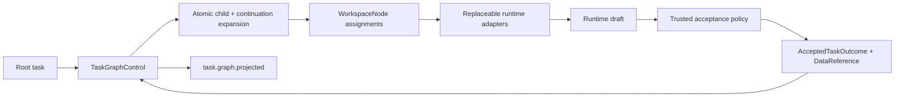
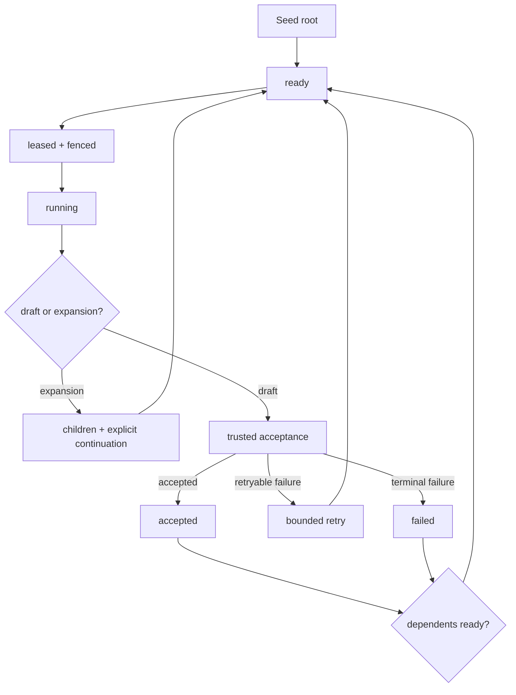

# Roster Dynamic Orchestration

Roster has one execution authority: the bounded dynamic task graph exposed by
`TaskGraphControl`. There is no compile-time plan scheduler, phase executor, or
second task receipt ledger.

The platform separates logical coordination from execution placement:

## Authority boundary

Roster owns:

- task identities, dependencies, joins, and dynamic expansion;
- workspace-node capability authorization;
- leases, fences, retries, cancellation, and bounded concurrency;
- task, depth, fan-out, context, token, cost, and wall-time limits;
- immutable input references and accepted outcome identities;
- shared-workspace frontiers, semantic conflicts, and certification;
- the bounded task-graph projection used by product surfaces.

Workers own one inner-loop operation. A model, coding harness, browser,
function provider, queue consumer, or application worker cannot schedule graph
work, accept its own draft, choose a conflict winner, or change topology.

## Dynamic lifecycle

`defineRosterPlatform` declares the domain, nodes, capabilities, functions,
workers, triggers, and run policy. `createRosterRootTask` creates a seed. A
coordinator that discovers more complexity calls `roster::expand`; the graph
atomically replaces its active lease with bounded children and an explicit
continuation. An identical expansion replay converges. Changed content under
the same expansion key is rejected.

Dependencies normally require an accepted outcome. `all-success`,
`all-terminal`, `any-success`, and quorum joins make partial-failure semantics
explicit. Parentage records provenance; dependencies control readiness.

## Required execution planes

Every execution receives three explicit planes:

1. `TaskGraphControl` for graph transitions and lease authority.
2. `DataReferenceStore` for immutable values that survive beyond model context.
3. A task-fenced `createTaskContext` factory for the shared-workspace CRDT.

Production uses `SpacetimeTaskGraphControl` plus durable value and workspace
stores. A durable graph rejects a process-local data-reference store. First
party agents do not create hidden in-memory fallbacks. In-memory controls exist
only when a test or embedding explicitly injects them.

Use ordered receipts for control history, the shared-workspace CRDT for bounded
independent contributions, and Git or object storage for source trees and large
artifacts.

## Worker mesh and context efficiency

Every model-visible function plane exposes two stable virtual functions:

- `roster::catalog.search`
- `roster::catalog.invoke`

Search returns a compact authorized subset of the live catalog. Invoke pins the
selected function version and provider epoch for `describe`, `call`, or
`pipeline`. Pipelines pass opaque `DataReference` values directly between
workers, so intermediate documents and transformations do not enter model
context.

A function call belongs in the worker invocation graph. Work belongs in the
durable task graph only when it needs an independent lease, retry, budget,
human visibility, dependency, or accepted outcome.

## Runtime placement

`WorkspaceNode` is the canonical logical participant. Runtime bindings,
processes, sessions, sandboxes, worktrees, and worker leases are separate
placement concerns. The binding epoch is snapshotted into a task definition and
rechecked before execution, preventing queued work from silently moving to a
replacement runtime.

## Read model

`OrchestrationState.taskGraph` is the only task execution projection. It
contains bounded task identities, nodes, capabilities, objectives, statuses,
attempts, dependencies, continuations, expansions, and accepted usage totals.
The UI derives its live DAG and completion state from this projection.

Domain events remain useful for domain artifacts, topology, reflection,
prompts, evidence, and certified compositions. They are observational; they do
not form a second scheduler.

## Where to read next

- [Dynamic agent platform](./dynamic-agent-platform.md) describes task,
  function, trigger, trace, and opaque-value protocols.
- [Workspace nodes](./workspace-nodes.md) defines logical identity, runtime
  placement, and task-fenced shared context.
- [Adaptive orchestration](./adaptive-orchestration.md) covers population
  demand, topology, and reflection.
