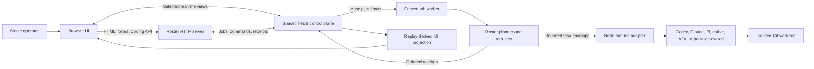
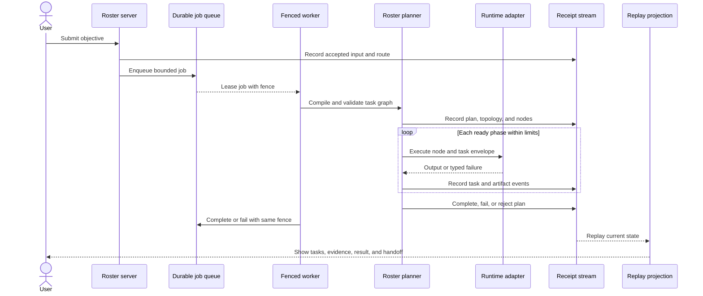
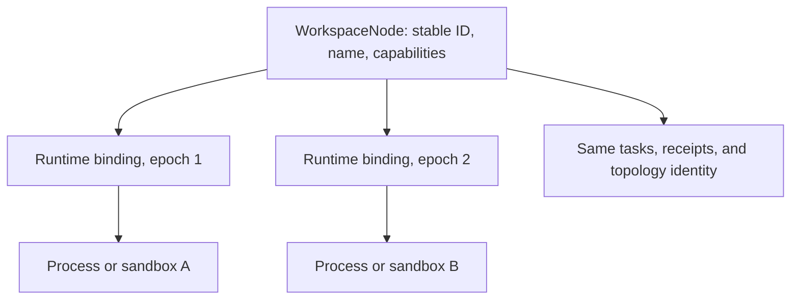
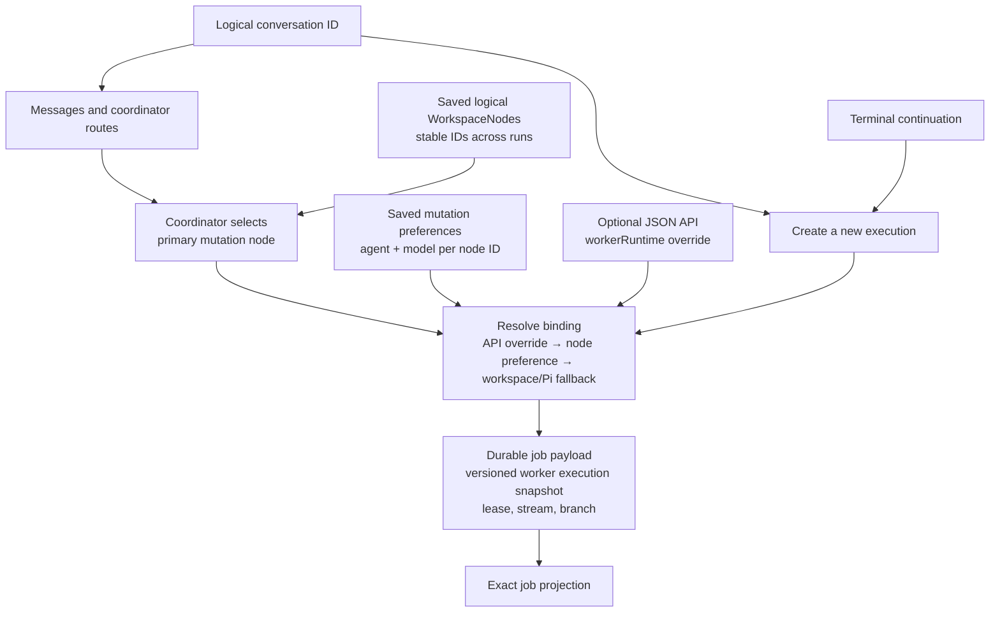
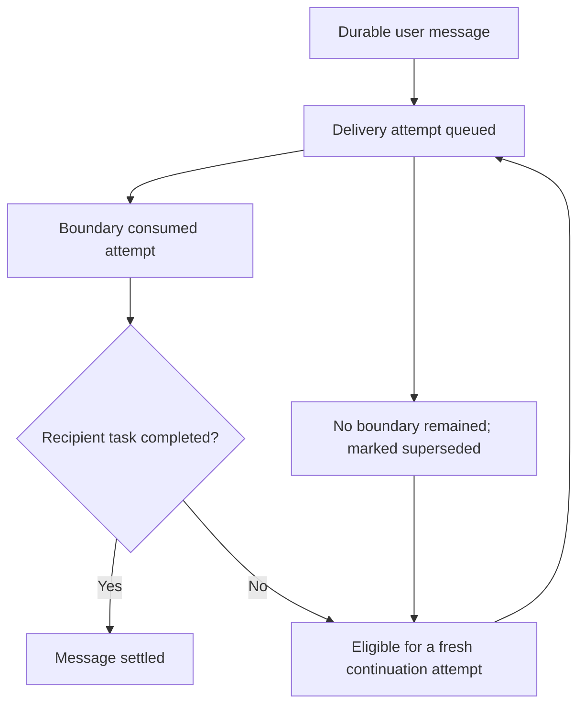
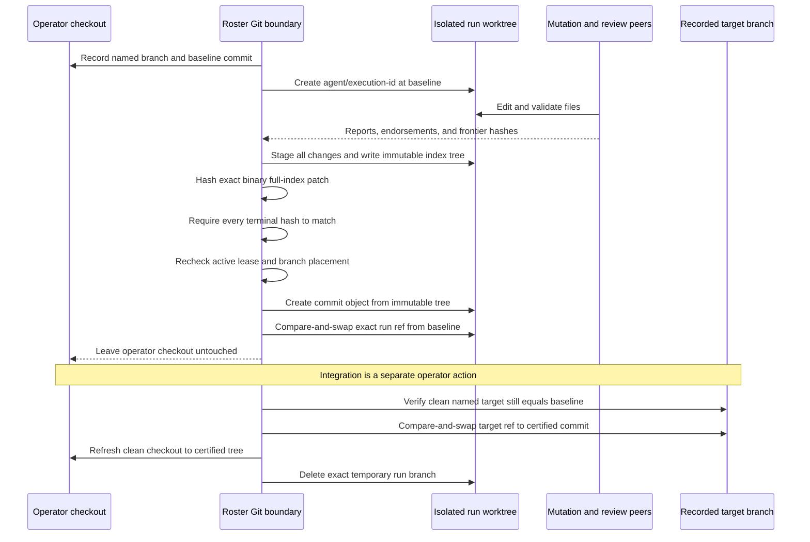
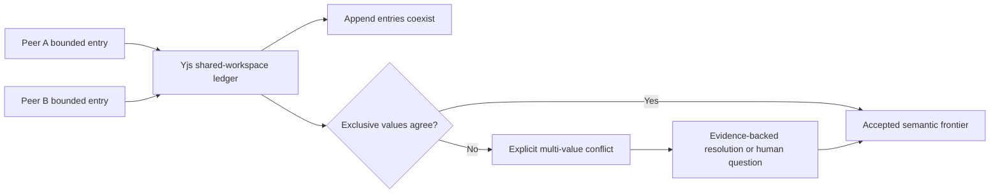
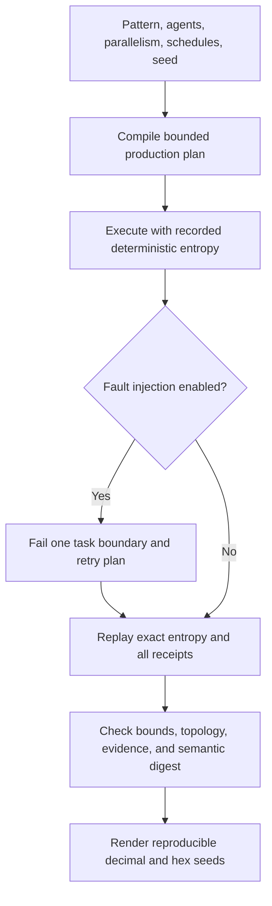

# Production Architecture

This document is the current implementation map for Roster as a single-user
application. It explains which component owns each decision, how a run moves
through the system, how Coding conversations and executions differ, how Git
changes become trusted, and what the simulator proves.

The current product scope includes repository CI verification but intentionally
excludes application-user RBAC and tenant isolation. The server, workers, and
SpacetimeDB deployment are operated for one trusted user and one configured
Roster workspace.

## HTTP access

The HTTP server binds to `127.0.0.1` by default. A shared middleware protects
browser pages, forms, streams, and APIs. With `ROSTER_API_TOKEN` configured,
requests require a bearer token or an eight-hour, origin-bound HttpOnly session
cookie. Open `/auth` to exchange the token for a browser session. Rotating the
token invalidates existing sessions. Health and readiness probes remain public.

Remote binding through `ROSTER_HTTP_HOST` requires both `ROSTER_API_TOKEN` and
an exact `ROSTER_PUBLIC_ORIGIN`, such as `https://roster.example.com`. Terminate
TLS at a proxy and preserve the public Host header; forwarded headers do not
set authentication authority. Requests with another Host or Origin are rejected.
Browser mutations must come from the workspace origin, including in local trust
mode. Without a token, local processes retain trusted loopback access.

Desktop launches generate a fresh random token in the native shell. The initial
`/auth` fragment is cleared before the browser exchanges it for a cookie; the
secret is never sent in a request URL. Repository scope and realtime page-session
checks still apply after this shared access check. This remains one operator's
authority and does not implement tenant isolation or application-user RBAC.

## System map

SpacetimeDB owns durable jobs, leases, commands, task rows, and receipt-backed
state. The HTTP server renders pages and accepts input; it is not a competing
state authority. Runtime adapters execute one node's inner loop. Roster retains
topology, task dependencies, budgets, artifact acceptance, conflicts, and
certification.

## State ownership

| State | Owner | Why |
| --- | --- | --- |
| Ordered control transitions | Hash-linked receipts | Deterministic replay and audit |
| Jobs, leases, fences, commands | SpacetimeDB | One durable claim and stale-worker rejection |
| Logical participants and topology | Roster orchestration state | Identity survives runtime replacement |
| Concurrent findings and decisions | Bounded Yjs shared workspace | Convergence without arrival-order acceptance |
| Source trees and certified changes | Git commits and retained patches | Exact content boundary for code |
| Large external artifacts | Object storage or references | Keeps large blobs out of receipts and CRDT state |
| Process output | Bounded local runtime logs | Diagnostic only; never certification evidence |

## One run from request to projection

Task count, depth, fan-out, parallelism, retries, timeouts, and cost are bounded
before or during dispatch. A runtime result is only a candidate output; the
planner and domain rules decide whether it satisfies the artifact contract and
goal.

## Workspace nodes and runtime bindings

`WorkspaceNode` is the logical participant. A process, CLI session, lease,
worktree, sandbox, or remote endpoint is only a replaceable binding.

`node.runtime.bound` advances the binding epoch. It does not create a new
logical node. Runtime adapters own transport and inner-loop execution only;
they cannot certify artifacts, rewrite topology, or expand budgets.

## Coding: conversation versus execution

A Coding conversation is the user-facing thread. Each mutating attempt is a
separate execution with its own job, receipt stream, lease, branch, and
worktree. The first execution uses the conversation ID; every terminal
continuation receives a fresh execution ID.

An exact `?job=` selector always binds tasks, outputs, patch, collaboration,
logs, and integration to that job's execution. A missing or mismatched selector
returns `404`; it never falls back to a different attempt while presenting the
requested job ID. Workspace settings are application configuration outside the
composer. Each bounded preference is keyed by a stable logical node ID and is
consulted only after routing selects the primary mutation node. Changing it
cannot rewrite the versioned worker execution configuration already snapshotted into a
queued or historical job. The logical `WorkspaceNode` is unchanged when either
setting changes; only a future writable binding changes. Review bindings stay
read-only and policy-controlled.

The room presents that durable state as a conversation, not as a receipt
viewer. Authored messages remain in one continuous chat feed. SpacetimeDB task,
handoff, checkpoint, and attention rows update a separate collapsed activity
log, while exact runtime placement, artifacts, and receipts remain available
through explicit room-detail links. Image artifacts render only through their
message attachment; their inline binary payload is never projected as message
text.

Focused reviewed runs let the selected specialist publish one bounded
read-only direction before mutation. The implementation node consumes that
accepted direction, then the same specialist independently reviews the actual
delta. This makes the visible order match the task DAG: specialist direction,
implementation, review, remediation when needed, and certification. A
human-resolved continuation still begins at implementation because the
accepted human resolution replaces the earlier proposal frontier.

### Follow-up delivery across continuations

User messages sent while a job is active are persisted on the logical
conversation and delivered at a safe task boundary. Every immutable delivery
attempt records its execution, job attempt, recipient node, and recipient task.

Delivery receipts are mirrored into the conversation history while recipient
task completion remains execution-local. Recovery evaluates all immutable
attempts: any successfully completed consumption settles the message, so an
older failed attempt cannot cause duplicate delivery after a later success.

## Coding: trusted Git boundary

Models and runtime processes do not have certification authority. Their
`frontierHash` fields are claims that Roster independently verifies.

Important failure behavior:

- A worker-authored commit is rejected even if local metadata claims it was
  certified.
- A detached or substituted worktree cannot receive the Roster commit; Roster
  advances only the exact run ref with an expected-old-value check.
- A no-change run completes without an empty commit or integration action.
- Integration never rebases, cherry-picks, creates a merge commit, resolves a
  conflict, or pushes a remote.
- Coding jobs currently use one filesystem-owning attempt. An interrupted
  pre-commit worktree can be inspected or reattached only while its run branch
  remains at the baseline. Branch-ahead state after an interruption is retained
  for manual inspection and is not automatically trusted or retried.
- The operator can explicitly retry a failed or canceled job. Retry is
  idempotently linked to the failed job and creates a fresh execution, receipt
  stream, lease, branch, and worktree under the same logical conversation.
- A lockfile-backed Node repository installs dependencies inside each isolated
  checkout. Coding CLIs inherit the server's effective SpacetimeDB identity via
  a model-invisible process environment, and cancellation terminates their full
  process group before patch capture. The primary checkout's dependencies and
  partial child processes are never reused as certification evidence. Job
  completion and failure use the terminal reducer's exact lease fence directly;
  they do not create a redundant heartbeat immediately before that fenced
  transition.

The retained patch and receipt streams are the durable audit material after a
successful integration removes the temporary run branch.

## Shared workspace and conflicts

CRDT convergence answers whether replicas contain the same entries. It does
not choose which competing semantic value is correct. Arrival order is never an
acceptance rule.

## Simulation Lab

The simulator uses the production planner, reducers, task/output receipts,
retry projection, and runtime boundary with deterministic entropy. It does not
create real customer Git branches or persist simulated runs to SpacetimeDB.

The hierarchy scenario scopes each review to a pod of at most four workers and
gates on all pod reviews. The adaptive scenario cannot claim an evidence gap is
closed until a real bounded remediation plan publishes the missing artifact.
The displayed seed reproduces that schedule directly.

## Local production checklist

For the current single-user scope:

1. Use Node.js 22.19 or newer.
2. Configure and start SpacetimeDB, then publish the checked-in module for the
   application runtime.
3. Configure model credentials and any local CLI runtimes you intend to use.
4. Run `npm run verify` before packaging or deployment. Verification provisions
   an isolated in-memory SpacetimeDB instance and uniquely named database, so it
   cannot depend on or mutate the development control plane. Use
   `npm run verify:external` only when deliberately exercising an already
   published configured database.
5. Run `npm audit` and inspect `npm ls --depth=0`.
6. Start the built server with `npm start` and exercise the Coding and
   Simulation Lab smoke paths against the deployed control plane.

For the local daily-driver path, `roster setup`, `roster doctor`, `roster up`, and
`roster status` wrap these prerequisites without changing state ownership.
`GET /healthz` reports process liveness and `GET /readyz` reports whether the
connected server is accepting work.

See [Repository guide](./repository-guide.md),
[SpacetimeDB runtime](./spacetimedb.md),
[Workspace nodes](./workspace-nodes.md),
[Coding API](./api.md#coding-conversation-api), and
[Simulation Lab](./simulation-lab.md) for operational and extension detail.
