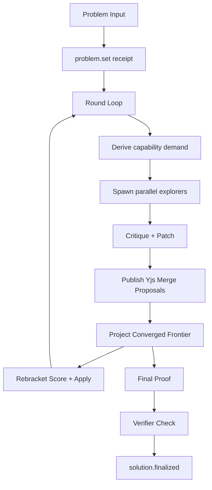
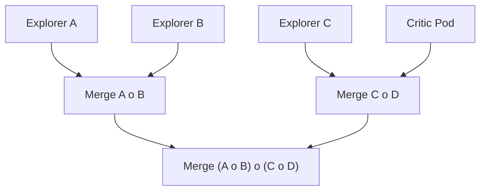

# Adaptive Proof: How It Works

This document explains the Adaptive Proof example, how Roster receipts drive it, and how rebracketing changes collaboration order. It is a theorem domain pack on the Roster orchestration kernel; theorem vocabulary stays in the pack.

The system is intentionally minimal:
- Receipts are the only durable artifact.
- State and UI are pure folds over receipts.
- Prompt identity, task inputs, outputs, and accepted compositions are explicit.

Implementation layout (framework-style):
- `src/agents/theorem.ts`: workflow entry + public exports
- `src/agents/theorem.constants.ts`: examples + workflow ids
- `src/agents/theorem.streams.ts`: stream layout helpers (index/run/branch)
- `src/agents/theorem.memory.ts`: memory selection policy
- `src/agents/theorem.rebracket.ts`: rebracketing engine
- `src/agents/theorem.runs.ts`: run slicing + UI helpers
- `src/domains/theorem.ts`: capabilities, workspace nodes, and orchestration limits
- `src/engine/workspace/node.ts`: durable node identity and runtime bindings
- `src/engine/merge/crdt-ledger.ts`: Yjs-backed merge proposal ledger and projection
- `src/modules/orchestration.ts`: shared receipt protocol and projection
- `src/views/orchestration.ts`: shared live/replay coordination UI

---

## Core loop (high level)

Mermaid flow:



---

## Receipts (events)

The shared kernel emits:
- `orchestration.configured`
- `node.spawned` / `node.retired`
- `node.runtime.bound` when a logical node changes execution placement
- `reflection.recorded`
- `topology.selected`
- `artifact.published`
- `task.graph.projected`
- `prompt.compiled`
- `evidence.recorded`
- `composition.proposed` / `composition.certified` / `composition.rejected`

The theorem pack emits only theorem semantics:
- `problem.set`
- `problem.appended`
- `run.configured`
- `run.status`
- `failure.report`
- `attempt.proposed`
- `lemma.proposed`
- `critique.raised`
- `patch.applied`
- `summary.made`
- `orchestrator.decision`
- `context.pruned`
- `context.compacted`
- `overflow.recovered`
- `tool.called`
- `subagent.merged`
- `merge.frontier.selected`
- `merge.evidence.computed`
- `merge.candidate.scored`
- `merge.applied`
- `rebracket.applied`
- `solution.finalized`
- `verification.report`
- `model.usage`
- `memory.slice`
- `branch.created`

The task-graph projection identifies every concurrent invocation. The UI
derives the active frontier, hierarchy, failures, retries, merges, and replay
position from the same durable graph used by the runtime.

`run.configured` stores the workflow id/version, model, prompt hash, and run parameters (rounds/depth/memory/branch threshold) for reproducibility.

---

## What makes it a dynamic node topology

- **Demand-derived roles**: the objective and reflection policy materialize the explorers and review capabilities needed for the current frontier.
- **Parallelism is a cap**: `maxParallel` bounds concurrent work; it does not request that many explorers.
- **Branching streams**: divergent work forks into separate timelines and merges explicitly.
- **Merge policy**: rebracketing changes merge order based on critique evidence.
- **Auditable execution**: memory slices, prompt hashes, immutable outputs, and composition decisions are durable.

## Streams (index + run)

Receipts are partitioned by stream to keep runs isolated and replay fast.

- **Index stream**: `<base>` (ex: `theorem`) stores run-level receipts.
- **Run stream**: `<base>/runs/<runId>` stores the full chain for one run.
- **Branch stream**: `<runStream>/branches/<branchId>` stores forked timelines.

Each stream is an `event_stream` row with ordered, hash-linked `stream_receipt` rows. Branch metadata stores its parent and exact fork sequence. The browser subscribes only to the selected index, run, and branch projections and can render the live head or any exact receipt prefix.

---

## Memory (receipt-only)

Agents never use hidden memory.
Each prompt receives a **memory slice** built from receipts:
- last round's attempts / critiques / patches
- the latest summary

This is computed on demand by folding the chain.
Each slice also emits a `memory.slice` receipt with phase, size, and selected items.
`prompt.compiled` stores template and variable hashes plus input versions, not the full prompt body.

---

## Rebracketing (causal)

Brackets are not decorative. They control merge order. For `n` current leaves, a bracket is a vertex of the associahedron `K_n`; a rebracket is one validated local edge in the Tamari lattice.

Example bracket:

```
((A o B) o (C o D))
```

Meaning:
1) Merge A + B
2) Merge C + D
3) Merge those two results

Each merge is a `summary.made` receipt tagged with its subtree bracket.

Mermaid for the merge tree:



The rebracket scorer uses evidence from receipts (critiques, patches, and summary links) to score the current tree and its local neighbors. It selects at most one positive-gain associator per reflection point and uses hysteresis to avoid oscillation. It does not enumerate the Catalan-sized global space.

Spawning grafts a new leaf and moves the topology from `K_n` to `K_(n+1)`. Retirement contracts one leaf. These operations have separate receipts and cannot hide a reordering of existing work.

---

## CRDT merge ledger

Concurrent theorem merge proposals use an add-only Yjs document inside one execution frontier instead of a keyed lock or compare-and-swap reservation.

- Each proposal is immutable and keyed by a hash of its plan, merge coordinate, inputs, output, content, and evidence links.
- Applying updates is order-independent and idempotent. Identical delivery collapses to one proposal.
- Proposals with the same semantic output join their evidence links.
- Different semantic outputs remain as a multi-value conflict. Neither output overwrites the other.
- Dependent merge steps remain pending until their inputs project to one semantic output.
- A converged output is published as an immutable artifact and crosses the generic `composition.proposed` / `composition.certified` boundary.
- A divergent projection emits `composition.rejected`; no theorem-specific compatibility event shadows that decision.

The workflow projects only after the currently scheduled frontier has completed. This is a frontier barrier, not a write lock: workers publish independently, then the orchestrator derives a view from the joined CRDT state. Bounded Yjs updates are first-class shared-artifact rows in SpacetimeDB and stream directly to authorized workers; large checkpoints remain external references. The receipt chain records the same publication and certification decisions for audit and replay.

Rebracketing stays outside Yjs. It advances the durable topology/frontier that the projector is allowed to certify. Proposals made under the previous bracket remain in the converged document, but are stale inputs to the new frontier unless a worker explicitly extends them under the new topology version.

CRDT convergence does not prove global finality. A remote proposal that arrives after a frontier was declared complete can change an accepted projection into a conflict. A distributed deployment therefore needs one of these protocols:

- known frontier membership with completion receipts,
- an explicit reconciliation proposal that references every observed alternative, or
- provisional results that can be superseded when later updates arrive.

This distinction keeps the merge state conflict-preserving without claiming that Yjs can determine when no more messages exist.

---

## Branching (real)

Branches are real streams:
- one branch per active agent is forked when that agent is materialized
- attempt / lemma / critique / patch receipts are routed to the agent's branch
- the main stream keeps run-level receipts plus merged summaries and finals

This keeps agent timelines isolated while preserving a compact main stream for replay.

The shared replay bar is present on Adaptive Proof and Verified Proof. Start, Previous, Play/Pause, Next, Live, scrub, and speed operate on exact receipt sequences; changing `at` never creates a second state source or reruns a model.

---

## Parallelism (explicit)

Attempts, critiques, and patches run in parallel.
Every bounded wave projects one authoritative `task.graph.projected` snapshot.
Immutable dependency references prevent one task in a frontier from observing a
sibling's partial output, and the shared UI renders active and accepted work
directly from that graph.

---

## Verification

We add a final verifier pass after the proof:
- emits `verification.report`
- updates metrics with `valid / needs / false`
- records AXLE evidence when formal verification is enabled

Every verification report declares `trust: model | formal`. An LLM report is advisory and produces `model-verification` composition evidence. A run that requires formal verification must satisfy the configured AXLE evidence and artifact-hash contract before it can emit `formal-verification` evidence.

## Runtime limits

The OpenAI adapter and theorem workflow apply independent request and run ceilings:

| Variable | Default | Purpose |
| --- | ---: | --- |
| `OPENAI_MAX_OUTPUT_TOKENS` | `4096` | Maximum output tokens for one response |
| `OPENAI_TIMEOUT_MS` | `120000` | SDK request timeout |
| `OPENAI_SDK_MAX_RETRIES` | `1` | SDK transport retries |
| `OPENAI_MAX_RETRIES` | `3` | Additional rate-limit retries |
| `ROSTER_MAX_LLM_CALLS` | `64` | Maximum theorem model calls per run |
| `ROSTER_MAX_RUN_TOKENS` | `250000` | Maximum reported model tokens per theorem run |
| `ROSTER_MAX_RUN_MS` | `600000` | Maximum theorem run duration |
| `ROSTER_STRUCTURED_RETRIES` | `2` | Schema-repair retries after an invalid model response |
| `ROSTER_AXIOM_TIMEOUT_MS` | `60000` | Timeout for one formal-worker delegation |
| `ROSTER_AXIOM_FAILURE_LIMIT` | `2` | Consecutive delegation failures before opening the run-local circuit |
| `ROSTER_MAX_NODES` | `128` | Hard population ceiling, not a requested roster size |
| `ROSTER_DEFAULT_MAX_PARALLEL` | `3` | Automatic per-run concurrency cap when no override is submitted |
| `ROSTER_MAX_PARALLEL` | `32` | Deployment-wide concurrency ceiling for any one run |

Each completed response emits `model.usage`. The live and replay projections sum those receipts; transport failures with no provider response have no token receipt. A budget violation emits `failure.report` with `failureClass: budget_exhausted` and prevents terminal composition.

The structured parser accepts valid JSON first, then narrowly repairs invalid backslashes commonly emitted around LaTeX delimiters. Schema retries remain bounded by `ROSTER_STRUCTURED_RETRIES`. Parallel explorer phases use a minimum-success policy: failed routes remain visible as failed tasks and are contracted from the active topology instead of aborting healthy siblings.

---

## Operational properties

The system gets better because:
- rebracketing changes **who merges first**
- memory is limited to **useful recent receipts**
- parallel work happens where safe
- verification provides a consistent "gap signal"

Still minimal. Still receipt-only. Everything is observable and replayable.
