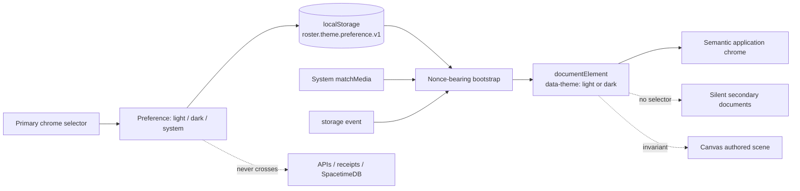
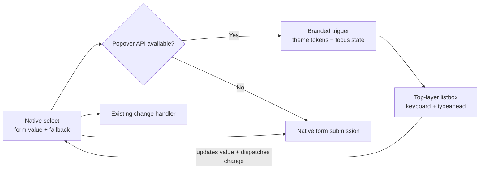

# Roster UI system

Roster's full-page surfaces use the server-rendered primitives in `src/views/agent-shell.ts`. Routes keep their domain-specific work areas while navigation, page identity, spacing, tokens, connection status, replay, and secondary navigation stay consistent. The server returns the initial shell; the generated SpacetimeDB clients own live state after boot.

## Browser theme contract

Theme is browser-local presentation state. The shared nonce-bearing bootstrap persists only `light`, `dark`, or `system` in `localStorage` under `roster.theme.preference.v1`, resolves the effective palette on `document.documentElement[data-theme]`, and never sends theme state through APIs, forms, receipts, cookies, Roster, or SpacetimeDB. The selector is rendered only in persistent primary chrome; Coding Review, generated headless forms, and other secondary documents apply the preference silently. Canvas authored scene nodes, fills, strokes, owner colors, and replay data remain invariant.

`system` remains the stored preference while `matchMedia('(prefers-color-scheme: dark)')` and cross-tab storage events update the transient root theme. CSP-protected documents pass their request nonce to the bootstrap; each complete document emits one bootstrap and one theme token layer.

## Select control contract

Primary Roster controls use the shared select projection in
`src/views/select-control.ts`. The native `<select>` remains the form authority,
so server validation, form submission, and no-JavaScript operation keep normal
browser semantics. Browsers with the Popover API progressively enhance an
opted-in `select[data-ui-select]` into a token-driven trigger and top-layer
listbox. The projection mirrors the selected value, disabled state, labels, help
text, and change events; it does not own application data.

The trigger is the only tab stop while enhanced. Arrow keys, Home, End,
Enter/Space, Escape, Tab, and typeahead follow the single-select interaction;
coarse pointers receive 44-pixel targets and reduced-motion preferences disable
the chevron transition. Option descriptions are authored as data, escaped into
the native markup, and rendered as secondary text. Pages opt in deliberately so
controls with specialized replay or navigation behavior are not silently
reinterpreted.

## Page contract

Every primary page should provide:

1. `agentSidebarHtml(...)` for the product rail and active route.
2. `agentPageHeaderHtml(...)` for a stable page name, description, status, and primary action.
3. `agentReplayBarHtml(...)` immediately below the page header. Every coordination surface supplies its own durable replay adapter to the same Start, Previous, Play/Pause, Next, Live, scrub, speed, and status contract; node runtime adapters do not own replay.
4. One full-width primary work area.
5. `agentTabsHtml(...)` for runs, team detail, evidence, activity, or timeline detail instead of a permanent right rail.
6. `agentShellCss()` after domain CSS so shared tokens and responsive behavior remain authoritative.
7. `agentTabsScript(...)` once per document. Pass the request nonce on CSP-protected pages.

Tabs preserve the current URL parameters and add `tab=<id>` when selected. Arrow keys, Home, and End move between tabs; panels use the WAI-ARIA tab/tabpanel relationship. The shared client preserves selected tabs, focused controls, open details, and scroll position while transaction deltas update panel content.

## Information architecture

| Page | Primary tabs |
| --- | --- |
| Adaptive Proof / Verified Proof | Workspace, Recent Runs, Run Ledger |
| Writer Roster | Workspace, Recent Runs, Run Ledger |
| Proof Swarm | Result & Workers, Evidence, Runs |
| Canvas Roster | Canvas, Team, Review, Activity |
| Command Center | Overview, Queue, Activity, Memory |
| Replay | Analysis, Runs, Timeline, Evidence |
| Simulation Lab | Application invariants (Coding), Campaign, Topology, Schedules |

The left rail is global navigation only. Recent runs and detailed evidence belong in page tabs so they remain available at tablet and mobile widths rather than disappearing with a hidden sidebar.

## Replay contract

Replay is page-level navigation, so it stays above forms and tabs. Missing `at` means the live head; a historical cursor remains stable while new events extend the head. Autoplay uses URL replacement rather than adding one browser-history entry per frame, pauses when the page becomes hidden, and preserves unrelated run, branch, worker, job, and tab parameters.

Every production agent page reads from the same authority while retaining domain-specific projection semantics. Adaptive Proof, Verified Proof, Writer Roster, and Proof Swarm fold generic stream receipts and durable branch rows. A Proof Swarm child worker has its own run-scoped replay. Command Center combines Roster job state, job events, and selected run receipts. Replay folds the selected stream. Canvas reconstructs patch heads from exact sanitized Canvas receipt sequence numbers. Simulation Lab uses the same replay interaction over its deterministic campaign trace. The shared component owns presentation and interaction; each adapter owns how one exact sequence projects into domain state.

Runnable coordination examples use one information architecture from `agentExampleTabsHtml`: **Workspace**, **Runs**, **Architecture**, and **Activity**, in that order. Domain-specific tabs follow the common tabs; Canvas adds **Team** and **Review**. The Architecture panel is generated from the central coordination extension registry, so topology, population, composition, artifact protocol, acceptance boundary, and enabled extensions cannot drift from Command Center metadata. Canvas run history uses the workspace-scoped `my_canvas_fleet_runs` projection; opening a historical run requires an authorized workspace membership and the transactional `join_canvas_workspace_run` reducer before run-scoped detail views become visible.

Canvas keeps a compact **Studio Floor** in the primary workspace so collaboration is visible without changing tabs. It projects active agent rows, task objectives, recent activity receipts, model routes, and last-signal age into agent cards plus a four-event handoff rail. Before the Art Director returns a plan, the client presents an explicit synthetic directing card and explains that the first structured model call is in flight. A live connection with no durable update becomes delayed after 15 seconds and a possible stall after 60 seconds; color is always paired with text. Only the concise summary uses `aria-live`, avoiding repeated screen-reader announcements from every card and receipt.

## Status vocabulary

- Neutral: Ready, Idle, Queued, Pending
- Live: Connecting, Leased, Running, Live
- Success: Completed, Certified, Passed
- Warning: Blocked, Degraded, Replay
- Danger: Failed, Canceled, Rejected

`Blocked` is reserved for a recoverable dependency wait. A terminal failure is always labeled `Failed`.

## Realtime integration

The shell embeds a short-lived workspace or run capability and removes that boot data after parsing. The browser restores its SpacetimeDB identity token, redeems the capability when needed, and subscribes only to caller-scoped, page-specific views. It waits for `onApplied` before announcing Live, then renders transaction inserts, updates, and deletes from the generated client cache.

Disconnect creates a fresh connection. The client restores identity, reapplies the same narrow subscriptions, waits for the new atomic snapshot, and swaps it in only after the replacement connection is current. Connection status is announced through an `aria-live` region.

Pages must not subscribe to every workspace row for convenience. Filter by selected stream, run, branch, or job; aggregate large worker populations; and keep the top replay cursor in exact durable sequence space. Native form submissions remain the mutation boundary for user actions and redirect back to a canonical page URL. Live delivery comes directly from the database projection, not from the HTTP response.
