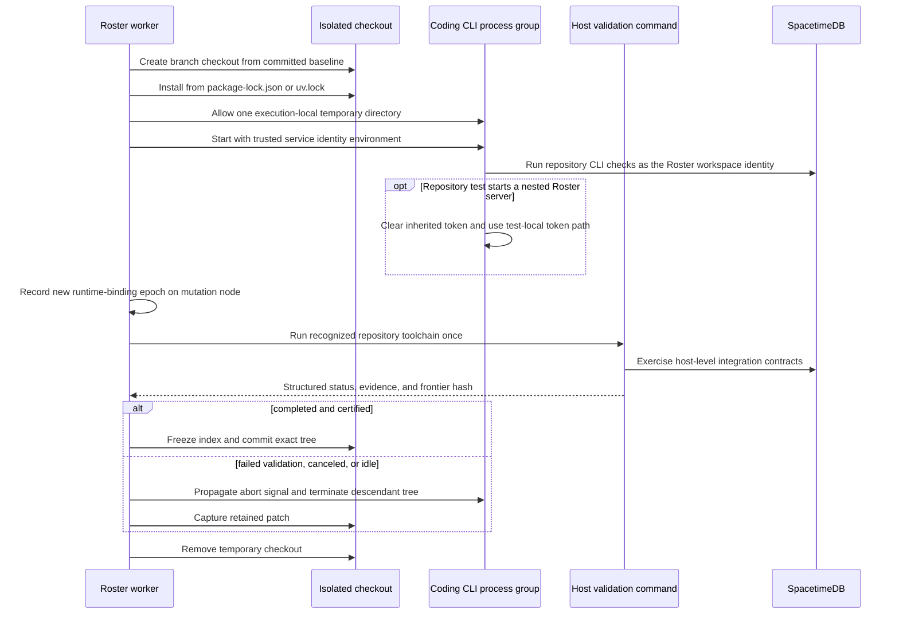
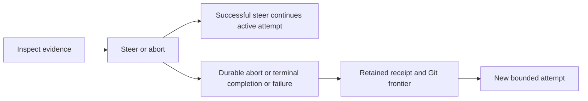
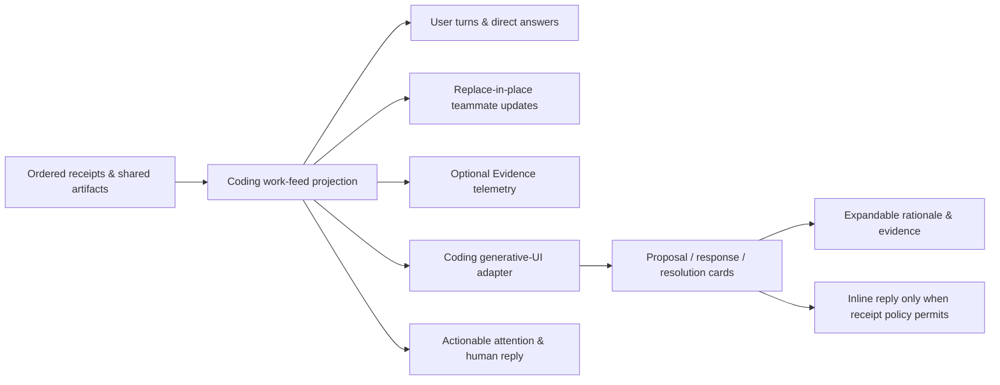
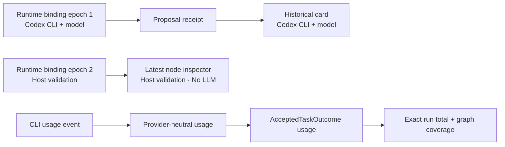
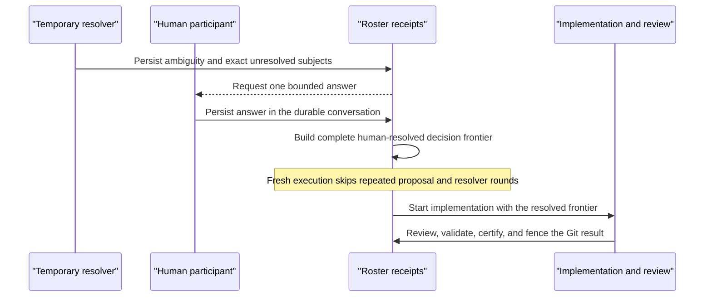
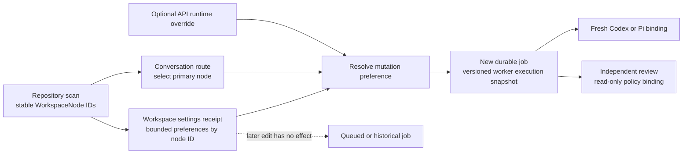

# Workspace Nodes

Roster models every participant as a durable logical workspace node. A node is
not a process, model call, worker lease, or sandbox. Those are replaceable
runtime details bound to the node for one epoch.

Every node has two separate identity fields: a stable machine `id` used by
receipts, tasks, and topology, and a human-readable `name` used everywhere the
node is presented. A profile may provide the name, a model planner may invent
it, or Roster deterministically generates one from the requested role and
ordinal. Changing that display name does not create a different logical node.
The `displayNameSource` metadata value (`profile`, `planner`, or `generated`)
keeps that provenance inspectable.

```text
Workspace node
  identity + capabilities + topology ownership
        |
Runtime binding
  Roster native | Codex CLI | Claude Code | Pi | Hermes | command | A2A | custom
        |
Execution placement
  current process | local worktree | isolated sandbox | remote service
```

This boundary lets a node keep its topology identity and task history when its
process restarts or its sandbox is replaced. The current Roster runtime-binding
receipt records each new binding with a monotonically increasing epoch. The product-facing node
projection is derived from orchestration receipts; it is not a second state
authority.

Process-local activation, provider generations, attempt leases, and bounded
draining follow the framework contract in [Runtime Lifecycle And
Extensions](runtime-lifecycle.md). These mechanisms replace compute and runtime
services only. They cannot unload receipts, accepted outcomes, shared-workspace
entries, or Git/object artifacts, and they never change logical node identity.

## Participant profiles

A participant profile is a workspace-wide presentation and capability overlay
for a logical node. It is keyed by `workspaceId` and `nodeId` and may customize
the display name, role, bio, skills, and domain capabilities. The overlay does
not create a second participant and never changes a runtime binding, worker
lease, process, session, worktree, sandbox, or model identity.

Profiles are stored in the private `roster_participant_profile` table and
published through the caller-scoped `my_roster_participant_profiles` view.
Workspace-member updates use an expected revision so concurrent edits fail
visibly instead of allowing arrival order to overwrite another change.
Room rosters, message authors, and `@mentions` consume this shared projection;
they do not maintain domain-specific copies of participant identity.

Profile edits apply to future node snapshots. Historical receipts and run
snapshots remain immutable. Custom skills are added to the bounded node task
context, while requested capabilities are intersected with the consuming
domain pack's capability catalog. Profiles never carry credentials or grant a
runtime access that the domain pack does not already support.

## Node continuity

Continuity is a first-class framework policy on `WorkspaceNode`, separate from
its runtime attachment and from any example domain. A node with `mode: "run"`
ends its private lifecycle with that execution. A node with
`mode: "workspace"` keeps a canonical workspace registration, bounded inbox,
typed commitments, private memory frontier, wake history, and lifecycle status
across execution runs. Run-scoped continuity remains the default; dynamically
materialized reviewers and other temporary topology members therefore do not
become permanent workspace participants accidentally.

Workspace continuity is episodic rather than an always-running model process.
An immutable source pointer is delivered to the node inbox, Roster admits at
most one active wake under the declared causal, frequency, and queue bounds,
and a scheduled reducer dispatches the wake through the ordinary durable job
queue. The claimed worker executes one normal task assigned to the actual
`nodeId` through `NodeRuntimeRegistry`. Runtime replacement does not change the
inbox, commitments, memory frontier, or wake identity.

Every inbox item belongs to a provider-neutral `laneId`, with optional `roomId`
and `runId` projection hints. One wake selects only the oldest waiting lane and
captures at most `maxInboxItemsPerWake` items from that lane. It never combines
independent rooms in one manifest. Delivery remains durable while another lane
is working; successful completion atomically consumes the current manifest and
admits the oldest eligible waiting lane. This gives rooms FIFO fairness without
making the inbox room-global or allowing parallel lives for one logical node.
Terminal failure leaves its bounded items pending for an explicit recovery
decision rather than creating an unbounded retry loop. An explicit Coding retry
resolves the exact failed wake as superseded before publishing its replacement
delivery, so FIFO continuity cannot replay the failed execution ID while the
failed wake and job remain immutable evidence.

Transport supersession and runtime cancellation are separate boundaries. A
transport adapter may acknowledge an obsolete request as silently aborted as
soon as a newer notification arrives, but the logical node finishes the one
manifest-bound wake already admitted before processing that notification. The
late result has no obsolete transport correlation, while its durable receipts,
commitments, and completed side effects remain ordered input to the next wake.
Notifications may enter the durable inbox while the admitted wake finishes;
the next manifest captures one bounded same-lane FIFO prefix rather than
starting parallel node lives or one model turn per arrival. This safe boundary
prevents notification bursts from repeatedly discarding planning or replaying
partially completed non-repeatable writes.

A hard runtime interrupt, such as a bounded timeout or operator cancellation,
is a terminal failure of that execution draft, not a successful wake and not
permission to accept partial output. Roster preserves the exact manifest-bound
inbox items for an explicit recovery decision. When an adapter supports
provider-native session continuation, recovery may reuse the runtime binding's
explicit `sessionId` to recover tool discovery and partial provider context.
The session remains replaceable placement state, never node identity or
continuity authority, and domains must rotate it after a settled wake and bound
consecutive interrupted recoveries.

Before a domain constructs that task, `RosterNodeContinuityPlatform` writes a
content-addressed `roster.node-continuity-manifest.v1` data reference. The
manifest pins the canonical node revision, continuity revision, wake cause,
exact inbox source versions and hashes, commitments, memory frontier, and
policy version. The framework rejects a wake task that changes the logical
node, assigns an unsupported capability, or omits that exact reference. A
domain chooses only the bounded meaning of the wake—respond, resume, review,
reflect, or another capability—and projects an accepted result into its own
message, proof, document, or scene contract.

SpacetimeDB is the production continuity authority. The private
`roster_workspace_node`, `roster_node_continuity`,
`roster_node_inbox_item`, `roster_node_wake`, `roster_node_commitment`, and
`roster_node_continuity_event` tables store ordered control state. Delivery and
optional wake request occur in one reducer transaction. The private scheduled
wake table supplies time-based activation, and wake admission is fenced by the
existing generic job lease before external execution. Completion consumes only
inbox entries bound into the admitted manifest. Caller-scoped views expose
appropriate projections; raw authority tables stay private.

The room-lane columns are an additive Roster-era schema upgrade. They remain at
the end of the two existing continuity tables with explicit empty defaults so
SpacetimeDB can preserve deployed rows. An empty lane on a historical row means
only that the older event did not record room scope; it does not merge new
deliveries or grant cross-room visibility. All post-upgrade deliveries write a
non-empty provider-neutral lane before wake admission.

Product surfaces may render `projectNodeContinuitySummary`, which contains only
lifecycle status, lane counts, active commitments, room/run identifiers, and
memory-frontier timestamps. Inbox payload references, message bodies, memory
content, and private runtime state are deliberately absent. Coding uses this
projection for room queue labels and the profile's “Current activity” card.

## Unified workspace surface

Every interactive agent page projects into the same provider-neutral workspace
surface. The framework marks the root with `data-workspace-shell` and owns the
stable `rail`, `conversation`, and `context` regions through
`data-workspace-region`. The outer product frame is marked
`data-ui-family="roster-agent"`. A domain supplies only bounded conversation
content, framework-composer fields, and contextual panels for
its artifact, runs, timeline, history, and optional specialist tools. It does
not assemble its own page navigation or duplicate participant identity.

The shell also owns the compact room bar, the 260-pixel desktop room rail, the
scrolling `conversation-feed`, and the bottom `composer-dock`. A runnable domain
uses `agentComposerHtml`; it supplies a typed message name, route, compact
options, examples, and action label. It must not supply a second primary form,
textarea, or domain-owned composer layout. The framework owns the form and
single expanding message field, Enter/Shift+Enter behavior, tools and submit
row, help text, focus treatment, responsive placement, and the stable
`workspace-composer`, `composer-input`, `composer-tools`, `composer-submit`, and
`composer-help` slots. Coding consumes the same slots and semantic token export
even though its repository adapter adds images, mentions, review policy, and
delivery presence. Domain colors remain available inside artifacts as semantic
data, not as competing product accents.

The room rail presents the current workspace roster and the accepted artifact
contract. The conversation remains visible as the primary human/agent surface;
artifact and operational detail live in the adjacent context region. Narrow
screens collapse that region behind one accessible disclosure without changing
room, run, or node identity. Registered headless and package-owned agents use
`agentWorkspaceShellHtml` directly and therefore receive the same product
surface without copying a domain stylesheet.

This is a presentation projection only. Room membership still comes from
receipts, participant profiles remain workspace-wide overlays, node continuity
remains lane-scoped, and runtime bindings remain replaceable execution state.
Selecting, hiding, or reordering a UI panel cannot claim a lease, consume an
inbox item, accept an artifact, or mutate orchestration topology.

Memory content is not stored in the continuity projection. A workspace node
with private memory owns the enforced scope `node:{workspaceId}:{nodeId}` in the
provider-neutral memory plane. Continuity records only the accepted snapshot
frontier used by a wake. Models may propose memories, but trusted acceptance
decides what becomes durable; hidden chain-of-thought is never continuity
state. Private execution state also stays out of the shared Yjs workspace.

Coding activates this framework boundary for saved repository specialists such
as `workspace.implementation` and `workspace.quality`. The specialist identity
is workspace-wide and may cross paths with more than one repository or change
conversation; repository placement remains part of each bounded task rather
than the node's identity. Coding coordinators, human participants, and temporary
run-only specialists do not acquire workspace continuity automatically.

The Coding room's public conversation projection may combine durable messages,
accepted model-authored task summaries, and bounded process-local room updates
into one social transcript. Process-local updates are presentation state only;
they do not become receipts, accepted artifacts, inbox entries, or acceptance
authority. The public row exposes only its authored text, addressed public
participants, timestamp, source class, durability, and bounded task/update
identity. Private continuity inbox bodies, scratch reasoning, hidden reasoning,
raw runtime logs, and function input/output payloads remain excluded from the
room projection and available only through their separately authorized control
planes where applicable.

Before each primary model-backed Coding contribution (direction, peer response,
resolution, implementation, investigation, or review), the graph runs a bounded
same-node announcement task. Its strict accepted summary is model-authored,
durable, addressed only to `@You`, shown verbatim to the human, and must be accepted before repository
work can start. The announcement has one attempt, a short timeout, and no
repository or room-function surface, so provider-specific optional tool use
cannot make the room appear stuck. Its explicit empty workspace grant also
runs local providers from a fresh runtime directory without preparing Git,
resuming repository-bearing provider sessions, or loading ambient provider
tools where the CLI supports disabling them. Codex announcement turns redact
the configured working directory from both runtime copies in the compiled
prompt and select a custom permission profile whose only workspace root is that
fresh directory; they do not rely on the broader legacy read-only sandbox.
Further authored updates remain
optional and bounded by the room-update policy. While work is quiet, the
conversation may show one compact, explicitly system-authored live-activity row
derived only from task state and runtime signal counts/timestamps. That row
never quotes runtime output or presents telemetry as speech from a workspace
node.

Read-only Pi executions receive authorized Roster functions through an
execution-scoped native extension backed by the same fenced mailbox as local
code mode. The bridge exposes only the projected function schemas and does not
grant shell, edit, or write tools. This lets an LLM optionally author later
visible room updates without weakening the investigation sandbox; the durable
announcement gate does not depend on it.

When a run needs attention, the public room names the exact unfinished public
task and assigned node, then classifies any cause into a bounded safe category
such as execution budget, timeout, runtime availability, or validation. Raw task
errors remain private. Accepted contributions stay visible and the recovery
action starts a fresh bounded attempt.

Public Coding progress counts only substantive specialist work. Room
announcement gates and every `coordinate` task—including the root, review
gate, finalizer, and completion seal—remain inspectable control state but do not
inflate completed, active, or total step counts. This semantic boundary
also excludes the coordinator node if historical data gives one of its control
tasks another capability. It does not hide investigation, implementation, review, validation, certification,
synthesis, or other model-specialist work.

The caller-scoped `my_coding_run_tasks_window` view is likewise a public status
DTO: it exposes only run/task/node identity, capability, status, attempt, and
update time. Task definitions, objectives, prompts, and errors stay in the
worker-authorized task view. The Coding page boot record carries no realtime
capability secret; the browser requests a short-lived, scope-checked session
capability only when it connects to the authorized room. Provider session and
sandbox identifiers, raw runtime output, and raw Git integration failures are
also excluded from the initial public Workbench document.

For a process-local room update, Roster derives the public author's `nodeId`
from the fenced task execution. The model cannot supply, override, or
impersonate that author through function input. Accepted summaries retain the
author and task provenance admitted at the trusted artifact boundary; the view
never infers authorship from display names or untrusted message text.

Saved Coding profiles created before continuity are upgraded when projected:
the current bounded Coding continuity policy is attached to existing
`workspace.*` specialists without changing their node ID or runtime. The first
post-upgrade delivery registers that exact node and policy in SpacetimeDB before
admitting a wake, so historical orchestration receipts remain immutable while
future episodes use the durable framework boundary.

Coding registration is content-aware and idempotent. A previously unseen saved
specialist starts at node revision 1; an unchanged canonical definition reuses
its current revision, while a changed capability, identity field, initial
runtime declaration, or continuity policy advances exactly one revision under
the reducer's expected-revision fence. Explicit framework registrations remain
strict and must supply their exact node revision.

After conversation routing selects a primary saved specialist, Coding writes
the ordinary versioned job payload to the durable data-reference plane and
delivers that exact reference to the node inbox. The node policy routes its
scheduled wake back to the existing `coding-agent` job handler, so the run stays
visible through the normal Coding APIs instead of becoming a shadow job. The
worker validates the reference, requires the manifest's `nodeId` to equal the
Coding primary assignment, admits the wake with its generic job lease fence,
mounts only that specialist's private memory alongside the shared room and run
scopes, and then executes the unchanged Coding task graph. The wake manifest
pins the accepted private-memory version read by that episode. Generic job completion or
terminal failure settles the wake in the same SpacetimeDB reducer transaction;
successful completion consumes exactly the manifest-bound message, while a
terminal failure returns it to the node's pending inbox.

## Breaking Roster boundary

The Roster refactor is an intentional breaking boundary. This build does not
read, write, translate, or dual-publish earlier schemas. That includes execution
envelopes, API discriminators, persisted projections, package names, commands,
and environment variables. Reinstall Roster clients, recreate development
state, and enqueue new work rather than expecting earlier streams or queued
jobs to replay. Any future migration must be explicit and versioned; there is
no implicit compatibility layer. Platform v3 uses member/node terminology
throughout its orchestration types, receipts, payloads, and registry.

Every canonical `WorkspaceNode` declares its initial runtime explicitly,
including nodes that execute in process with `roster-native`. Normalization,
planning, simulation, and dispatch reject a missing runtime instead of silently
inventing one or deriving a runtime profile from `promptProfile`. A later
runtime-binding receipt may replace that declared runtime for one monotonic
epoch without changing the logical node.

The following built-in examples use the `roster-native` runtime:

- Adaptive Proof materializes proof nodes dynamically.
- Writer Roster materializes research, drafting, review, and composition nodes.
- Canvas Roster materializes director, feature-owning artist, critic, and finishing nodes. The director publishes a versioned composition scaffold as a shared artifact before painters independently author their owned scene patches. Typed gradients, advanced strokes, and parsed path bounds remain part of the shared artifact contract rather than runtime-specific SVG behavior.

The platform dispatcher mutates topology through the storage-neutral
`TaskGraphControl`, then leases each assigned node task through
`NodeRuntimeRegistry`. The in-memory and Spacetime controls implement the same
enqueue, claim, heartbeat, expansion, acceptance, failure, and cancellation
contract. Adding Codex CLI, Claude Code, Pi, A2A, or a package-owned
runtime therefore changes the registered adapter, not task-graph, artifact, or
certification semantics. Runtime kinds are open strings; validation
belongs to the adapter registered for that kind, so extension does not require a
core edit.

Dispatch resolves the latest replayed runtime-binding receipt for the
logical node. Its runtime, profile, command or endpoint, sandbox, and session
replace the node-authored default for that execution; the node ID, capability
assignment, task history, and topology position do not change. The dispatcher
captures the selected monotonic binding epoch on each admitted task, so replay
never consults a newer placement policy for already-published work.

## Shared workspace

`SharedWorkspaceLedger` is a bounded Yjs-backed blackboard for typed entries:

- messages;
- findings;
- evidence;
- decisions;
- task and topology proposals;
- artifact references.

Default limits bound identifier, subject, reference, body, input-version,
incremental-update, encoded-state, and entry counts before data is admitted.
Callers may lower these limits per ledger. If concurrent valid entries exceed
the retained-entry bound, the ledger keeps the lowest content-derived update
IDs, so delivery order cannot choose which entries survive compaction.

Append entries coexist. Exclusive entries for the same semantic subject must
agree on content; competing values become an explicit artifact conflict. Yjs
convergence never chooses a semantic winner by arrival order.

Execution state remains private to a node runtime. Source trees belong in
isolated worktrees or sandboxes and should be published as Git commits, patches,
or external artifact references rather than edited through the workspace CRDT.

Self-improvement preserves the same boundary and runs autonomously. A Coding
`WorkspaceNode` may include one bounded `improvementCandidate` in its accepted
verified final report when exact repository and validation evidence identifies
a reusable framework weakness. The accepted run/task/node/outcome/artifact
provenance becomes the proposal identity, but the authoring node receives no
verification, promotion, rollback, topology, or certification authority.
Separate deterministic-policy authorities verify the candidate through the
Coding admission projector, warm and canary it independently, compare its
captured target baseline, and promote only passing evidence. Future Coding
admissions pin the resulting process-local generation; already-admitted tasks
retain their prior snapshot. Each pinned run records a durable deployment
observation, and two failed runs trigger rollback-forward through a fourth
independent policy authority. No operator page participates in this lifecycle;
the Monitor Inspect surface is a read-only audit projection. Rollback is a
higher runtime epoch and never deletes the accepted Coding output, Git commit,
observation, or rollout history.

In production Room OS deployments, SpacetimeDB stores bounded Yjs updates and
checkpoints. A publication is admitted only while its run, task, logical node,
lease fence, frontier, topology, catalog, and runtime-binding epoch still match.
The canonical local ledger applies the delta after that reducer succeeds.
Filesystem persistence remains a local simulation/test adapter; it is not the
production shared-state authority.

Before a task transitions from leased to running, Roster creates one
`roster.task-context-manifest.v2` value and persists it in the same authoritative
transition. The manifest records the exact repository root, branch, commit, and
worktree placement (or explicit nulls), run/task/node attempt and fence,
frontier/topology/catalog/runtime-binding versions, included inputs, artifacts,
and references, excluded unfinished dependency inputs, and the exact
`roster.task-execution-grant.v1` admitted for the attempt. Runtime execution
starts only after that transition succeeds; replay never reconstructs context
or authority from later artifacts, mutable configuration, classifier
availability, or timeline arrival order.

The execution grant is a content-addressed, reducer-admitted authority snapshot.
It binds the policy version, task definition, run/task/node/attempt/fence,
frontier/topology/catalog/runtime-binding versions, normalized function access,
workspace operations, graph-expansion permission, selected skill hashes,
projected tool versions and effects, code-mode bounds, and task budgets. A
`TaskRiskAssessment` may inform admission, but only deterministic host policy or
an exact human authorization can produce a granted `TaskAdmissionDecision`.
Denied or deferred decisions cannot mint a grant. Changing any bound field
requires a new start attempt and grant.

Function effects and shared-workspace operations are separate policy axes.
`RosterPlatformDefinition.access` selects catalog/function authority, while
`workspaceOperations` may independently select task-fenced `read` and
`publish`. The compatibility default derives publication from a granted write
effect, but domains with graph writers or evidence publishers should declare
the workspace operations explicitly so `graph.expand` never accidentally
implies `workspace.publish`, or vice versa.

Repository placement is snapshotted as run-owned context-frontier state during
atomic execution initialization. At task start, the reducer reconstructs the
manifest from that placement plus immutable task inputs, dependency
dispositions, accepted outcomes, and output references, then verifies the
caller's context and manifest hashes. A leased worker cannot choose its own
repository placement or include/exclude sets.

Room-facing collaboration uses the typed `roster.room-timeline-entry.v1`
contract. Messages, claims, artifacts, decisions, handoffs, reviews,
checkpoints, and attention are distinct durable entry kinds rather than labels
inferred from task status. Ordered graph control remains receipt/reducer state;
the timeline is its normalized projection, not another scheduling authority.

The ledger is accessed through `createRosterTaskContext`, not through an
unfenced node-global context. Each read and publish checks the active task fence
and carries exact run, task, node, frontier, topology, catalog, and input
versions. Bounded selectors let a task read only the kinds, subjects, or entry
IDs it needs. A worker whose lease or runtime epoch was replaced cannot keep
publishing through stale authority.

## Authoring

Use `defineRosterPlatform` for a reusable coordinated application and
`createRosterRootTask` to seed its canonical dynamic task DAG. The platform
definition declares named nodes, capabilities, run bounds, live worker
functions, triggers, and access policy. A coordinating task may then publish
bounded child work plus an explicit continuation by discovering
`roster::expand` through the compact catalog surface.
See [Dynamic agent platform](./dynamic-agent-platform.md) for the complete
three-graph architecture and authoring example.

### Bounded emergent peer consultation

A platform may opt into `roster::consult` with one explicit
`RosterNodeConsultationPolicy`. Eligible node turns then receive a bounded
`eligiblePeers` projection containing only durable node IDs, names,
capabilities, and role/specialty labels admitted by that policy. A node may
submit one typed `roster.node-consultation.v1` value with a stable turn key,
question, recipient node/capability pairs, `any` or `all` response semantics,
and bounded evidence references.

`all` materializes every admitted recipient. `any` selects the
lexicographically first canonical node/capability pair before scheduling; it
never races peer completions or lets arrival order choose which answer enters
the continuation.

Roster, not the runtime adapter, stamps the child task and continuation
identities. It atomically delegates the active task to recipient tasks, carries
the asking task's already-accepted dependencies into those turns, and resumes
the asking logical node with the accepted peer responses and its original
result contract. If a recipient exposes another concrete evidence gap, it may
open a further admitted consultation. The ordinary `maxTasks`, `maxDepth`,
`maxFanout`, `maxInflight`, context, token, cost, and wall-time policies bound
the resulting discussion.

An explicit continuation is the effective prerequisite for downstream tasks
that were admitted before the consultation emerged. The delegated parent stays
visible as skipped provenance, but dependency readiness, accepted outcome
context, artifact references, and replay resolve through its exact continuation
chain. This lets discussions emerge without rewriting already-persisted task
definitions or treating arrival order as authority. Duplicate expansion
identities converge through the ordinary receipt-backed graph expansion
boundary; stale leases, unauthorized recipients, self-consultation, and
continuation cycles fail closed.

The persisted run context frontier owns the repository placement captured at
admission. Each dynamically admitted child or continuation owns its exact
task-scoped frontier, topology, and catalog versions. Task start reconstructs
the manifest from those reducer-owned task rows instead of requiring a later
consultation catalog snapshot to equal the run's initial snapshot; the active
lease, execution grant, dependency outcomes, runtime epoch, and manifest hash
still fence every turn.

```ts
import {
  createRosterTaskContext,
  rosterNativeRuntime,
  SharedWorkspaceLedger,
  type WorkspaceNode,
} from "../src/sdk/workspace.js";

const node: WorkspaceNode = {
  id: "researcher",
  name: "Ada, Evidence Researcher",
  capabilities: ["research"],
  runtime: rosterNativeRuntime("writer.researcher"),
};

const ledger = new SharedWorkspaceLedger("workspace/run-1");
const context = createRosterTaskContext({
  node,
  ledger,
  fence: {
    runId: "run-1",
    taskId: "research-task",
    nodeId: node.id,
    fence: 1n,
    frontierVersion: "frontier-1",
    topologyVersion: "topology-1",
    catalogVersion: "catalog-1",
    inputVersions: { brief: "sha256:…" },
  },
  authority: {
    assertActive: async (_operation, fence) => {
      // Compare against the current durable task lease and input frontier.
      if (fence.fence !== 1n) throw new Error("stale task fence");
    },
  },
});

await context.publish({
  kind: "finding",
  mode: "append",
  subjectId: "market-demand",
  body: { summary: "Shared state is the blocking dependency." },
  references: ["source-1"],
});
```

## Agent attachments

An attachment says which agent executes a named member's turns. It does not
create a second identity, room, task graph, or artifact model. Use
`defineRosterMember` for the durable member and one attachment helper for its
initial runtime:

```ts
import {
  attachA2A,
  attachClaude,
  attachCodex,
  attachCommand,
  attachCustomRuntime,
  attachHermes,
  attachPi,
  defineRosterMember,
} from "roster/runtime";

const members = [
  defineRosterMember({
    id: "builder",
    name: "Mira",
    role: "implementation",
    capabilities: ["implement"],
    attachment: attachCodex({
      model: "gpt-5.6-sol",
      sandbox: "workspace-write",
    }),
  }),
  defineRosterMember({
    id: "reviewer",
    name: "Ari",
    role: "independent review",
    capabilities: ["review"],
    attachment: attachClaude({ permissionMode: "plan" }),
  }),
  defineRosterMember({
    id: "researcher",
    name: "Sol",
    role: "research",
    capabilities: ["research"],
    attachment: attachPi({ tools: ["read", "grep"] }),
  }),
  defineRosterMember({
    id: "challenger",
    name: "Noor",
    role: "challenge",
    capabilities: ["review"],
    attachment: attachHermes({ provider: "openrouter" }),
  }),
  defineRosterMember({
    id: "local-worker",
    capabilities: ["analyze"],
    attachment: attachCommand({ command: ["custom-agent", "--stdio"] }),
  }),
  defineRosterMember({
    id: "remote-specialist",
    capabilities: ["research"],
    attachment: attachA2A({
      endpoint: "https://agents.example.com/execute",
    }),
  }),
  defineRosterMember({
    id: "package-worker",
    capabilities: ["analyze"],
    attachment: attachCustomRuntime({
      kind: "acme-agent",
      endpoint: "acme://reviewer",
    }),
  }),
];
```

`attachCodex`, `attachClaude`, `attachPi`, and `attachHermes` map ergonomic
provider options onto the provider-neutral `WorkspaceNodeRuntime`. A command
attachment is not an arbitrary interactive shell: its executable must read one
`roster.node-execution.v5` envelope from stdin and write one versioned
`NodeExecutionResult` to stdout. An A2A attachment sends the same envelope to
its HTTP endpoint. A custom attachment still requires a package-owned
`NodeRuntimeAdapter` registered for that runtime kind.

Attachments contain non-secret, replayable configuration only. API keys,
bearer tokens, authenticated HTTP clients, and trusted child-process
environment belong to adapter construction and must never enter a member
profile, runtime metadata, binding, receipt, or model-visible envelope.

## Runtime-placement policy

An initial attachment is convenient for a fixed member. Use
`defineRuntimePlacementPolicy` when Coding, Canvas, or another roster may bind
the same durable member to a different agent by role, capability, access level,
workspace, or saved operator preference:

```ts
import {
  attachCodex,
  attachHermes,
  attachRuntimePlacement,
  createRuntimePlacementBinding,
  defineRuntimePlacementPolicy,
  resolveRuntimePlacement,
  rosterAgentRuntime,
  runtimePlacementProvenance,
} from "roster/runtime";

const builder = members.find((member) => member.id === "builder")!;
const runtimePlacement = defineRuntimePlacementPolicy({
  version: "product-room-placement-v1",
  profiles: [
    {
      id: "codex-write",
      label: "Codex implementation",
      access: ["workspace-write"],
      runtime: (context) => rosterAgentRuntime(attachCodex({
        workingDirectory: context.workingDirectory,
        sandbox: "workspace-write",
      })),
    },
    {
      id: "hermes-review",
      label: "Hermes independent review",
      access: ["read-only"],
      runtime: (context) => rosterAgentRuntime(attachHermes({
        workingDirectory: context.workingDirectory,
      })),
    },
  ],
  select: (context) => ({
    profileId: context.preferredProfileId
      ?? (context.access === "workspace-write"
        ? "codex-write"
        : "hermes-review"),
    reason: context.preferredProfileId
      ? "Saved member preference"
      : "Roster access policy",
  }),
});

const placement = resolveRuntimePlacement(runtimePlacement, {
  rosterId: "product-platform",
  rosterVersion: "3",
  runId: "run-1",
  node: builder,
  capability: "implement",
  access: "workspace-write",
  workingDirectory: "/workspace",
});
const placedMember = attachRuntimePlacement(builder, placement);
const binding = createRuntimePlacementBinding({
  node: builder,
  placement,
  epoch: 1,
  topologyVersion: "product-room-topology-v1",
});
const placementSummary = runtimePlacementProvenance(placement);
```

`placeRuntime` validates the selected profile and requested `none`,
`read-only`, or `workspace-write` access. `attachRuntimePlacement` is pure: it
changes only the effective runtime and preserves the member ID, name,
capabilities, and room history. `ResolvedRuntimePlacement` carries the roster
ID and version together with the policy version, profile ID, normalized runtime,
and selection reason. `runtimePlacementProvenance` projects those durable
non-secret fields, while `createRuntimePlacementBinding` content-addresses them
with the effective runtime, topology version, and monotonic epoch. Persist that
binding with the current Roster runtime-binding receipt before dispatch.

Resolve placement when work is enqueued or bound, then persist its non-secret
result. A queued or replayed run uses that recorded result instead of
re-evaluating a changed policy. `NodeRuntimeProfile.available` is only an
enqueue/UI hint. Also keep the Roster placement profile ID separate from
`WorkspaceNodeRuntime.profile`, which remains native provider configuration
such as a Codex profile or Claude custom agent.

## Trusted output acceptance

Runtime dispatch returns a draft; it does not itself admit that draft to a
shared workspace or certified frontier. A `DynamicTaskDefinition` declares a
versioned acceptance policy and a `result` contract. The result mode is natural
text by default; JSON is explicit, while artifact mode delegates domain
admission to a trusted policy. Only the resulting `AcceptedTaskOutcome` may
unlock an accepted dependency.

`roster.task-outcome.v2` includes the owning `runId` in its canonical identity.
This makes reducer replay idempotent inside one execution without aliasing
identical task content from two independent runs into one global durable
outcome row.

Use a task acceptance policy for bounded, idempotent domain work such as
normalizing an artifact, verifying exact ownership, stamping server-owned
identity, merging a CRDT update, and emitting the authoritative acceptance
receipt. Do not use it to move scheduling, retries, budget authority, conflict
resolution, or certification into an adapter. Canvas uses this boundary to
keep external painters from writing directly to its scene ledger.

## External execution protocol

External adapters receive a versioned, JSON-serializable
`roster.node-execution.v5` envelope. It contains a deterministic execution ID,
the logical node, effective runtime and durable binding, task binding, bounded
input, binary attachments, artifact references, the exact task execution grant,
a content-addressed execution surface, W3C-compatible trace context, result
contract, attempt number, and timeout. The
`roster.node-execution-surface.v1` value consolidates the exact skills,
authorized virtual tools, workspace input manifest, and optional code-mode/RLM
configuration supplied to that turn. Dispatch fails before adapter launch when
the actual node, task, binding epoch, skill/tool projection, code-mode bounds,
or workspace frontier differs from the admitted grant.
At the dispatch boundary, Roster normalizes the effective runtime, logical
node, optional binding, and complete request data once into fresh immutable
snapshots. The same canonical frozen runtime, node, binding, task, target,
input, result contract, trace, execution surface, attachments, and artifacts
flow through validation, execution-ID
hashing, envelope preparation, external dispatch, and native dispatch. The
execution ID hashes the exact canonical content carried by the frozen envelope.
After selecting the effective source, Roster reads one property, recursively
copies, normalizes, and deep-freezes its complete typed aggregate, and only then
reads the next property. This acquisition order also applies to array members
and to own enumerable JSON or metadata keys, so a later sibling getter cannot
mutate an earlier value before it is detached. Safe data-property definition
preserves keys such as `__proto__` without changing snapshot prototypes.
JSON objects must be plain `Object.prototype` records or null-prototype
records; arrays are also accepted, while dates, maps, sets, boxed primitives,
class instances, and other non-plain objects are rejected without invoking
`toJSON` or coercion. Unsupported, cyclic, excessively deep, and excessively
large non-JSON values are rejected at this boundary. Canonical hashing sorts
record keys into prototype-safe objects, so an own enumerable `__proto__` key
remains part of both canonical JSON and execution identity without mutating a
prototype. The original mutable request, node, runtime, binding, and nested
data objects are never re-read during that dispatch.

Callbacks are the deliberate exception to data detachment:
`validateOutput`, `invokeFunction`, `onLog`, `onModelOutput`, `onTrajectory`,
`onUsage`, the
host-only runtime-effect registrar, and the native `execute` function retain
their captured identities. The platform
abort signal also retains its identity. Each callback, the signal, and every
top-level request property is acquired exactly once. Callback and private
request authority remains absent from non-native envelopes; external adapters
receive only the canonical provider-neutral data snapshot and their bounded
execution control.
They return a versioned result with
either `status: "completed"` and an output, or `status: "failed"` and an error.
Usage and transport metadata may be included without moving budget or artifact
acceptance into the adapter.

Agent CLI adapters compile that authoritative envelope into a smaller,
provider-neutral `roster.node-prompt-context.v1` projection for the model. The
turn objective, shared target, and mode-specific output schema appear once in
the surrounding instructions, so the context JSON omits their duplicate
`task.objective`, `target`, and `resultContract` fields. It retains the original
execution schema version, node/runtime/binding identities, grant, bounded
input, trace, surface, attachment metadata, artifacts, attempt, and timeout.
This projection is only a model context optimization: execution identity,
validation, replay, runtime control, and output acceptance continue to use the
complete frozen `roster.node-execution.v5` envelope.

A domain may normalize a narrowly defined, provider-neutral draft envelope at
its result seam before validation—for example, unwrapping one exact output-key
record. That normalization must be deterministic and bounded, reject ambiguous
or extra fields, and then apply the unchanged domain result contract. It does
not turn a runtime adapter into an acceptance authority or make malformed
provider output successful.

Image inputs use `NodeExecutionRequest.attachments`, not a provider SDK request.
Roster validates and content-addresses at most four PNG, JPEG, WebP, or GIF
attachments, includes them in the deterministic execution envelope, and keeps
their data bodies out of the model-visible JSON prompt. Local CLI adapters
materialize those bounded inputs as private temporary files and translate them
to the selected runtime's native image mechanism; command and A2A adapters
receive the same provider-neutral envelope. The adapter deletes its temporary
files after the bounded turn and still receives no scheduling, artifact
acceptance, or topology authority.

Coding reloads the referenced durable conversation-image artifacts when a
mutation job starts and projects them through the same attachment boundary to
its model-backed proposal, implementation, and review tasks. It does not place
image bodies in the queue payload, and repository validation tasks do not
receive them.

A task graph may carry one bounded target contract as a content-addressed input
reference. Tasks receive only declared dependency outcomes, explicit data
references, and bounded shared-workspace reads; unrelated peer outputs do not
enter their context.

Complete `DataReference` records stay on Roster's host-private data plane,
including reference and artifact locators, URIs, producer identity, and
arbitrary metadata. Complete accepted artifact references, including their
artifact IDs and storage locators, are host-private as well. Model-facing node
execution receives deterministic, content-free input descriptors: a canonical
source and label plus `contentHash`, `mediaType`, and `byteLength`. For external
runtimes, Roster also resolves only those admitted references through the
authoritative data-reference store and projects their bounded, hash- and
length-verified JSON values as `resolvedDataReferences`. Resolution prioritizes
explicit task inputs, takes a deterministic bounded prefix, and reports
`omittedDataReferenceCount` beside the descriptors when the body count or byte
budget is exhausted; locator, producer, and private metadata fields remain
excluded. Accepted dependency artifacts are
projected to `outputKey`, `kind`, `contentHash`, `mediaType`, and `byteLength`.
The same safe input-reference projection is used for explicit task inputs,
direct dependency outcomes, and `request.surface.workspace.inputs`; native handler
context retains host-private `dependencyDataReferences`, accepted outcomes, and
`readDataReference` access.
Descriptor labels are content digests over a canonical tuple containing the
reference scope, source, and exact identity components. Roster validates label
uniqueness once across the aggregate explicit and direct-dependency reference
set before runtime dispatch, so punctuation in task IDs or output keys cannot
alias another tuple or scope.

Local agent CLI turns also receive execution-private `GIT_INDEX_FILE` and
`GIT_OBJECT_DIRECTORY` locations under their writable runtime temporary
directory. The repository's common object directory is mounted only as a Git
alternate, so concurrent model-side `git add` and `git write-tree` operations
neither contend on the authoritative run index nor write their core loose Git
objects to the linked worktree's shared Git administration directory. This
does not relocate side stores owned by Git LFS or custom clean/smudge filters;
repositories that require those stores need an explicitly supported placement.
Mutation tasks may use their private index to publish a provisional
`frontierHash` in the accepted report. A later read-only certifier consumes that
hash as the candidate frontier identifier and reviews the actual worktree
delta; it never stages files or attempts to reconstruct the identifier from its
different execution-private index. Repository-wide host validation supplies
the candidate identifier instead when that gate is selected. After graph
quiescence, Roster stages the authoritative run index, freezes its immutable
tree, recomputes the patch hash, and rejects every provisional report or
endorsement that does not match. The hash transports identity between logical
tasks; no execution-local Git index becomes shared orchestration state.

This noninterference guarantee covers the RosterPlatform reference planes and
the sanitized prepared envelopes supplied to external runtimes. It is not a
general taint scanner for arbitrary JSON deliberately supplied by a trusted
caller as task input, node metadata, or another public envelope field.

`RosterPlatformExecutionOptions.executionOptions` is the narrow customization
point for provider-neutral inner-loop settings on a node task. It may supply
only code mode, bounded attachments, trajectory observation, log observation,
and transient model-output observation. Model output crosses this boundary as
text deltas or replaceable snapshots for live presentation only; it never
becomes a task outcome, receipt, or acceptance signal. Its input is a detached
primitive identity descriptor containing
only the run, node, and task IDs, task capability, and effective runtime kind;
that kind comes from the resolved binding when one exists and otherwise from
the node-authored runtime. The descriptor exposes no node, task, binding,
runtime, metadata, input, reference, or callback object, so casting and mutating
it cannot mutate Roster authority. Roster constructs the sanitized request once
and explicitly selects the hook's permitted output fields, so the hook cannot
replace task input, workspace or dependency projections, tools, function
invocation, native execution, runtime/binding identity, task/result/trace
identity, or host-private control and data references.

Provider-reported execution usage is normalized at that same boundary. Token
input includes cache reads and cache writes; cached and cache-write counts remain
available as subsets, output includes any provider-counted reasoning, and total
tokens are input plus output. Trusted acceptance copies normalized usage into
the `AcceptedTaskOutcome`. The execution `maxTokens` allowance charges total
tokens minus provider-reported cached input. Cached input remains durable usage
evidence, remains available for provider-cost accounting, and is never rewritten
out of a task outcome or model reservation. Cache writes and output still consume
the token allowance. Missing CLI usage remains missing: Roster does not estimate
tokens or turn an unavailable historical value into zero.
Duration-only host-worker usage is retained but is not presented as model
usage.

An external runtime adapter may also report exact provider usage observed
before an interrupted execution settles. Roster normalizes that callback with
`partial: true`, while preserving the original timeout or cancellation as the
authoritative task outcome. Partial usage may settle budgets and diagnostics,
but it never converts the failed execution draft into an accepted result and
never grants the adapter scheduling, retry, or certification authority.

Provider availability is a separate, process-local admission and placement
signal. A hard authentication, authorization, quota, or billing failure blocks
new model calls for that provider until an operator resets or restarts the
process; a clear rate-limit rejection creates only a bounded cooldown. This circuit never
changes a durable attempt's snapshotted runtime binding and is never consulted
during replay. The durable run receipt records the structured failure class and
retryability, while human-facing views receive a sanitized message. Switching
providers therefore requires a new admitted attempt and runtime binding rather
than silently continuing an existing attempt on different semantics.

### Exact execution skills

`NodeExecutionRequest.surface.skills` carries at most eight exact, bounded
provider-neutral skills. Roster normalizes each skill's ID, name, description,
and instructions, computes its `contentHash`, and includes the complete skill
record in the envelope's execution surface and `executionId`. Runtime adapters may apply
those instructions inside their inner loop, but skill text never receives task
scheduling, runtime placement, artifact acceptance, conflict resolution, or
certification authority.

Reusable platforms declare their exact skill catalog with
`RosterPlatformDefinition.skills` and select skill IDs for one sanitized task
through `selectSkills`. `NodeExecutionSkillRegistry` rejects duplicate catalog
IDs, blank or duplicate selections, unknown IDs, and selections above the
execution bound. Selection sees only the run, node and task identities,
capabilities, handler kind, and effective runtime kind; it cannot replace task,
runtime, tool, context, or binding authority. The selected immutable skill
records are projected through the same envelope for every runtime adapter.
`executionOptions` remains an inner-loop-only hook and cannot inject skills.

Coding conversation planning supplies the bundled
`prompts/skills/roster-coordination/SKILL.md` this way. Local Pi conversation
placement disables ambient extensions, tools, prompts, context files, and skill
discovery; `noSkills: true` prevents uncontrolled provider configuration while
the exact Roster-supplied skill remains present in the common execution
envelope. The OpenAI structured-planner adapter applies the same bundled skill
instructions, so the coordination contract does not depend on a provider's
native skill mechanism.

### Bounded code mode, worker pipelines, and delegation

A task may opt into `codeMode` to give a local coding worker an
execution-scoped value store and the provider-neutral `roster-tool` command.
Registry-backed local code mode always replaces the task input in the
adapter- and model-facing envelope with a content-addressed handle, including
when a legacy caller requests `inputMode: "inline"`. The worker can inspect bounded slices
with `roster-tool peek` or `search`, or materialize a complete value into its
private temporary directory for local code to reduce. The client uses a
bounded request/response mailbox inside that execution-only directory, which
works in local runtime sandboxes that prohibit network and Unix sockets. A
read-only manifest and content-addressed value snapshots let more restrictive
review sandboxes use `list`, `collect`, `peek`, `search`, and unnamed
`materialize` without writing to the mailbox. Function calls still cross the
live Roster authorization boundary. The temporary client, manifest, mailbox,
and values are removed when the turn completes or is canceled.

For local code-mode execution, `NodeRuntimeRegistry` performs preparation
before adapter dispatch and retains the cleanup lease. An engine-private
`WeakMap` binds each built-in Command, Codex, Claude, Pi, or Hermes adapter
instance to its prepared executor and launch environment; neither is a method
or property on the public adapter. That executor receives only the sanitized
envelope, bounded client path, launch environment, and ordinary execution
control. Public `executeEnvelope` entry points reject code-mode envelopes, and
remote adapters fail closed until they implement an equivalent prepared
boundary. This is structural in-process separation, not confidentiality from
malicious code running in the same Node.js process. A separate-process or
container trusted computing boundary remains future work.

Authorized Roster functions remain in the function directory rather than being
projected into every prompt. `createRosterFunctionExecutionPlane` binds exactly
two virtual functions to the node task: `roster::catalog.search` and
`roster::catalog.invoke`. Search returns
bounded summaries. Invoke uses `describe`, `call`, or `pipeline` against the
exact task-local catalog snapshot, function version, provider ID, and provider
epoch returned by search. The number of prompt-visible catalog functions is
therefore constant as the live worker mesh grows.

Coding dependency resolution is a separate, explicitly authorized worker
boundary. By default it is absent from the function directory, provider
bindings, access grants, and compact catalog results. An authenticated API
override may snapshot `dependencyResolution: "registry"` only on a Codex worker
execution. That immutable authority projects
`coding::repository.dependencies.resolve` into the task-local catalog, where it
must still be discovered through `roster::catalog.search` and invoked with the
pinned catalog version, function version, provider ID, and provider epoch.

The dependency worker accepts only its fixed versioned operation token. It
validates the current Git-tracked root npm manifest and lockfile against the
validated repository execution-profile evidence, rejects newly introduced
non-registry dependency specs and lockfile host expansion, and then runs fixed
script-disabled npm argv outside the model sandbox. Its child environment is a
replacement environment containing only a bounded executable path and
run-owned npm home, cache, temporary directory, user config, and public-registry
settings; it does not inherit model, provider, cloud, Git, npm-token, loader, or
validation secrets. One invocation is admitted per manifest hash. Temporary
state is removed after success, failure, or cancellation, and the worker
returns only manifest and lock hashes, change status, vulnerability counts,
exit summaries, and duration.

This worker authority is distinct from code-mode tool context. The model sees
only the two virtual catalog functions, a compact search match, and the
context handle returned by `roster-tool call`; package bodies, npm logs, the
full catalog, provider credentials, and host environment never enter the model
context.

Pinned catalog calls allow awaited or void execution only. Durable enqueue
crosses a trigger or dynamic task boundary; it is not disguised as a
provider-pinned call whose live epoch could change before the queue wakes.

A completed `roster-tool call` stores the provider output and returns only a
context handle, so a large child result does not automatically re-enter the
parent model context. Function arguments may use
`{"$rosterContext":"<handle>","pointer":"/path"}`; Roster resolves that
reference before schema validation and invocation.

Recursive agent work uses the dynamic task DAG, not a synchronous child-model
call. An actively leased coordinator discovers `roster::expand` with
`roster::catalog.search`, calls it with the `call` operation on
`roster::catalog.invoke`, and supplies at least one bounded child and one
explicit continuation. Roster validates and commits the whole expansion
atomically, moves the parent to waiting/delegated, and releases its lease so
child work can run even when `maxInflight` is one. Node assignment, concurrency,
retries, epochs, receipts, budgets, cancellation, output acceptance, and
certification remain authoritative at that boundary.

Small deterministic transforms should not become durable tasks.
The `pipeline` operation delegates to `WorkerPipelineExecutor`, which pins an
authorized catalog snapshot and passes opaque, content-addressed
`DataReference` values directly between functions. The model receives only a
bounded final preview and reference, while step receipts retain function,
provider, epoch, input, and output identity. This is the preferred path for
compositions such as fetch → select → split → filter → join.

An agent-authored pipeline may start from exactly one existing
`initialReference` or bounded `initialValue`. A step normally consumes the
previous worker output directly. Its optional `input` template can place that
output inside the next worker's object contract with
`{"$pipeline":"value"}`, or select a JSON Pointer with
`{"$pipeline":"pointer","pointer":"/path"}`. Template depth, template nodes,
step count, per-value bytes, total transferred bytes, preview bytes, and wall
time are all bounded before or during execution.

Together these form the platform's RLM boundary: context handles and memory
search externalize long state, catalog search externalizes the worker mesh,
pipelines recursively transform opaque values, and DAG expansion recursively
adds independent reasoning nodes. The RLM plane bounds context; Roster's DAG
and shared workspace provide swarm coordination and convergence.

### Validated composition policy

Candidate generation and candidate acceptance are separate boundaries.
`decideCompositionPolicy` is a provider-neutral, deterministic reducer over
bounded metadata and immutable artifact references. Candidate bodies stay in
the data-reference, shared-artifact, Git, or object-storage plane; the decision
does not copy them into another model context.

The task declares its intent rather than asking a model to infer it from prompt
text:

- `ideation` returns a bounded portfolio with distinct mechanism sets;
- `convergent` selects the highest-ranked validated candidate;
- `synthesis` requires plural source provenance, declared source coverage, and
  retention of declared mechanism IDs.

Every mode rejects failed or missing evidence, inconclusive constraints, and
quality regressions beyond the configured non-inferiority tolerance. Synthesis
source nodes are derived from referenced candidate IDs; a composer cannot claim
unseen nodes or invent retained mechanisms. Candidate IDs break score ties, so
delivery order cannot choose the result.

The default policy bounds the frontier to 32 candidates and the ideation
portfolio to four, permits at most a one-point quality regression, and requires
75% source coverage plus 50% mechanism retention for synthesis. These defaults
are explicit and versioned. A domain may tighten them, but it must not silently
reinterpret the task or lower a saved acceptance contract after execution.

If collaboration does not clear the gates, Roster retains an independently
validated baseline. If the baseline also fails, the decision is
`no-qualified-output`; the system does not turn uncertainty into acceptance.
`certifyComposition` can bind the selected candidate and decision ID into the
certification. Existing single-proposal workflows remain valid, while
multi-candidate workflows can prove that the certified proposal was actually
selected.

The policy is exported from the SDK, so Codex, Claude Code, Pi, Hermes, native,
command, and A2A nodes use the same semantics. Runtime placement can assign a
stronger composer or validator, but model/provider choice cannot change
provenance, thresholds, fallback, or certification.

Code mode defaults to 16 function calls, 64 context values, 32 MiB total
context, 16 MiB per value, 64 KiB per observation, and 1 MiB per client
request. Roster also enforces hard ceilings of 128 calls, 512 values, 256 MiB
total context, 64 MiB per value, 1 MiB per observation, and 8 MiB per request.

The standard local adapters for shell workers, Codex CLI, Claude Code, Pi, and
Hermes all expose the same client. A Pi node configured with
`metadata.noTools: true` remains deliberately tool-free and rejects code mode.
`roster-native` code executes inside the trusted process and can call the
function directory directly, so it does not use the external client. A2A and
A2A and other remote adapters reject code mode until their protocols provide
a bidirectional, authenticated callback channel instead of a machine-local
mailbox.

### Durable memory through code mode

`createRosterMemoryFunctionDescriptors` and
`bindRosterMemoryFunctionProviders` project one provider-neutral memory plane
through the same handle transport:

- `roster::memory.scopes` lists only the exact sources authorized for the
  execution;
- `roster::memory.search`, `open`, and `diff` return bounded documents with
  stable source IDs, content hashes, and snapshot versions;
- `roster::memory.propose` records a content-addressed pending proposal with
  source references. It never commits accepted memory directly.

Coding runs bind four source classes: the complete current room, the current
run's ordered receipts, its accepted artifacts, and one content-addressed
workspace memory scope. Room, receipt, and artifact scopes are read-only.
Workspace memory accepts proposals, but an independently authorized Roster
decision must accept or reject each proposal before it becomes a durable memory
entry. Repeated identical proposals converge on one proposal ID.

The durable source owns the data. Code-mode handles remain execution-scoped and
are regenerated for every turn, so a sandbox path, mailbox, or handle never
becomes long-term identity. Exact document IDs, source versions, and content
hashes are the portable provenance. This lets a worker search long room history
or reduce many prior artifacts without putting their bodies in the prompt,
while receipts, the shared-workspace CRDT, Git, and object storage retain their
existing authority.

Memory function authorization has two layers. The function directory requires
the node's `memory` capability, `memory:read` or `memory:propose` scope, and the
corresponding read/write effect. The repository then rejects every source not
explicitly bound to that run. This prevents a worker from manufacturing a
cross-room or cross-workspace scope name.

### Canonical runtime trajectories

Codex CLI, Claude Code, Pi, and Hermes may expose their inner-loop transcripts
through one optional `roster.node-trajectory.v1` observation contract. Roster
uses the pinned `@letta-ai/trajectory` normalizer to convert each provider's
native session format into canonical records with stable source identities,
logical ordering, message/reasoning/tool-call/tool-result types, record hashes,
and normalization diagnostics. The Roster wrapper adds the exact execution,
run, logical node, task, runtime kind, and runtime-binding provenance, then
content-addresses the complete bounded observation.

Trajectory capture is deliberately opt-in through the node-runtime observation
hook. The hook should place the content-addressed observation in external
artifact storage rather than copying it into a task result or shared-workspace
entry.

The callback is an external-artifact handoff, not a receipt writer. A
trajectory cannot schedule work, settle usage, accept a task result, publish a
shared-workspace entry, resolve a conflict, or certify a frontier. Capture,
normalization, and observer failures are emitted only as bounded process
diagnostics and never fail the node task. Callers that retain a trajectory
should put the large document in object storage or another access-controlled
artifact store and place only its bounded reference and content hash in any
authorized receipt.

Roster accepts at most 16 MiB of native transcript and 4,096 canonical records
per execution by default. Trajectory's own defaults additionally bound tool
arguments and retain bounded head/tail tool results. `AgentCliTrajectoryOptions`
can lower those limits, omit tool results, or supply a trusted native-store
reader. Raw native sessions are never included in the callback.

Completed Coding executions also feed a read-only progressive trajectory index.
`roster.trajectory-rollup.v1` blocks summarize complete geometric groups of
canonical records, and each block binds its exact source version, record range,
child document IDs, child content hashes, and summarizer identity/version. A
staircase view can therefore use coarse blocks for old history while retaining
the recent or not-yet-sealed frontier as raw records, with exact non-overlapping
coverage. Search returns matching coarse blocks first; `open` drills into their
bound children or retrieves an exact canonical record.

The first Coding integration uses a deterministic extractive summarizer so
rollup construction does not introduce an untracked model call. A model-backed
summarizer may replace it only with an explicit bounded budget. Each execution
has a separate immutable scope rather than merging concurrent histories by
arrival order. Exact observation replay is idempotent, changed content under an
existing execution identity is rejected, and only the owning logical node can
list or query the scope. Later tasks by that node can discover completed scopes
during the same live run; the current manifest is not rediscovered after a
server restart even when the referenced rollup blocks use durable storage.

These blocks are retrieval indexes, never accepted memory or control state. The
canonical records remain authoritative, and neither a summary nor its index can
schedule tasks, resolve conflicts, admit an outcome, settle usage, or certify a
frontier. Persisting cross-restart scope discovery requires a future bounded
receipt or node-owned index contract rather than treating DataReference listing
or arrival order as authority.

Capture uses exact provider session identity rather than selecting whichever
session most recently appeared. Codex resolves the session reported by
`thread.started`; Claude receives an execution-derived UUID; Pi writes an exact
execution-derived session into a private temporary directory that Roster
removes after normalization; and Hermes quiet mode reports an exact session ID
that Roster exports through Hermes' own session command. Claude and Hermes use
their ordinary authenticated native stores when capture is enabled, so
operators must apply the provider's retention and access policy there as well.
Without `onNodeTrajectory`, Claude and Pi retain their existing ephemeral
execution behavior.

The dependency is pinned to an exact upstream commit because the latest
published `0.2.0` package predates the Pi adapter already present upstream.
Changing that pin requires rerunning the four-source normalization fixtures and
the full Roster verification suite.

`createCommandNodeRuntimeAdapter` is the concrete process transport for shell
workers that implement the Roster envelope protocol. It launches the configured
command directly (never through a shell), writes one envelope as JSON to stdin,
expects one result document on stdout, supports cancellation, and bounds
combined stdout/stderr. A command is an argv array, so arguments are not
interpolated:

```ts
const runtimes = new NodeRuntimeRegistry([
  createCommandNodeRuntimeAdapter({ kind: "shell" }),
]);

// The executable reads one NodeExecutionEnvelope and writes one
// NodeExecutionResult. The latest durable binding supplies this command.
```

The native `execute` callback is available only to the `roster-native` runtime.
Every non-native adapter must register a serializable `executeEnvelope` route
or an engine-prepared transport binding; an external execute-only adapter is
rejected before dispatch. The callback is intentionally absent from the
external envelope, so a CLI or A2A implementation never receives the full
trusted request or depends on serializing a closure.

Platform composition has one explicit dispatch rule: `roster-native` tasks
always use Roster's canonical native registry and adapter, while every
non-native effective runtime uses the caller-injected registry. Adapter lookup
errors propagate unchanged; the platform never catches them or silently falls
back to a different registry. Each runtime registration is an engine-private,
immutable dispatch snapshot containing the original method identities and, for
local code mode, a frozen prepared binding and launch-environment snapshot.
The registration store is runtime-private through an ECMAScript private field,
not merely TypeScript-private, and the public descriptor is the registry's sole
projection.
`NodeRuntimeRegistry.adapter(kind)` returns a dedicated frozen, null-authority
public descriptor whose only fields are the runtime kind and an optional
primitive boolean code-mode support flag; it never exposes the raw adapter,
private registration, prepared binding, or prepared executor. Registration
rejects non-function executable hooks and prepared executors, non-boolean
support flags, and invalid, dynamic, accessor-backed, or non-primitive prepared
environment values before inserting the registration. Accepted environment
data properties are copied into an inert snapshot, so later source or binding
mutation cannot change the canonical dispatch path. The primitive-only
`NodeRuntimeAdapterView` returned by `adapter(kind)` is exported from the named
`roster/runtime` SDK entry point for consumers that need the exact public view.

First-party Coding workers use the platform execution-options hook and dispatch
through their original Codex, Claude, Pi, Hermes, or command adapter. The
simulation coordinator and package-owned custom adapters likewise compose
through `executeEnvelope` and its bounded control, while built-in local coding
adapters use the engine-prepared transport when code mode is enabled. None of
these paths is relabeled as `roster-native`.

Codex CLI, Claude Code, Pi, and Hermes use provider-specific adapters because those
native CLIs do not implement the Roster envelope protocol. `createCodexCliNodeRuntimeAdapter`
translates the envelope into a bounded `codex exec` prompt and parses the final
JSON value. `createClaudeCodeNodeRuntimeAdapter` uses Claude's non-interactive
print-mode JSON protocol and unwraps its structured result. It always enables
Claude Code safe mode so ambient hooks, MCP servers, plugins, skills, agents,
and memory cannot enlarge or replace the exact Roster-projected execution
surface. Mutation nodes using `acceptEdits` also grant Claude's built-in Bash
tool inside the isolated checkout so required Git frontier commands cannot
fall into a non-interactive approval loop; `plan` and `dontAsk` nodes do not
receive that grant.
`createPiAgentNodeRuntimeAdapter` uses Pi print mode with an ephemeral session
unless trajectory observation requests one private capture session, passes the
Roster envelope as stdin, and parses the final JSON value. The standard registry
also installs `createHermesAgentNodeRuntimeAdapter`, which uses Hermes quiet
one-shot mode so stdout contains the final bounded JSON response and an exact
session identifier. Each Hermes turn receives a private ephemeral
`HERMES_HOME`; the adapter copies only its bounded `auth.json` into it, so
global memory, personas, skills, hooks, MCP configuration, and session history
cannot enter the execution surface. The private home and session telemetry are
removed after the turn.
The registry defaults Codex to `workspace-write`,
Claude to `acceptEdits`, and Pi to project approval for non-interactive local
checkout execution; runtime metadata can lower Claude to `plan` for a
non-editing reviewer. Supported metadata is:

- all four: `workingDirectory` and `model`;
- Codex: `sandbox` (`read-only` or `workspace-write`) and `reasoningEffort`
  (`low`, `medium`, `high`, `xhigh`, or `max`);
- Claude: `permissionMode` (`acceptEdits`, `dontAsk`, or `plan`);
- Pi: `provider`, `model`, `thinking`, `extensions`, `skills`,
  `promptTemplates`, `tools`, `excludeTools`, `projectTrust`, `noExtensions`,
  `noBuiltinTools`, and `offline`.
- Hermes: `provider`, `model`, `thinking` (`none`, `low`, `medium`, `high`, or
  `xhigh`), and `yolo`. Roster writes the selected reasoning effort into the
  execution-private Hermes home; ambient Hermes configuration remains excluded.

Coding mutation nodes default to Pi. `ROSTER_CODING_PI_EXTENSION_PACKAGES` resolves
installed Pi packages by their `package.json` `pi.extensions` entries and passes
those paths to the Pi runtime adapter. The curated default package set is
`@cortexkit/aft-pi`, which provides AST/search/LSP-backed code-intelligence
tools for the default Pi worker. `ROSTER_CODING_PI_EXTENSIONS` still appends
explicit extension paths, and `ROSTER_CODING_PI_ENABLE_DEFAULT_EXTENSIONS=0`
disables the curated package default. Roster also declares the Pi CLI directly,
so the executable does not depend on an extension package's transitive
dependency graph.

When Pi receives Roster functions without code mode, Roster admits an explicit
function-call budget in the task execution grant and the generated native-tool
bridge enforces that exact budget. Those turns disable ambient Pi extension
discovery while continuing to load the generated bridge and explicitly
configured, trusted extension paths.

The runtime `profile` selects provider-native configuration such as a Codex
configuration profile or Claude custom agent. Hermes profiles are selected
through their generated command alias because Hermes 0.9 does not expose a
`--profile` execution flag. An optional `command` is an executable prefix for
installations that do not use the default `codex`, `claude`, `pi`, or `hermes`
executable.

Local coding CLI discovery and execution share one trusted PATH projection.
Roster preserves the server's existing PATH precedence, prepends executable
directories explicitly listed in `ROSTER_CODING_CLI_PATH`, and on macOS appends
bounded user CLI locations (`~/.local/bin`, Cargo, Bun, Volta, npm-global, and
pnpm), Homebrew locations, and installed ChatGPT or Codex application resource
directories. Native desktop discovery and launch-time validation use the same
ordered projection: the bundled Pi runtime and explicitly configured locations
come first, the inherited PATH remains next, and the bounded macOS locations are
fallbacks. This keeps the runtime picker and spawned node placement consistent
even when a Finder-launched app does not inherit the interactive shell PATH.
Roster never sources shell startup files during discovery.
`ROSTER_CODING_CLI_PATH` accepts platform-delimited absolute directories, not
shell fragments or argument strings.

The same runtime projection also performs bounded MCP configuration discovery
for every executable runtime. Codex and Hermes are queried through their
configuration-only MCP list
commands; Claude user, local, and repository `.mcp.json` configuration is read
directly so discovery never health-checks or contacts a server. The projection
contains only the bounded server name, transport class, enabled/pending state,
and user/workspace scope. Commands, arguments, URLs, headers, environment
variables, OAuth material, and credentials are never returned to the browser or
stored in a workspace receipt. Pi reports that MCP is extension-managed because
its base CLI has no native MCP registry.

Automatic discovery is not automatic authority. A discovered MCP server becomes
callable only after a trusted provider projects its tools into the Roster
function directory and the task grant authorizes the exact function, scopes,
and effects. A failed MCP probe does not hide an otherwise executable coding
CLI; the runtime remains selectable with an explicit `probe-failed` MCP status.

Coding runs also discover at most 24 tracked repository skill manifests from
`.agents/skills/**/SKILL.md`, `.codex/skills/**/SKILL.md`,
`.claude/skills/**/SKILL.md`, and `.pi/skills/**/SKILL.md` in the exact temporary
checkout. Shared `.agents` skills are available to Codex, Claude, and Pi;
provider-named directories bind only to that runtime. Roster records bounded
name, description, and relative-path descriptors on the run-specific node, but
keeps skill contents in Git. Symlinks, oversized manifests, malformed
frontmatter, untracked files, and paths escaping the checkout are ignored.
Pi receives applicable manifests through explicit `--skill` arguments. Every
coding runtime receives the same provider-neutral instruction to read only the
listed skills relevant to its bounded task. Saved node identity is unchanged,
so an existing specialist inherits the repository's current tracked skills on
its next run without a workspace rescan.

Workspace scans also derive a content-addressed repository execution profile.
Known lockfile-backed Node/npm and Python/uv repositories stay on the
deterministic path. Node/npm prefers a declared aggregate `verify` script; when
that is absent, Roster derives only the bounded declared `lint`, `typecheck`,
`test`, and `build` gates, in that order. Other package scripts never enter the
detected profile. When no verification command can be derived and a model
onboarder is configured, the tracked rescan adds one `onboard-toolchain` task
before specialist enrichment. That task receives bounded Git-tracked build
evidence and may return only direct, allowlisted executable argv with
repository-relative working directories. It never edits files or executes its
proposal. Desktop local-only mode deliberately omits that optional model
onboarder, so scanning and deterministic manifest detection never require a
separate OpenAI API credential. An unfamiliar toolchain remains unconfigured
until the operator or a repository skill supplies a bounded execution profile.

Roster persists the resulting `roster.repository-execution-profile.v1` value in
the workspace profile. Dependency installation and repository certification
consume it later inside the isolated coding checkout. The runtime rejects the
profile if its cited evidence changes, if a working directory escapes the
checkout, or if verification changes the staged Git frontier. The repository
skill `.agents/skills/repository-toolchain-onboarding/SKILL.md` documents the
same authoring rules for coding nodes; the typed profile remains execution
authority rather than the skill prose.

When a profile is present, its content-addressed evidence paths are explicit
target constraints for implementation and remediation tasks. Ordinary changes
must keep those files unchanged and use existing scripts or direct focused
commands. Dependency, script, lockfile, and toolchain changes require a
separately reviewed and onboarded profile; Roster does not execute a host gate
whose command-authoring evidence was rewritten inside the same mutation.

Host validation configuration is a separate runtime binding from every logical
node and coding CLI environment. An operator may pair an absolute
`ROSTER_CODING_VALIDATION_ENV_FILE` with a bounded comma-separated
`ROSTER_CODING_VALIDATION_ENV_KEYS` allowlist. Roster selects only those dotenv
values, rejects loader/path-control keys, consumes the selector before model
runtime materialization, and binds the selected fragment only to the non-model
command adapter used by repository validation. Values do not enter node
envelopes, durable jobs, receipts, reports, Codex, Claude, Pi, or Hermes
environments. Without this explicit binding, isolated checkouts correctly fail
closed when a repository gate depends on untracked local configuration.

Because coding checkouts start from committed `HEAD`, deterministic execution
profiles read their tracked manifest evidence from that same committed
frontier. Dirty or untracked operator manifest edits may still appear in the
workspace's general file inventory, but they cannot author executable install
or verification policy for a run that intentionally excludes them. Rescanning
a dirty checkout therefore produces a profile valid for the actual isolated
run baseline instead of an immediately stale working-tree profile.

## Function directory and capability plane

Roster definitions may declare provider-neutral functions alongside their
capabilities. A function has a stable namespaced ID, version, capability,
description, JSON Schema input and output contracts, effects, scopes,
idempotency, and timeout metadata. `RosterFunctionDirectory` validates those
contracts and projects only functions that are both live and authorized for a
specific workspace node. Function contracts are separate from persisted
membership records, so adding them does not redefine member identity or runtime
placement.

Function providers are replaceable live placement. A provider binding names the
function, provider, and monotonic epoch, and may include a heartbeat observation
and TTL. Expired providers disappear from live catalog projections. The
directory deterministically selects the highest live epoch and uses provider ID
as a stable tie-breaker. Provider arrival order never selects execution
placement. Removing or replacing a provider does not change the logical
function ID or any workspace-node identity.

An authorized catalog projection includes only the functions and effects the
calling node may use, plus the selected live provider epoch. Its content-derived
catalog version is copied into task input manifests and pins a worker pipeline
before it starts. A stale catalog fails closed instead of silently routing a
replay through changed worker placement.

Invocation has three modes:

- `await` validates input, executes the selected provider, and validates output;
- `void` waits only for provider acknowledgement;
- `enqueue` delegates to an injected Roster scheduler and returns its receipt ID.

The directory deliberately contains no durable queue. Enqueued work must become
a normal Roster task so receipts, leases, retries, budgets, artifacts, and
certification remain under Roster control. Access defaults to read effects only;
write and external effects and required scopes must be explicitly granted.

`RosterTriggerRouter` maps direct, HTTP, schedule, queue, state, stream, and
custom events to these same function contracts. It provides bounded,
event-idempotent reactive routing without becoming a second scheduler. A direct
trigger remains a function call; an `enqueue` trigger crosses into the durable
task DAG.

This worker/function/trigger composition lets agents discover live
capabilities and lets workers pass values directly to other workers. Roster
retains authority around the mesh. Durable task expansion, leases, budgets,
retries, accepted outcomes, semantic conflicts, and certification remain
Roster transitions. Task, function, trigger, pipeline, and runtime calls carry
compatible trace context so a deployment can project them into one
OpenTelemetry trace.

Package-owned providers and runtime adapters can bridge external function
meshes without changing Roster core. Roster still emits the surrounding task
receipts, validates returned output, and decides whether artifacts advance the
frontier. Remote handlers must be idempotent and use the supplied execution ID
to suppress duplicate effects when their transport cannot cancel in-flight
calls.

## Coding agent

### Terminal-client authority

`roster coding` and its non-interactive subcommands are alternate clients for
the same server-owned Coding rooms. They may list caller-visible projections,
submit a prompt or room message, wait for an exact job, request a durable abort
or retry, inspect the certified frontier, and request guarded integration or
delivery closure. A terminal connection is not a workspace node, worker,
runtime binding, lease holder, receipt writer, or Git authority.

Execution-specific terminal commands carry the stable logical conversation ID
and an exact durable job ID. The corresponding execution ID, receipt stream,
runtime-binding epoch, branch, and worktree remain separate identities. A
terminal continuation or retry may reuse the conversation but must return a
fresh selector; the client never resolves “latest” at mutation time. Ctrl-C or
a network disconnect detaches observation only and cannot imply cancellation.

The terminal sends mutation intents through the authenticated Coding HTTP API.
It does not connect with coordinator or worker authority, call task-graph or
receipt reducers, claim or complete tasks, mutate topology, accept outputs, or
certify a frontier. Read projections do not become control state, and local
arrival order cannot select an accepted result.

For a loopback interactive session, the terminal may supervise the existing
local SpacetimeDB and Roster processes and wait for the ordinary readiness
endpoint. On first connection it reads the selected workspace projection and,
after explicit operator confirmation, invokes the same bounded initial-scan API
used by the web surface. Process supervision and onboarding convenience create
no new node, receipt, task, or Git authority; the server still validates and
publishes the complete durable workspace profile.

Likewise, `roster coding merge` is a request for the server's existing guarded
integration transaction, not a local Git command. Only Roster may compare the
recorded clean baseline and exact certified commit, advance the recorded target
ref, write integration evidence, and remove the run branch. The terminal must
not rebase, cherry-pick, force-update, push, or treat its current checkout as
delivery authority. See [Coding from the terminal](coding-cli.md) for the user
workflow and command reference.

`defineCodingAgentRoster` declares only a durable coordinator. For each objective,
`deriveCodingNodeDemands` selects a bounded run-specific population and
`materializeCodingNode` binds those logical nodes to Codex, Pi, Claude, or Hermes
runtimes.
The run records its reflection, persists each bounded member join, executes the
generated graph, and persists member departure after the frontier settles. The
exact receipt identifiers follow the current Roster orchestration schema.

The `/coding` workspace has an explicit first-connection step: the operator is
asked whether Roster should scan the repository and create its specialist team.
The bounded scan streams the complete tracked or unignored Git path index,
content-addresses that complete inventory, retains at most 20,000 representative
paths, reads up to 64 bounded Node or Python project manifests across a monorepo, and scores repository
signals to select a small
set of stable logical nodes such as implementation, quality, UI, API, data,
documentation, security, runtime, machine-learning, and experiment stewards. The selected roster is saved in
the durable Coding workspace receipt stream. Later change runs reuse those node
IDs while binding them to a fresh Pi, Codex, or Claude process and a durable
run-scoped Git branch.

The saved team is demand-sized rather than fixed at six. Implementation and
quality are always present; zero to eight additional specialists are admitted
only when their repository evidence scores above zero, with ten specialists as
the hard profile ceiling. The add-repository dialog remains visibly busy across
both scan phases, reports elapsed time, and uses an indeterminate progress
indicator because repository indexing and read-only specialist enrichment do
not have a trustworthy shared percentage.

Workspace creation pairs two bounded phases. The first phase is the fast,
deterministic path-and-manifest scan above. The second phase automatically asks
each selected specialist to inspect up to ten relevant, symlink-safe repository
files with at most 64 KiB of retained evidence through Pi and the installed
`@cortexkit/aft-pi` extension. The onboarding runtime has a fixed read-only
allowlist: file reading and search, AFT outline/zoom/semantic search, AST-grep
search, and LSP diagnostics. Shell, write, edit, replace, refactor, and package
installation tools are absent. Each independently validated structured review
contributes a specialization summary, operating instructions, learned skill
descriptors, provider-neutral tool requirements, and sparse dependencies on
other saved specialists. The deterministic scan remains roster authority; Pi
cannot invent a node ID or bypass the bounded specialty allowlist. A failed Pi
review leaves that node usable with a partial enrichment marker instead of
blocking workspace creation.

Immediately before publication, Roster validates the assembled population as
one profile boundary. Every specialist must have a unique canonical
`workspace.<specialty>` identity, its authored worker or supervisor
capabilities, the fixed read-only onboarding runtime and provenance, the
bounded workspace continuity policy, and an explicit
`coding.workspace.<specialty>` prompt profile. Prompt-facing metadata must agree
with the accepted acyclic dependency graph; complete reviews must contain
grounded instructions, evidence paths, and an evidence fingerprint. Each node
then receives a content-derived `promptFingerprint`, and the review plus those
node fingerprints receives one `publicationFingerprint`. Replay verifies both
fingerprint layers and rejects modified identity, authority, runtime, prompt,
or dependency content instead of silently accepting it. Profiles predating
these fingerprints are structurally validated and upgraded in memory.

Machine-learning and experiment specialists remain ordinary logical review
nodes. Selecting them does not authorize paid compute, dataset acquisition, or
external side effects. Checkpoints, datasets, generated media, and large metric
sets stay in object storage or another external artifact store; coding receipts
and shared-workspace entries carry only their bounded references and evidence.

Roster validates dependency proposals against saved node IDs and gives every
proposal a content-derived identity. Strongly connected components are
projected as explicit `dependency-cycle` conflicts: every proposed edge remains
auditable, and no lexicographic or arrival-order winner is silently accepted.
Only conflict-free edges enter the saved execution DAG. They are stored both in
the versioned workspace profile and on the dependent node metadata. A `ready`
conversation route keeps the planner's smallest explicitly selected mutation
and review surface; saved dependency edges do not make every upstream specialty
relevant to every narrow change. An `escalated` cross-boundary route expands the
selection through the dependency closure. In full reviewed coding plans, a
selected dependent specialist's task consumes its selected upstream
specialists' report artifacts, making the relevant saved collaboration DAG an
execution dependency rather than presentation metadata. The UI marks
conflicted profiles and affected specialists until a later rescan supplies a
conflict-free graph.

Each rescan creates a new profile revision and advances the workspace and
per-node enrichment epochs even when the deterministic repository fingerprint
is unchanged. Stable node IDs, names, task history, and runtime independence
remain intact; learned skills are merged under a fixed bound while current
Pi/AFT structural evidence may refine instructions and dependencies. Tool
requirements do not authorize arbitrary package installation. The saved node
records `onboardingRuntime: pi-agent`, `onboardingEvidence: aft-ast`, and the
curated extension package assignment. Later change execution still resolves a
fresh runtime binding from workspace policy.

An explicit rescan is workspace management, not a coding mutation. Roster gives
it a durable objective, a branchless management job, a fenced queue-worker
lease, and receipt-backed parent and specialist tasks. It never creates a Git
checkout, branch, commit, mutation review, or integration action. Roster saves
the result to a fingerprinted profile revision stream before updating the
receipt-backed workspace catalog to select that revision. Existing runs retain
their exact profile stream for historical replay; future conversations resolve
the newly selected roster. The project-rail rescan action opens that tracked
workflow in the ordinary work feed; normal conversation turns remain entirely
under the configured conversation planner instead of matching rescan phrases.
The abort signal and exact lease fence are checked after inspection, after
enrichment, immediately before saving the immutable candidate, and again before
selecting it in the catalog. Cancellation may leave an unselected immutable
candidate if it arrives between those writes, but it cannot change the selected
workspace profile.

The project-rail rescan remains an ordinary session-authenticated HTML POST with
a `303` redirect when JavaScript is unavailable. Its browser enhancement
immediately suppresses duplicate submits and navigates to the tracked run. The
run shows its submitted objective, management status, bounded per-specialist
task states, receipts, and terminal profile summary. Distinct requests while a
workspace rescan is active receive a conflict that identifies the active run;
an exact stable request retry resolves to the same job. Initial workspace
onboarding remains synchronous and retains its distinct creation feedback.
The synchronous onboarding endpoint is creation-only once a profile
exists, so it cannot race the workspace-level tracked-rescan singleton.

The branch is the user-visible source boundary. A temporary checkout of that
branch is replaceable runtime placement, not another logical workspace. The
Coding server admits distinct mutation conversations without canceling earlier
workspace work. Each execution uses an isolated worktree, while SpacetimeDB
job and task fences—not a process-local repository mutex—define mutation
authority. It commits
only a certified delta to the run branch and removes the temporary checkout
after completion or failure. A
run may start while the operator checkout has uncommitted files because its
isolated checkout is created from the recorded committed `HEAD`; those local
files are excluded from the run. Integration remains blocked until the operator
checkout is clean and still points at the recorded baseline. Failed runs retain
their patch as diagnostic evidence but do not retain an empty branch.

A mutation job has four bounded queue attempts. `ensureRosterExecution`
creates one provider-neutral execution policy and binds it to the orchestration
receipt stream. Every compiled Coding task is published as an immutable
`DynamicTaskDefinition` with its logical node, dependency edges, exact input
versions, runtime-binding epoch, handler version, acceptance policy, attempt
budget, and stable execution reference before the external runtime begins. The
job lease and task leases remain separate authorities. If a coordinator
disappears, scheduled reducers expire both leases independently. A replacement
folds the durable orchestration stream, preserves accepted outcomes, and
requeues only unfinished retryable tasks with attempts remaining. Stale workers
cannot heartbeat or accept an outcome under a replacement task fence, and they
cannot publish collaboration state or commit Git under a replacement job fence.
Diagnostic patches remain available for failures, and Git compare-and-swap
still rejects a moved run frontier.

Coding's graph wall-time is an operational stale-dispatch guard rather than its
primary resource budget or the lifetime of a durable workflow. One active
dispatcher tenure defaults to eight hours, direct platform callers may lower
or extend it with `maxWallTimeMs`, and Roster clamps that tenure to a hard
24-hour ceiling. Queue wait, inactive time, and time between replacement
workers remain outside that window, so an asynchronous workflow may live much
longer while its accepted graph outcomes, immutable values, receipts, and
shared-workspace entries remain durable. Job and task heartbeats renew their
short fenced leases during active work. Extending the dispatcher tenure does
not relax the independently enforced task count, graph depth and fan-out,
concurrency, per-task timeouts, attempts, context bytes, token budget, cost
budget, lease fences, or certification boundary.

Local simulations use one provider-neutral clock authority across receipt
timestamps, queue deadlines, job-worker renewal and abort timers, delegated
waits, and dynamic task dispatch. `VirtualClock` advances that authority
manually, allowing months of dormancy, renewal, expiry, and replacement-worker
behavior to execute without real sleeping while preserving exact receipt
times. Production SpacetimeDB reducers continue to use authoritative server
time; a client-supplied clock never decides a production lease or fence.

Every generated Coding task carries a durable
`roster.coding.task-context.v1` policy reference. The policy is selected from
the task capability, not from the model provider: Codex, Claude, Pi, and Hermes
therefore receive the same logical context projection when they perform the
same role. Proposal tasks emphasize the objective and specialization;
implementation adds accepted peer decisions and repository evidence; review
emphasizes the implementation report and live change frontier; remediation
adds review findings; validation and certification add final validation
evidence. Each policy separately records its primary sources and its complete
available sources, so emphasizing the diff never makes the diff the task's only
context.

The live delta is represented by `roster.coding.change-frontier.v1`. Its
read-only worker materializes the current worktree in an execution-private Git
index, produces an immutable candidate tree, and hashes the exact binary
full-index patch from the run's recorded baseline. It can return a compact
summary or a bounded path-selected patch. It rejects a stale baseline and never
touches the checkout's real index. Implement, review, remediation, and
certification tasks may discover this function; pre-mutation proposal and
resolution tasks cannot. The non-model repository validator receives the same
frontier as host-owned state rather than model tool access.

This is a projection boundary, not a second source of truth. Objectives,
decisions, reports, findings, memory, and validation evidence remain immutable
references; repository files and the changing patch body remain behind bounded
RLM functions. Composition passes typed handles and accepted outputs between
tasks instead of copying the full repository and conversation into every model
prompt. At commit time Roster still freezes a trusted Git tree and recomputes
the frontier hash, so an agent-reported `ChangeFrontier` is useful context but
cannot certify itself.

Coding binds the compact RLM plane to every non-validation node task. Its live
worker pack currently declares repository-confined `workspace.read` and
`workspace.search` functions, the capability-gated Git
`change-frontier.read` function, plus deterministic `json.get`, `text.split`,
`text.filter`, and `text.join` transforms. The repository workers resolve
canonical paths beneath the isolated worktree, skip symlinks during traversal,
reject path and symlink escapes, and enforce file, scan, result, patch, and
total-byte bounds. Memory workers and workspace workers share the same
task-local catalog; only live, authorized providers appear in a search result.

The Coding pipeline value store is execution-local because these worker chains
complete inside one fenced durable task. Pipeline results that must survive
task or process loss are still published through the task outcome, artifact
store, shared workspace, or Git frontier rather than relying on a process-local
reference.

`SpacetimeTaskGraphControl` projects a bounded read model after graph expansion
and task state transitions. The ordered Coding stream stores
`task.graph.projected` receipts containing task identities, dependency edges,
statuses, attempts, continuations, and expansion structure. Catalog searches,
descriptions, calls, and pipelines emit `function.activity.recorded` receipts
containing identities and byte/count metadata only—never function inputs,
outputs, or previews. The Coding Work tab uses these projections for its
Dynamic DAG and worker-plane status instead of treating the compile-time plan
as the live execution graph.

Accepted output bodies remain outside those graph receipts. A caller-scoped
server read may join an accepted SpacetimeDB task outcome and its exact immutable
`DataReference` to the host-private durable body store. That projection validates
run, task, node, outcome, artifact, media, length, and content-hash identity,
requires reference coverage for every accepted text or JSON result, selects the
accepted terminal dependency frontier instead of task-name arrival order,
applies deterministic response and pre-read work bounds, and fails closed on a
missing, ambiguous, or corrupt body. It is a read model only: it does not fabricate
`artifact.published` receipts or create another output authority.

Coding finalization uses that same canonical accepted projection with explicit
dependency roots. A skipped task resolves only through its one validated durable
continuation, every selected value retains `(taskId, outputKey)` identity, and a
repeated semantic key from multiple tasks is never selected by lexical order.
Missing, cyclic, cross-run, or ambiguous continuation evidence fails the
finalizer closed. Mutation runs then admit one bounded `synthesize` task over
the certified current frontier. Its required `coding_final_answer` contains the
model-authored human summary and the exact certified frontier hash; a native,
non-presenting completion task seals that identity into `coding_result` without
creating a second answer. Investigation runs use their existing bounded final
synthesis as the designated answer source. No internal handoff, report field,
or scripted completion fallback may substitute when that summary is missing.

### Social participants and branch rooms

Roster's agent-facing system shares a room-first presentation contract. The
Lobby and sidebar expose runnable applications as named `#rooms`, and room
identity plus visible human/agent participants remain persistent above the
room's workbench. Conversation is the navigation and continuity layer; the
primary `Work` view opens the domain artifact, while Runs, Architecture,
Timeline, receipts, and runtime details remain alternate views inside the same
social context. Proof boards, writing drafts, code review, and canvas scenes do
not become chat transcripts or one generic infinite canvas. They remain native
work surfaces attached to a continuing human-agent room.

The shared shell therefore has three stable conceptual regions: a room rail, a
live room header/conversation, and a domain workbench. Wide coding views may
render all three simultaneously; narrower or task-specific examples may place
the workbench immediately below the persistent room header and switch its
surfaces with accessible tabs. This is presentation composition only and does
not combine conversation state with artifact or execution authority.

Agent activity uses a small framework-neutral dotted-orb canvas as a redundant
visual state cue for listening, working, and completed rooms. The host retains
a text status and accessible name, reduced-motion freezes a representative
frame, offscreen orbs stop painting, and theme colors follow the existing Roster
tokens. The animation never invents presence or progress; its state is supplied
by the same receipt-derived room projection as the adjacent text.

This contract also covers operational agent surfaces. Replay is an analysis
room whose composer addresses its analyst participants; Simulation Lab is a
testing room around campaign controls and exact replay; focused child-worker
pages are child rooms connected to their parent collaboration. The Roster Lobby
is a directory and operating surface rather than a fictional participant. It
shows every application room first, then keeps dispatch, fleet, queue, memory,
and architecture controls available without making them the product's primary
mental model.

Agent examples and operational rooms compose that contract through the shared
`agentShellFrameHtml` and `agentWorkspaceShellHtml` view boundaries. A system
tool such as Simulation Lab may replace the conversation composer with bounded
campaign controls, but it retains the same top navigation, room rail, room
header, context region, responsive layout, focus behavior, and semantic action
tokens. This keeps the interaction grammar framework-owned while allowing the
center work surface to remain native to each room's purpose.

The Coding surface projects the human operator and durable agent
`WorkspaceNode`s as social participants. The coordinator remains a system node
for receipts and orchestration. It is not presented as a teammate or room
member; when coordination state needs a conversational projection, it speaks as
`Roster` with the explicit role `System Facilitator`, never as an unnamed
Coordinator or as a model-backed specialist. The participant projection uses the node ID as its
continuity key and derives the display name, handle, and role from the existing
node profile. It is deliberately not a second persisted node shape: replacing
a runtime binding, process, session, lease, worktree, or model does not replace
the person the room presents.

Every repository conversation is a durable human–agent room. The first message
creates the private `coding_room` directory row, its `coding-room` event stream,
and the immutable message receipt in one SpacetimeDB reducer transaction. Room
identity is therefore independent of whether the coordinator accepts mutation
work or creates a queue job. Informational answers, declined requests, planner
recovery, and clarification-only conversations remain discoverable in the
Rooms directory after restart.

Each repository conversation owns one durable Git branch and certified
frontier. The branch is deterministically attached to the room and starts from
the committed repository `HEAD`, including when that source checkout is
detached. Every investigation, review, and mutation receives an isolated
worktree pinned to the recorded room frontier; no two runtimes share a mutable
POSIX checkout. A certified mutation advances only the exact room ref with a
compare-and-swap and appends the next ordered room-frontier receipt. Room
frontiers are coordinator-authored input artifacts, not task outputs: they
record the Git baseline supplied to executions and therefore never claim a
producing task. A stale or out-of-band ref move becomes an explicit failure
instead of silently replacing accepted work.

Execution branches remain private certification mechanics. The UI presents the
room branch, not one child room per attempt, and terminal executions do not
archive their continuing conversation. A new execution may replace the room's
active-run pointer only after the prior execution is terminal; an in-flight
execution keeps exclusive ownership of that room projection. Investigation and
mutation executions may therefore succeed one another without changing the
durable room's identity or originally recorded kind. An optional delivery
target records the named source branch and commit that existed when the room
branch was created.
Delivery to that target remains an explicit fast-forward action; a room created
from detached `HEAD` simply has no target until the operator attaches one.
Explicit close-and-keep records an immutable disposition without merging,
deleting, rebasing, pushing, or relabeling the room frontier. Pre-Roster Coding
streams are outside this breaking migration and are not promoted through a
compatibility reducer.

Message reactions are content-addressed conversation artifacts keyed by the
conversation, target message, reacting node, and bounded emoji. They therefore
replay with the room and deduplicate repeated submission, while remaining
social context rather than an orchestration vote or acceptance signal.

Room state and presence are read models over receipts: task state may show a
participant as working, and a clarification route may show the room as waiting
for the human participant. Neither presence nor chat presentation schedules a
task, accepts an artifact, resolves a semantic conflict, certifies a frontier,
or mutates Git. Those authorities remain with Roster reducers, receipts, shared
workspace rules, and explicit integration actions.

Before a local coding CLI enters its inner loop, Roster inspects a bounded,
provider-neutral repository toolchain contract. A root `package.json` plus
`package-lock.json` selects `npm ci`; a root `pyproject.toml` plus `uv.lock`
selects `uv sync --frozen --all-extras`. Both commands are fixed argv sequences,
so repository prose never becomes executable input. Dependencies are materialized
inside the temporary checkout and never symlinked from the operator checkout.
Only the non-model host command runtime receives the already-connected Roster
service identity. Codex, Claude Code, Pi, and Hermes processes do not inherit
`SPACETIMEDB_TOKEN`, the database name, or the service URI; reducers are invoked
by the trusted coordinator around their inner-loop execution. Tests that start
a nested Roster server use a temporary token path so the test server cannot
contend with its supervisor under the same durable identity. A
durable abort is polled while a handler is active and becomes an `AbortSignal`
that flows through dependency materialization, the graph dispatcher, and the
runtime adapter. Roster rechecks the fenced lease after dependency setup,
before any model task begins. On
POSIX, Roster snapshots the CLI's full descendant tree before termination, so a
tool that creates a second process group cannot outlive cancellation and race
isolated-checkout cleanup. Each Codex execution also receives a private,
explicitly writable temporary directory through `TMPDIR` and the sandbox
allowlist. The command-scoped shell environment pins that exact value instead
of depending on user-level Codex configuration. Roster removes it when the
command settles, keeping ordinary compiler caches and temporary files out of
the Git frontier. Codex sandboxes may reject local IPC socket creation even in
a writable directory, so repository scripts invoke TypeScript with
`node --import tsx` instead of the `tsx` CLI's IPC-based launcher. Bounded
commands do not authorize background daemons: Roster closes their remaining
process group as soon as a successful root command exits, without waiting for
descendants to close inherited output pipes. It still captures output through
the final close boundary, waits for graceful helper exit, and applies a bounded
force-kill escalation before releasing the task.
When a task times out or a durable abort arrives, the planner likewise waits
through a bounded cleanup-settlement grace period before the server may dispose
the isolated checkout.

Repository-wide certification deliberately crosses one additional runtime
boundary. The model-backed mutation node remains the same logical
`WorkspaceNode`, but immediately before `validate-repository` Roster records a
new runtime-binding epoch for the checked-in `repository-validation` command.
That bounded, non-model host worker stages the model-authored working frontier
and runs the recognized repository gate exactly once in the same isolated
checkout. Node repositories run their checked-in `npm run verify`; uv-backed
Python repositories run only the Ruff, MyPy, and Pytest checks evidenced by
their checked-in `pyproject.toml` configuration and test tree. The worker rejects any
frontier mutation caused by verification, streams diagnostic output through
the normal command limits, hashes the final staged Git frontier, and returns a
structured validation report. Staging belongs here because a sandboxed coding
process cannot write the Git worktree index stored outside its checkout. This
is not a sandbox escape for model tools: the Codex inner loop remains
sandboxed. The host gate exists because integration tests intentionally
exercise local listeners, SpacetimeDB connections, npm packaging, and process
tree cancellation that a coding sandbox must deny. Failed reports remain
ordinary certification evidence and cannot produce a commit.

The verification wrapper starts its in-memory SpacetimeDB on both a random
loopback port and a run-scoped temporary data directory. The explicit data
directory is required even for in-memory mode because the standalone process
otherwise takes the default installation lock used by the live Roster control
plane. Verification therefore remains isolated without stopping or sharing the
application's durable service.



### Stuck-run diagnosis

For a run that appears stuck, inspect the durable queue status and heartbeat
age first (a heartbeat proves lease liveness only), then the current
task-graph frontier and active leased task, bounded process-local runtime logs, and the
ordered durable receipts together with the retained Git patch and recorded
baseline/accepted frontier. Logs are diagnostic rather than orchestration or
acceptance authority. Steer the active attempt or durably abort it, retain that
receipt and Git/frontier evidence, and preserve its execution and lease
identities when steering succeeds. After a durable abort or terminal completion
or failure, start any fresh bounded attempt with new execution, receipt-stream,
lease, branch, and worktree identities.



A completed run records the operator's baseline branch and commit beside the
certified run commit. Integration is an explicit human action: Roster will only
fast-forward that same clean baseline branch when it still points at the exact
recorded commit. The action is idempotent, advances the named target ref with an
exact-old-value compare-and-swap, refreshes the clean checkout to the certified
tree, records integration request/result artifacts on the execution stream, and
then deletes the exact temporary run branch. The retained patch and receipts are
the audit evidence. Integration never rebases, cherry-picks, creates a merge
commit, resolves conflicts, or pushes a remote. A moved target must be rebased
and certified again as a new bounded change. After integration, the derived UI
projection continues to recognize the run as integrated when the certified
commit is an ancestor of the recorded target branch, including after later
commits or merges; an unrelated checked-out branch never substitutes for that
target.

The Coding project rail projects a bounded cross-workspace attention list from
the durable job and integration state. Failed jobs offer an explicit safe retry;
certified commits offer **Merge certified code**. The latter is the same
idempotent integration transaction described above, not a second merge path.
Browser desktop notifications are a disposable projection of those durable
items. A safe retry records its source job and creates a new execution, stream,
lease, branch, and worktree while preserving the logical conversation and saved
workspace-node identities.

The Coding center pane is a conversation first. User turns and direct team-room
answers retain conversational presentation, and repeated delivery of the same
durable message identity renders once. An introduction names the actual saved
agents and explains how they share context, hand work across specialties, and
independently review changes; it does not personify Roster. The semantic
conversation planner classifies greetings, introductions, follow-ups, and novel
questions from the same bounded transcript and roster context; the UI does not
recognize those turns with phrase regular expressions or canned response
templates. Informational turns cannot create a branch or execution lease.
Specialist joins, peer-graph selection, receipts, and certification telemetry
stay fully inspectable in Evidence instead of becoming receipt-shaped chat.
While a long-running task is active, the browser may translate a strict,
bounded allowlist of process milestones—task start, repository inspection,
file change, validation start, review, and handoff—into replaceable live
progress posts. These posts are explicitly marked as live presentation, remain
process-local, never participate in task acceptance, and disappear when an
identical durable room message arrives. Raw stdout, stderr, command payloads,
and unrecognized provider text remain outside the conversation. Accepted peer
proposals, responses, resolutions, endorsements, and investigation findings
are different: they are the semantic
conversation, so Messages projects each accepted summary immediately as a
chronological agent-authored post addressed to the graph-connected teammate.
For a read-only investigation, each specialist finding addresses the synthesis
lead (the lead's own finding addresses a sibling investigator), and the accepted
synthesis replies to the contributing peers. This makes the evidence exchange
visible while preserving the final standalone answer for the user.
Prompts require that summary to be natural first-person room prose written to
the named recipient; JSON/report/status/orchestration narration stays outside
Messages, while exact recommendations and evidence remain in the structured
artifact. The artifact remains the durable authority and supplies the durable
message identity; its trusted accepted reference carries the bounded prose into
the transactional room timeline. Live progress uses a process-log sequence ID
and is addressed to the graph-connected downstream teammate, or to the human
when there is no downstream recipient. Names and `@mentions` use the same
participant profile trigger as durable messages. The full bounded process log
remains in the node inspector. A run-level
attention update always offers a concrete recovery path in the room—retry the
bounded run or reply with new direction—while preserving accepted contributions.
Agent names link to their detailed identity, memory, and placement view. The
compact task counts, runtime bindings, raw handoffs, and receipt activity remain
optional behind **Evidence**, so they do not displace earlier conversation.

Live progress posts form a bounded, replace-in-place tail rather than durable
history. Every realtime render restores the stable order: ordinary conversation
and accepted peer turns, live progress, run-level attention, inline human
action, then the Roster progress or recovery row. Scroll anchoring keeps the
reader's visible message fixed unless they were already following the tail.

An active or completed Coding execution projects one compact **mission bar**
between the durable room header and the conversation. It keeps the bounded
objective, current run state, branch, accepted contribution count, and only the
specialists actually assigned to the task graph visible without turning the
conversation into a dashboard. It distinguishes working, waiting, accepted,
and attention states and explains whether agents are parallel or gated by
accepted handoffs. Its primary action opens the exact plan, blocker, or
certified review.

The adjacent **Workbench** is a presentation projection with three URL-addressable
views: Plan for the durable task graph and receipts, Changes for the exact Git
frontier and delivery controls, and Team for specialist activity and accepted
work. It is open by default on desktop, collapses on narrower screens, and is
available through keyboard commands. The command palette can focus the shared
composer or open one of those projections, but it cannot claim a lease, change
topology, accept a draft, or integrate code. Merge remains an explicit
same-origin action over the exact certified commit and the existing Git
fast-forward guards.

Messages sent while agents are working are first-class room messages, not a
separate `/btw` channel. The server records the immutable conversation message
and semantically routes it against the current receipt-derived run projection.
Status questions and check-ins receive an immediate informational answer from
that live projection without creating a worker command. Messages that add,
remove, or change requested work queue a bounded Room OS control intent; the
active worker consumes that intent only at a safe graph boundary. Every open client projects the message
and its queued/consumed delivery state from caller-scoped SpacetimeDB timeline
and control-intent rows. The sender may optimistically show its own message,
but the durable row identity replaces that frame and is the cross-client
authority. Status, task ownership, handoffs, and delivery changes arrive through
the same direct subscription without an HTTP status poll. Viewer clients receive
only the control intent's room identity, kind, target run, delivery status, and
timestamps; the command payload, creator identity, and consumer identity remain
private coordinator state.

The live Coding subscription is itself bounded. Before subscribing, each
browser document or CLI watcher lifetime selects one exact authorized run and
room under a connection-specific selection ID. Selection rows are keyed by
caller identity plus that ID, expire after one hour unless refreshed, may
replace an explicitly named predecessor selection, and are limited to eight per
identity. The selection reducer accepts only a bounded 1–3,600 second lease;
browser and CLI clients request the one-hour maximum. A refresh transactionally
replaces the selection's prior scheduled expiry, while replacement and stale-row
cleanup remove both the request and its timer. Thus the private schedule queue
has exactly one row per active selection and at most eight rows per identity.
Every CLI transport generation refreshes the watcher's same random selection
ID. Session mint, connection, join, selection, stale acknowledgement, and
recovery races therefore cannot create a generation-specific cleanup chain or
consume another identity slot. Independent CLI watchers still receive distinct
selection IDs. The protocol has no final-delete operation, so a stopped watcher
leaves only that one request and one timer to expire within the bounded lease.
SpacetimeDB tags projected rows with
the selection ID and filters the exact selection before projecting at most 256
room timeline rows; the combined
selected-head view is therefore also hard capped at 2,048 rows per identity,
and same-identity tabs cannot overwrite each other's room cursor. A 512-row task window prioritizes non-terminal work before
recent terminal history; associated edge and output-reference views
have independent hard ceilings. Complete execution totals remain in the run
summary. Earlier room history is loaded only after an explicit user request,
through the private `coding_room_timeline_page_request` authority and the public
`my_coding_room_timeline_page` view. The request binds the caller, selection ID,
exact run, room, and exclusive sequence cursor; the view rechecks current exact-run
membership, returns one stable fixed-size page, and filters foreign runs and
rooms before projection. Both unfiltered public timeline views hard-cap their
server-side result at 256 rows, so SQL filtering cannot first materialize an
unbounded caller history. The browser deduplicates immutable row IDs, reveals
history in 20-row UI increments, clears its page cursor on reconnect, and
returns to the bounded live window instead of silently rebuilding an unbounded
cache. The CLI continues to subscribe only to that exact bounded live window
and refreshes its watcher-lifetime selected head after grant renewal or reconnect.

The host job worker defaults to ten concurrent leased jobs (`JOB_CONCURRENCY=10`)
and keeps the existing bounded range of 1–256. This host-level capacity is
separate from each run's task-graph `maxParallel` limit: increasing it lets
independent rooms start promptly without weakening per-run topology, budget,
or safe-handoff bounds.

A delegated graph task is not terminal merely because it published children.
It becomes a durable `skipped/continued` parent only after its recorded
continuation reaches a terminal disposition, and that settlement propagates
transitively through nested continuations. A domain coordinator may mark the
execution completed or failed only after every task, including those parents,
is terminal. The correlated job wrapper finalizes only after that execution
transition succeeds, so the job and realtime execution projections cannot
silently disagree.

The explicit reconciliation reducer applies the same proof to historical
quiescent executions. Its only terminal-state exception is the legacy case
where an expired wall-time schedule canceled an otherwise unsettled historical
continuation during migration; it still requires the repaired outcome to match
the complete task evidence.

If a room message commits after the execution's last safe boundary, Roster
leaves its control intent pending without a closed-run target and supersedes
only the terminal job wake-up command. A later bounded continuation can claim
the same durable intent; the message is neither injected mid-token nor stranded
on the completed job.

Proposals, responses, resolutions, endorsements, and final results remain
distinct evidence views when they change what the user needs to understand or
do; human questions remain conversational because they require a reply. This
is a presentation over the ordered task and artifact receipts, not a second
chat authority. Task
dependencies, Git-frontier agreement, budgets, and certification remain owned
by Roster.



The cards use the provider-neutral [`GenerativeUiCard`](./generative-ui.md)
presentation contract. Coding maps validated collaboration artifacts into that
contract; the shared renderer does not parse receipts or infer authority.

Each accepted execution also contains one compact run-progress message. It
is replay-derived from the completed conversation message and route, ordered
receipt timestamps, canonical tasks, collaboration frontier, certification,
integration handoff, and the correlated SpacetimeDB job lease. Optimistic
browser frames, partial model deltas, provider names, process logs, and poll
arrival never affect it. A message is accepted only after both its validated
message and durable route exist; clarification is therefore accepted without
requiring a job or lease.

The projection reports `Working`, `Waiting for you`, `Ready to merge`,
`Finalizing delivery`, `Merged`, `Completed`, or `Needs attention`.
Working includes the current collaboration phase, canonical completed/total
task count, every specialist owning a running task, and the latest meaningful
Roster-authored durable update. Job heartbeats prove lease liveness, while the
separate runtime-log stream emits a transport heartbeat every fifteen seconds.
The browser uses that signal only to refresh a visible “worker active” clock;
it never converts a transport heartbeat into a chat message or control event.
An overdue lease remains nonterminal with bounded recovery
pending until the scheduler durably requeues or fails it. Waiting is reserved
for a persisted clarification route or an exhausted ambiguous peer resolution;
other terminal failures explicitly state that no human answer is requested.
Certification is not delivery completion. While the validated Git handoff is
still being prepared the projection says `Finalizing delivery`; once the exact
commit can be applied it says `Ready to merge` and presents the explicit merge
action in the conversation. Only an integrated commit or a certified no-change
result is terminal `Merged` or `Completed`. A failed or canceled execution
wrapper after certification becomes actionable `Needs attention · merge
blocked`; a completed wrapper without validated commit and baseline metadata is
`Needs attention · merge unavailable`.

The single progress message is a stable, atomic, polite status region. It shows
the current human-readable milestone as its message and a short step/participant
summary beneath it. While the run is active, a visible live clock advances once
per second from the newest runtime-stream heartbeat or durable execution, task,
timeline, or output timestamp, so a receipt-quiet model call still looks active
rather than frozen. The clock is
disposable presentation and is hidden from assistive technology; the polite
status region continues to announce only semantic milestones. If the direct
subscription pauses, the same clock changes to the connection state instead of
falsely claiming fresh work. Detailed latest-receipt and lease diagnostics, the report,
the complete ordered receipt list, exact task identities, and runtime logs
remain available on the Work surface. Its live announcement changes only with
semantic state, meaningful durable content, or a coarse quiet-time bucket, so
realtime heartbeat deltas do not announce transport-only ticks. A temporary
connection loss edits the same message to `Reconnecting` and the next successful
projection clears that state without duplicating the message. Refresh preserves
an exact conversation scroll position when
the reader is not following new receipts, focused controls through stable focus
keys, composer value/selection/focus and queued submissions, selected-node
inspector state and scroll, and process-log scroll/follow mode.
The run panel is only marked busy during the synchronous projection swap; a
hydrated Working projection remains non-busy so its descendant polite status
region is announced while work continues. Open receipt, result, and delivery
details are restored by stable semantic keys alongside keyboard focus.
The progress message is visibly authored by `Roster · System Facilitator`, so
a teammate's projected handoff to `@Roster` has an obvious conversational
acknowledgement rather than appearing to terminate at an anonymous “Team
status” record.

Ephemeral browser feedback follows the same one-status rule. Sending a message
uses one delivery label and one Roster working row whose text is replaced by
route progress or streamed answer content. Repository browsing uses a visual
skeleton with one polite `Loading folders…` announcement, and reconnection
edits the durable progress row to the concise `Reconnecting…` state. These
states are disposable UI feedback; they never create orchestration receipts or
additional workspace-node authority.

Desktop-local conversation runtimes expose provider text deltas through the
same process-local observation boundary. Because their authoritative planner
result is structured JSON, the conversation projection incrementally decodes
only the top-level informational `answer` string into that working row. Routing
fields, partial JSON, reasoning, tools, and diagnostics never enter the room;
the validated completed route and durable message still replace the live row.

Certified runs link to a read-only review page that renders the bounded stored
patch by file and pairs it with explicit certification, task-completion, commit,
and branch-handoff state. The review page is a projection; it does not alter
receipts, branches, or the accepted frontier.

Certified Git handoffs also link to a deterministic Markdown collaboration
record. The bearer-protected API endpoint and normal local-operator browser
download route use one bounded renderer. The job selector pins job provenance;
the loader captures the current durable receipt chain once and folds state from
that exact prefix. It separately resolves a caller-scoped, independently validated
accepted-output projection for the selected execution, so durable proposals,
responses, resolutions, and endorsements do not disappear merely because their
bodies were intentionally excluded from graph receipts. The record identifies
the observed receipt count and accepted-output snapshot count and is a projection at
request time, not an immutable completion snapshot. Later durable receipts or
accepted outcomes, including integration receipts, may produce a newer record
for the same run and selected job. No persisted export, archival `at` contract,
or new schema authority is introduced.

Selected-job objective, status, branch, commit, and result remain separate from
current-head collaboration state. The projection preserves semantic peer phase
and plan order, keeps selected logical nodes distinct from effective
runtime/model bindings and binding epochs, and includes only allowlisted peer
contributions, tasks, recorded resolution, certification evidence, structured
integration state, Git identity, and selected-job result fields. The recorded
resolution is not presented as the authoritative shared-workspace conflict set.
Raw logs, patch or file contents, environment data, CRDT payloads, arbitrary or
unrecognized bodies, raw reports, and credential-shaped secrets do not enter the
projection. Job completion controls eligibility but is not certification;
endorsements and certified-frontier receipts remain the evidence while task
status is context. Field, collection, section, and total UTF-8 limits have
stable visible truncation markers, and authored text is normalized, redacted,
and Markdown/HTML escaped.

The main Coding workspace projects that same bounded state as a desktop code
workbench: the saved repository profile and recent runs form a persistent
project rail, the conversation remains the working surface, and run evidence
stays independently scrollable. Large repositories are represented by their
bounded scan profile rather than by copying a source tree into the UI.
The direct Room OS subscription uses a short-lived capability for one exact
execution. The same-origin Coding page issues an HttpOnly session bound to the
control workspace, repository workspace, conversation, job, execution, and
room; the browser redeems it only into exact run membership. Coding subscribes
only to bounded `my_coding_*` DTO views. Those views count unique collaboration
proposal, response, and endorsement output keys without exposing reference
bodies, task objectives, outcome bodies, manifests, or general workspace rows.
The page authority is independently expiring and revocable. Grant renewal is
scheduled before the earlier of the viewer-grant expiry and page-session expiry,
with a safety margin, and every successful renewal rotates the page token.
`/coding/runtime-logs` and `/coding/room-updates` require that exact page scope
at admission and reauthorize it before every snapshot, event, and heartbeat;
missing, expired, predecessor, operator-token-rotated, foreign, and cross-run
authority terminates or rejects the stream. When renewal rotates a still-active
room-update stream, its clean authorized EOF is a reconnect boundary: the
browser opens one generation-fenced replacement under the rotated page cookie.
Clean EOF after the exact job/run becomes terminal. Exact-authority HTTP
rejection (including missing, expired, predecessor, or operator-rotated scope
reported as 401), abort, replacement, and disposal cannot create a retry timer;
a transient server response such as 503 remains eligible for bounded retry. Runtime-log and
room-update bodies are therefore absent from initial HTML and arrive only after
this Workbench authorization succeeds.

The project rail presents the stable saved specialists. Coding nodes use the
display name and role stored in their repository profile; the UI never remaps a
logical node to a built-in person. The coordinator and human
participant remain available to orchestration, but only the human and actual
agents appear in the room roster. Coordinator-authored projection updates render
as messages from `Roster · System Facilitator`, never as a specialist or agent
speaker. The run inspector labels its smaller list `Active for this run` so dynamic task
selection is not mistaken for a second saved team. Historical role-only names
are displayed as recorded without rewriting receipts.

Every visible Coding agent keeps a compact, clickable `Agent · Model` projection
beside its name in the conversation and inside the participant profile. The saved
project rail shows the configured runtime preference for that logical node;
active-run, coordination, and realtime-cast rows use the dedicated public active
binding DTO (`runtimeKind`, model, and reasoning effort), while historical
messages retain the binding that authored the artifact. These are replaceable
execution facts, not node identity. The DTO omits raw runtime JSON, session,
sandbox, placement, environment, and credentials. A saved preference never
overrides an active binding. A missing binding or provider model is
omitted from conversational and cast rows instead of being rendered as a
placeholder or inferred from another node. Exact runtime details appear after a
binding exists.

Names, `@mentions`, and the compact execution chip all open the same global
participant profile. Coding profiles add one agent/model editor for saved
specialists. Saving it appends the existing versioned workspace setting for
future task assignment; it never mutates an active binding, queued execution
snapshot, or historical message. Other open clients observe the workspace
receipt directly through SpacetimeDB and update their profile and chat
projections without polling. The Repository menu retains the same form as a
secondary administration surface rather than becoming another settings
authority.

The project rail can connect multiple local Git repository roots. A
receipt-backed catalog stores one deterministic entry per canonical root, while
each repository keeps an independent orchestration profile stream, specialist
roster, recent-run projection, worker session key, and Git frontier. The
original server repository continues to use its selected Coding workspace
stream; newly connected repositories use workspace-keyed profile streams.
Catalog entries never turn repositories into
workspace nodes or merge their source trees. Coding jobs carry the selected
workspace ID, canonical repository root, and exact profile stream, and
same-repository execution remains serialized while separate repositories may
run independently.

The Coding inspector projects the selected repository's current branch, HEAD,
working-tree state, origin, upstream divergence, run branch, recorded target,
and certified handoff state in one Git control surface. Review and local
fast-forward actions are scoped to that repository and exact recorded job.
Adding an existing local clone immediately gives it the same independent
projection; Roster does not clone repositories or publish remote branches from
this surface. Remote pushes and provider-side pull-request merges remain
explicit operator actions outside the orchestration runtime.

Each Coding run agent row opens a node-scoped inspector over the same bounded
status projection. It keeps the durable logical node separate from its effective
public runtime and model identity, assigned tasks, and the
latest ordered receipts authored by that node. One same-origin bounded NDJSON
response streams control-character-sanitized Codex, Claude Code, Pi, and Hermes
stdout/stderr into the selected node's process log. Worker rows expose that log
directly while the Room OS subscription continues to project durable task and
timeline state. The diagnostic response is not an SSE, transcript, receipt, or
orchestration authority. These process-local diagnostics are kept
in a size- and entry-bounded memory store and disappear on server restart; they
are not receipts, replay state, shared-workspace entries, certification evidence,
or Git artifacts. The receipt log remains the durable run record.
Each connected diagnostic client also has an independent entry and encoded-byte
pending budget. A blocked writer coalesces duplicate sequences and retains only
the newest deterministic suffix; disconnect and authority loss clear the buffer
and unsubscribe the observer. A slow inspector therefore cannot turn the
process-local store's bounded producer into an unbounded per-response queue.

The Messages coordination card uses the direct Room OS node, task, and
runtime-binding projections rather than retaining its initial server-rendered
counts. It keeps the primary coding agent and model visible, updates
working/waiting/done state as transactional rows change, and shows each named
node's effective runtime and model without requiring the operator to open the
technical inspector. Historical rows fall back to the node's declared runtime
when no current binding row remains; this changes presentation only and does
not make the browser a runtime-placement authority.

During graceful shutdown, the server stops claiming work and rejects new HTTP
mutations, but keeps read-only pages and status projections available while its
already-leased handlers drain. It releases the HTTP listener only after those
handlers settle, so the same process continues serving the bounded logs it owns
instead of showing durable Working state from one process beside an empty log
store from another.

Job workers validate every lease renewal and abort the runtime signal on
definite loss or at the last confirmed lease deadline. Transport failures do
not extend that deadline. An obsolete attempt can only record a terminal
failure through its original fence. Runtime adapters must honor the abort
signal to stop their inner loop; reducers remain the authority for final writes.

Task graph projections expose optional `retryAt` epoch milliseconds on pending
retries. A scheduled retry is live work. Dispatch waits for bounded eligibility
updates within the execution wall-time limit; the durable scheduler promotes
the task. Process-local control and snapshot restore accept the same `Clock`
used by dispatch, allowing deterministic retry tests and simulation replay.
Determined simulations advance one logical millisecond after each ready batch.

Cancellation rejects late handler results and acceptance hooks before outcome
admission. Graph expansion also checks interruption before its fenced mutation.
Explicit model-call reconciliation records incurred cost and tokens even when
they exceed the budget, releases the reservation, and exhausts the execution.
Repeating the exact settlement is idempotent; changing it is rejected.

HTTP authentication is shared across pages and APIs. Desktop's native shell
bootstraps a launch-specific local session; domain routes retain their exact
workspace, job, execution, and realtime-page authority checks. See
[Production Architecture](production-architecture.md#http-access).

Runtime/model labels in historical work-feed cards are resolved from the latest
runtime-binding receipt that precedes the artifact, not from the final run
projection. A later repository-validation binding therefore cannot relabel an
earlier Codex proposal as `Shell`. Product copy names that non-model runtime
`Host validation · No LLM`; model-backed cards show both the coding harness and
the selected model, for example `Codex CLI · GPT-5.6 Sol · High reasoning`.
The agent inspector still shows the latest binding because it describes current
placement.

The run inspector totals only provider-reported usage from completed Codex,
Claude Code, and Pi tasks. It shows receipt coverage beside the exact total, so
a mixed run is visibly partial and a pre-usage historical run says that usage
was not recorded. Cached input remains included in the visible input and total
counts.



Coding conversation turns now use a provider-neutral bounded envelope before a
mutation job exists. UI messages, API calls, agent messages, and future PR or
review comments share the same source, external identity, revision, tag,
mention, reply, and author fields. Message identities are content-derived, so a
retried webhook converges while an edited external comment is a new revision.
Open namespaced tags such as `domain:data`, `intent:clarification`,
`risk:migration`, and `source:pr-comment` can evolve without adding a closed
routing table.

Every durable conversation envelope receives system-owned provenance tags
before caller or model tags are admitted: `source:*`, `author:*`, and, when
applicable, `routing:mention`, `thread:reply`, and `content:image`. Durable
routes likewise receive `routing:roster`, `disposition:*`, and an execution or
clarification intent. Peer turns expose deterministic projection tags such as
`protocol:agent-turn`, `turn:question`, and `response:all`. These tags support
timeline display, filtering, and diagnostics only. They never identify the
authoritative recipient, create topology, grant mutation authority, or replace
the validated author/recipient node IDs on the turn and task binding.

The composer presents saved specialists as optional `@name` suggestions.
Typing `@` filters the roster in place; pointer selection or Arrow keys plus
Enter/Tab inserts the stable short handle at the current caret, and Escape
closes the suggestion list without changing the draft. An explicit mention is
included in the chronological model context alongside the
saved node ID, given name, role, and specialty aliases. Mentioning a specialist
is therefore routing input, not manual topology construction or a hidden
post-planner mutation. The coordination skill must return the mentioned saved
node when relevant, and the normal Roster boundary validates the exact returned
selection.

The workspace operator is also a logical participant: `human.operator` /
`You, Workspace Participant`. It owns clarification, decision, and authorization
capabilities and can be selected when product intent, missing context, or human
authority is required. It never becomes the primary mutation node, receives an
executable task, or holds a worker lease. New workspace streams persist this
member through the current Roster membership schema. Pre-Roster membership
payloads and agent-named configuration receipts are outside this breaking
contract.

The loaded structured model acts as `CodingConversationPlanner`. It sees the
bounded transcript, saved repository roster, and bounded read-only repository
context, then proposes `ready`, `investigating`, `informational`, `operational`,
`needs_clarification`, `escalated`, or `declined`, plus tags, questions, an
optional direct answer, and a small node selection plus one primary node.
Executable routes must also
return typed `reviewMode` (`fast` or `reviewed`) and `validationScope`
(`focused` or `repository-wide`) decisions. An `informational` route covers
greetings, roster and capability questions, and repository facts already
present in the bounded context. Those turns answer directly without selecting
a node, enqueueing a job, taking a worker lease, or creating a Git branch.
Clarification is reserved for actionable
changes whose missing fact, choice, or authority would materially alter the
implementation. Roster validates the proposal against the saved node IDs and
population limit and retains implementation authority. A review-only
specialist cannot be silently converted into a mutation worker: the returned
primary must be an explicitly selected saved node with mutation capability, and
reviewed mode must explicitly select a distinct saved review-capable node.
Roster never inserts a generic worker or reviewer. A clarification is
persisted on the run stream without enqueueing a job, taking a worker lease, or
creating a Git branch. An answer is appended to that same conversation and
replanned; only an actionable route becomes a coding job.

An `investigating` route is executable but strictly read-only. It is required
when answering would mean opening files, searching code, tracing behavior,
comparing responsibilities, or collecting evidence not already present in the
conversation context. Roster selects one saved synthesis lead and the smallest
relevant peer set, materializes parallel `investigate` tasks, and runs a final
evidence-synthesis task on the lead. Investigation runtimes receive read-only
placement: Codex uses its read-only sandbox, Claude uses plan mode, and Pi gets
the curated read/search/AFT/LSP tool set with no Bash or approval mode. The
graph may run for the ordinary long Coding wall-time bound, but every task is
pure and bounded. The host uses the current checkout directly and does not
create a run branch, install dependencies, prepare a Git frontier, commit,
integrate, or expose a write effect. Its accepted `final_report` contains a
standalone answer plus concrete repository evidence and visible limitations.
A short “do it” after proposed repository research inherits this disposition
and starts the investigation instead of producing another coordination answer.

An `operational` route is the same no-job authority boundary for requests to
pull the current checkout, restart or rebuild the host development process,
refresh the browser, or otherwise control the environment rather than change
tracked repository content. The conversation context declares host-process,
browser, and current-checkout authority explicitly. When those capabilities are
`none`, the direct answer states the limitation and the smallest accurate next
step; it never claims the operation ran. A short confirmation inherits the
preceding proposed action, so “can you do it” after restart/refresh guidance
cannot be reinterpreted as an escalated repository mutation. Merely mentioning
UI, runtime, build, deployment, or data in an explanation does not justify
specialist dependency expansion; the requested repository effect itself must
cross those boundaries.

Direct informational answers use the same chronological transcript and saved participant
identity as planning, but are written as an ongoing teammate conversation:
they lead with the useful answer, prefer one cohesive paragraph or concrete
analogy, and avoid routing narration and serial status-report prose. A direct
saved-node mention produces a durable reply authored by that node; Roster does
not relabel the answer as its own. Corrections such as “that is too abstract”
remain in the transcript and cause the next answer to replace the prior
explanation at the requested level. The default target is two to five natural
sentences, with lists reserved for genuinely scannable material.

A direct informational reply may create one bounded conversational peer
handoff when the replying saved agent emits exactly one explicit `@GivenName`
for another saved agent. Roster persists the second agent's reply as a normal
content-addressed room message linked to the first reply; it does not create a
task, branch, worker lease, or recursive mention chain. Plain names remain
prose, multiple or self mentions do not dispatch, and a failed peer response is
reported in the room with a direct retry instruction instead of disappearing.
This makes the visible `@mention` contract match ordinary chat expectations
without letting prose or the browser construct orchestration authority.

An informational route may also select a bounded ordered list of saved
non-human nodes when the semantic conversation model determines that the human
explicitly asked several participants to answer individually. Roster invokes
each selected participant sequentially, persists each model-authored reply as
a distinct durable room message, and streams author changes as distinct chat
rows. The model must mark that authority with `routing:participants`; without
that explicit route tag, informational node selections normalize away. The
selected order is model output validated against the saved roster;
it is not derived from phrase matching or hardcoded introduction text. This
social fan-out creates no repository task, branch, worker lease, or recursive
peer chain, and an unavailable participant fails visibly without suppressing
the remaining bounded replies.

Local conversation placement normalizes only disposition-owned null fields
(for example, an actionable draft's forbidden user-facing `answer`) and then
applies the full Roster validator. It never invents an executable primary,
reviewer, or coordination policy. A rejected draft receives one bounded retry
through the same selected runtime with the validation failure attached to that
execution attempt.

Authentication, authorization, provider, quota, and rate-limit failures are
not contract-correction opportunities, so Roster does not spend the second
attempt on them. If the configured conversation planner is missing, its
runtime is unavailable, or both bounded contract attempts fail, the turn fails
visibly. Roster persists an operational recovery route but does not manufacture
an executable route, answer, node selection, job, or branch. Bearer-protected
Coding API calls receive a structured `503` response with
`code: "planner_unavailable"` or
`code: "conversation_runtime_unavailable"`, a retryable flag, conversation and
trace identities, and the persisted recovery route instead of a plain server
error. The already-recorded user message remains durable; retrying that
conversation re-runs planning and supersedes the recovery projection when a
valid route is accepted.

The Coding right inspector and work feed derive their `Human action` projection
from those durable routes and from validated collaboration resolutions only. A
genuine clarification lists every exact pending question and the recorded
rationale. After peer proposals, dependency-routed responses, and the temporary
resolver are exhausted, an ambiguous resolution lists every exact unresolved
subject, reason, and candidate summary. Those two states alone expose `Reply`.
The inspector action focuses the persistent composer, while the work feed
renders a native inline reply form from the shared generative-UI contract. Both
submit through the same conversation ingress and neither manufactures authority
or a message. Proposal and peer-response questions stay peer-to-peer
conversation content and never create a human request.

An ambiguous value is actionable only when its artifact was authored by the
planned `resolve-collaboration` task after all of that task's proposal and
response dependencies were published. Receipt order also must show that the
resolution follows the latest human message and conversation route. A later
reply, clarification, informational route, or failed continuation supersedes the
old ambiguity even though retained output bindings keep the prior
artifact.

When an exact historical job is selected after its ambiguity has been answered,
the inspector shows that the answer was received and links to the newer bounded
execution instead of relabeling the resolver's intentional stop as a runtime or
repository failure. The selected job's tasks, artifacts, logs, and Git frontier
remain exact. Only the conversation composer follows the newest active job, so
a note sent while inspecting the historical attempt stays in the same durable
conversation and is queued to that continuation rather than creating an
unrelated conversation.

While an execution is active, an ordinary composer message has `/btw`
semantics: Roster persists it in the room immediately, queues one durable
control intent, and delivers it to the working graph at the next safe task
handoff. It does not restart the run, create a competing mutation job, or
interrupt a leased model call. The conversation labels the message as a side
note until a recipient consumes it. Mentions narrow the intended social route
but do not bypass task-fence or graph-boundary checks.

An accepted answer to a validated collaboration ambiguity is an ordered human
control decision, not another peer proposal. Roster combines the exact decisions
and unresolved subjects retained by the prior resolver with that answer into a
complete `collaboration_resolution` input for the fresh execution. The
continuation starts at implementation instead of repeating proposal, response,
and temporary-resolver rounds that could manufacture a serial chain of new
preferences. Independent review, remediation, repository validation,
certification, lease fencing, and Git frontier checks remain required.



Operational failures are a separate, non-actionable inspector state. Historical
planner outages tagged `risk:planner-unavailable`, failed runtime or worker
tasks, rejected or failed plans, and failed jobs explicitly say that no human
answer is requested. The inspector gives bounded guidance to inspect retained
process diagnostics and durable receipt logs, correct the runtime or repository
condition, and start a new bounded attempt; it does not invent retry eligibility
or infer human intent from free-form error text. Ambiguous durable resolutions
take precedence over this recovery presentation because the failed job that
ends a conflicted attempt may coexist with a legitimate human continuation.
Failure evidence is scoped to the current plan version and attempt. A current
task or plan failure is projected immediately even while the queue still reports
an active job, while a completed current plan or job suppresses older task
failures and plan rejections.
The action card lives inside the run-details projection, so the existing status
poll refreshes it while preserving selected-agent detail, inspector position,
terminal position, and process-log continuity.

Outside desktop local-only mode, the production Coding route binds the semantic
planner and `CodingConversationAnswerer` to the same low-cost conversation model
(`ROSTER_CODING_CONVERSATION_MODEL`, default `gpt-5.6-luna`). The model receives
the bounded transcript, saved agents, and read-only repository context; the
answerer streams only after the structured routing boundary selects
`informational`. This per-call model is independent from the quality-first
global model and from each specialist's mutation or review runtime. Desktop
local-only mode delegates semantic conversation routing and actionable coding
work to the selected installed CLI using that CLI's existing authentication. The
browser submits with `Enter`, immediately projects an optimistic user turn, and
consumes a chunked NDJSON response containing answer deltas. This is not an SSE
authority and partial deltas are not receipts: only the completed validated
conversation message and route are persisted. Native form submission remains
supported without streaming. The composer remains enabled while a turn is being
routed: additional messages are queued locally and delivered in order to the
same conversation or active job, so Enter never drops a follow-up or launches
competing mutation jobs. Codex, Claude Code, and Pi remain separate replaceable
execution runtimes for actionable mutation and review work.

Terminal operational failures never turn an ordinary chat message into an
implicit retry. The main conversation status exposes the explicit bounded retry
action next to the failure, and explains that the new attempt starts from the
repository's current state while the failed execution remains immutable.
Unresolved runtime/model placeholders stay out of the conversational and cast
surfaces; exact binding diagnostics remain available only after a binding
exists.

Repository context remains explicitly bounded for large workspaces. Roster
parses `git ls-files -z` incrementally instead of buffering or truncating the
command output. Every path contributes to the content hash, technology signals,
specialist scores, total file count, and logical-area counts, while at most
20,000 paths remain in the prompt-facing sample. Common monorepo containers such
as `apps`, `packages`, `services`, and `plugins` retain one child segment as
their logical area. The saved profile round-robins at most 32 area summaries
across top-level roots, retains at most six representative paths per area, and
gives specialist onboarding at most ten specialty-ranked files across distinct
logical areas. This prevents a lexically early package from consuming the
entire bounded context without making discovery incomplete.

`npm run verify` exercises a short real-SpacetimeDB scale canary: sustained
hash-linked writes, connection replacement, exact stream recovery, expired
worker-lease takeover, fence advancement, and replacement completion. Longer
deployments use `npm run test:soak`; `npm run test:soak:production` additionally
requires a configured real-provider probe and fails its event, reconnect,
worker-recovery, or provider p95 SLO.

Run-specific population now follows the validated saved-node selection instead
of reconstructing a fixed implementation/reviewer hierarchy. The durable names
and node IDs survive between conversations, while fresh Pi, Codex, or Claude
processes remain replaceable runtime bindings. No run-specific peer has a
`parentId`; topology describes artifact composition, not command authority.
Internal execution roles are projected as mutation peers and review peers;
they are not compatibility promises for pre-Roster role payloads.

Branches and worktrees are intentionally not alternatives. The room branch is
the durable source-history frontier shared logically by every participant. A
temporary execution branch and worktree are replaceable runtime placement that
let one bounded task inspect or mutate that frontier without changing the
operator's checkout or sharing a filesystem with another runtime. Persistent
agent context belongs to the logical `WorkspaceNode`; the room branch belongs
to the room, while execution branches never become participant identity.

Coding conversation identity is also separate from execution identity. The
conversation stream owns user messages and routing decisions. Every terminal
continuation receives a fresh execution ID, receipt stream, private execution
branch, job lease, and worktree while retaining the same room branch;
`?job=` projections bind
tasks, artifacts, reviews, collaboration records, and integration to that exact
execution. The initial execution may reuse the conversation ID when the current
Roster schema binds them explicitly. Workspace recovery accepts only matching repository/run
metadata while the run ref remains at its recorded baseline. Roster freezes the
staged index into an immutable tree, verifies every terminal frontier claim
against the trusted patch hash, creates the commit object itself, and advances
only the exact run ref with a compare-and-swap. Any branch-ahead state found
during recovery is rejected and retained for manual inspection; local marker
files are never certification authority. Certified no-op executions do not
create empty commits. After a certified delta advances the exact room ref, the
private execution branch is deleted while its receipts and retained patch
remain durable.

Closing or archiving an execution never closes its parent conversation. The
repository-room composer continues to submit the same conversation ID from a
terminal or retained-branch view. Roster appends the follow-up to that durable
room, routes informational turns without a job, and gives only a newly
actionable turn a fresh execution identity and branch. A new room is created
only through the explicit New room action.

Every run includes one mutation peer. The Repository menu and participant
profile editor expose the same locally discovered Pi Code, Claude Code, Codex
CLI, and Hermes Agent mutation runtimes and store that runtime's bounded model
preference for each durable saved specialist; unavailable runtimes are not
offered as new choices, while an existing saved preference remains visible as
currently unavailable. Agent and model selection are not
message-composer input. The preference is keyed by the stable
`WorkspaceNode.id`, not a process, lease, session, or runtime binding. The
setting is a distinct versioned
`roster.coding-workspace-settings.v2` projection in the ordered workspace-catalog
receipt stream, separate from workspace identity, scanned profiles, logical
nodes, and runtime bindings. Its bounded `nodePreferences` list and workspace
runtime/model defaults are required fields. Roster first routes the
conversation and selects the logical primary mutation node. It then resolves a
valid JSON API runtime override, otherwise that node's preference, otherwise
the workspace/Pi product default. The effective runtime is normalized into a
versioned `roster.coding-worker-execution.v1` snapshot. For Pi this includes the
provider, unqualified model, thinking level, extension package names and resolved
entrypoints, machine-local skill and prompt paths, tool policy, trust mode, and
offline flags. Credentials are never persisted, and the job contains no mirrored
top-level runtime or model fields. Later preference or server-environment changes
therefore affect only subsequently created executions. Commands sent to an
active job, queued jobs, and historical runs retain their recorded runtime and
non-secret execution configuration. Independent review bindings remain read-only and policy-controlled, so
a cheaper or more permissive mutation preference cannot weaken certification.



Small low-risk text changes use the one-worker fast path. An automatically
reviewed change with one selected review surface uses a compact four-task graph:
implementation reports the needed changed files, the selected specialist
reviews the actual Git delta, the mutation peer remediates any actionable
finding, and that specialist certifies the exact final frontier. This keeps
independent review and Git certification without materializing a proposal
council, temporary resolver, unrelated saved dependencies, or repository-wide
validation. If the actual diff reveals a cross-boundary effect, the review must
surface it explicitly rather than silently treating a static dependency as
relevant.

Broader, explicitly reviewed, escalated, or higher-risk objectives add only the
relevant security, data, API, documentation, or performance specialists. Before
any edit in that full collaboration graph, every selected specialist—including
the mutation peer—publishes a structured proposal with
stable semantic subjects, evidence, rationale, confidence, and open questions.
Equivalent exclusive positions converge; incompatible positions remain a
multi-value conflict. When the saved dependency DAG routes one selected peer to
another, Roster adds one bounded response task for that dependency target after
proposals. Acyclic dependency chains become ordered response chains; no
all-to-all discussion round is created. Proposal, response, review, and endorsement keys
derive from stable logical node IDs, so multiple peers may share a specialty. The
live Coding mutation acceptance check must also show visible collaboration in the
room: at least one accepted peer proposal addressed to another selected node and
at least one accepted peer response addressed back to its proposal author. These
are addressed semantic posts in the room conversation, not task-status rows,
process logs, evidence cards, or unaddressed summaries. The one-worker fast path
above remains exempt because it deliberately does not materialize this proposal
and response exchange.

Every reviewed multi-node mutation, including the focused compact plan, has a
bounded conversational spine before editing: the selected review peer writes a
direct natural-language proposal to the mutation peer, and the mutation peer
authors a direct reply after reading it. Larger saved dependency graphs may add
more bounded response turns, but a missing optional topology edge can no longer
leave a reviewed room with a proposal and no human-readable peer reply.

A temporary resolver binding is content-derived from the selected topology and
borrows a compatible read-only runtime through placement policy. It has no fixed
person identity or permanent authority. Its structured resolution must copy
every proposal subject ID exactly and cover each ID once; a readable summary
cannot substitute for protocol coverage. The binding may advance only the
explicit conflicted subjects to a new frontier and is then retired. If
repository evidence remains insufficient, the run releases its lease, keeps the
ambiguity durable in SpacetimeDB, and asks the human participant for the missing
intent. A UI or API reply continues the same durable conversation in a new
bounded attempt, and the routing model receives the exact unresolved subject,
reason, and candidates rather than only the human's short reply. No conflicted
attempt can implement, certify, or commit.

After a conflict-free decision frontier, the mutation peer implements and
reconciles independently authored review findings. Review peers use Codex CLI
with `gpt-5.6-sol`, high reasoning, and a read-only sandbox when Codex is
installed, falling back to Claude plan mode only when Codex is unavailable.
Every relevant selected peer still reviews its own risk surface. Final
endorsement follows the saved dependency DAG instead of fanning back out to
every peer: only terminal review nodes certify the non-empty Git diff frontier,
after consuming their upstream review reports transitively. Independent review
branches remain independent terminal certifiers, so unrelated risk dimensions
cannot silently approve one another. Arrival order never resolves disagreement.

A deterministic validation planner consumes the accepted coordination skill's
typed validation scope and the exact selected review population; it does not
interpret objective keywords, regular-expression risk signals, hardcoded
repository paths, or agent identities. Review tasks then use the actual changed
paths and Git diff semantics as their scope evidence. A user review preference
may upgrade a `fast` skill decision to `reviewed`, but it cannot downgrade a
`reviewed` skill decision.
Implementation, peer review, and remediation tasks always stay scoped to the
task delta and never run the full suite themselves. A cross-boundary or
high-risk run instead adds exactly one bounded `validate-repository` task on
the writable mutation peer, after remediation, that runs the recognized Node
or Python repository toolchain once and returns a structured
`repository_validation_report` artifact. Every
terminal certification task — including every branch of a genuinely
independent terminal frontier — depends on that same report and validates
its passing status and matching frontier hash instead of rerunning the suite
or ceding repository-wide authority to a single peer. The derived scope and
rationale remain private task/report evidence. Public Coding HTML and boot
state project only bounded accepted status and summary; they never serialize
validation commands, rationales, frontier hashes, tool inputs, or credentials
from `final_report`. Authorized Git review derives its visible patch from the
exact certified repository frontier rather than trusting a worker-authored
report echo. Mutation and remediation tasks expire after five minutes
without process output and retain a
twenty-minute absolute cap, so a progressing large-repository validation pass
can finish without creating an unbounded lease. Proposal passes are capped at seven minutes and
eight relevant files; conflict resolution and endorsement use five minutes,
while full peer review has ten minutes for targeted validation.

Coding collaboration uses the shared-workspace protocol rather than a second
state model. Peer positions, rationales, questions, dependency-routed
responses, resolutions, and endorsements become bounded Yjs workspace entries.
Yjs supplies add-only delivery convergence; the workspace projector owns
semantic conflict rules. Each task reads and publishes through its fenced
`RosterTaskContext`; the injected durable workspace adapter persists the
bounded CRDT state. SpacetimeDB remains authoritative for task leases,
accepted outcomes, and immutable `DataReference` mappings, without duplicating
the CRDT as generic shared-artifact tables or reducers. Git remains the large
source-tree and patch boundary; receipts remain ordered control history. A
process log is never collaboration evidence.

The side-effect-free Simulation Lab has a `collaboration` campaign for this
boundary. It compiles the production Coding roster from a variable synthetic
roster, schedules the real task DAG with recorded entropy, injects one bounded
failure, advances the affected node's runtime binding epoch, and retries
through the production plan reducer. It also proves that an ambiguous semantic
subject selects `human.operator` and blocks certification, then replays the
resolved shared-workspace frontier under reordered and duplicate Yjs delivery.
Ordered receipts are replayed both once and with duplicate delivery. The
campaign never creates a Git branch or writes to live SpacetimeDB; those remain
production authorities rather than simulator state.

The collaboration campaign also executes the live `roster::consult` boundary.
One proposal opens an `all` discussion with eligible peers, one consulted peer
opens a nested `any` question, and Determined/entropy scheduling varies task
completion order across the campaign. The invariant requires the same accepted
continuation chain, exact duplicate-call replay, deterministic `any` recipient,
bounded depth/task growth, and accepted answer transfer into the resumed task.
The pure `coding-agent-turn/v1` planner checks below remain complementary: they
cover message/obligation convergence, while this scenario exercises actual
task materialization, leases, continuations, and downstream dependency
substitution.

The non-Coding campaigns begin with one coordinating task. That task sees only
the two compact task-local catalog functions, searches for graph expansion,
pins the discovered `roster::expand` provider version and epoch, and atomically
publishes the bounded sibling-dependency DAG plus its continuation into the
same `TaskGraphControl`. The report retains content-free catalog activity and
the expansion identity, hash, parent, children, and continuation. Campaigns do
not preload a parallel simulator graph, and catalog observation never
participates in acceptance.

Determined receives only the dispatcher's already-bounded ready batch. It
cooperatively interleaves checkpoints around claim, start, handler completion,
dynamic expansion, immutable-value storage, acceptance, and failure. Every
batch entry must execute exactly once, and checkpoint failures fail the
simulation instead of being converted into model retries. Production dispatch
keeps the concurrent batch runner; the injected Determined runner is an
observational simulator boundary, not a second scheduler or graph authority.

System robustness scenarios use the versioned
`roster.system-verification.v1` contract. A scenario names its verification
layer, node/task/concurrency/time bounds, deterministic seed, required
independent invariants, and declared fault plan. The execution environment must
reject unsupported faults and report the exact declared fault IDs it exercised;
an unsupported, skipped, or unrecovered fault is never represented as passing
evidence. The Determined environment is the kernel implementation. The command
runtime environment launches the actual process adapter, crashes one binding,
rebinds the same logical node at a higher epoch, validates the external
execution envelope, and contains a canceled hanging process. The shared
workspace environment applies actual bounded Yjs updates in forward, reverse,
and duplicate orders while requiring an exclusive conflict to remain explicit.
The Git environment creates a temporary repository, recovers an uncommitted
isolated worktree, freezes and commits its exact frontier, retains patch
evidence, removes the placement, and rejects integration after the target moves.
The Coding lifecycle environment composes the production lease-recovery guard,
Git worktree placement, node materialization, accepted execution-profile
constraint, repository validation report, and split runtime environments. It
injects restarts both before and after durable orchestration begins, proves the
former retries with exactly one model execution and the latter refuses replay,
retains the interrupted patch while removing its placement, prevents worker
model overrides from changing reviewer policy, preserves the compiled
toolchain frontier against later input mutation, keeps detailed validation
failure evidence, and fails closed when host-only validation configuration is
incomplete or would cross into a model runtime.
The SpacetimeDB environment runs only against an isolated or explicitly
configured control plane. It interrupts the real platform after a dynamic
child acceptance commits but before acknowledgement, then reconnects with
fresh task-graph, immutable-value, and shared-workspace adapters. Only the
continuation may run; it must consume the persisted child value and CRDT
finding, the old task fence must reject publication, and exact expansion and
acceptance replay must not duplicate state. The desktop environment launches the same
Node sidecar entry used by Tauri against a temporary Git repository and private
state directory, proves the Coding route becomes ready, stops the old process,
restarts on a new loopback port, and requires the device identity to survive.
This verifies the production sidecar boundary without claiming Rust windowing
or packaged-binary coverage. The optional live-runtime environment crosses one
explicitly selected discovered CLI adapter with a non-mutating canary in a
disposable directory, the least-privilege mode exposed by that CLI, an exact
node/nonce response contract, a hard timeout, and required normalized token
evidence. It is never part of deterministic verification by default and does
not inject an artificial failure into a paid provider call. Its token ceiling
is checked after provider reporting; the single invocation and timeout are the
pre-call bounds. Codex CLI, Claude Code, Pi, and Hermes all cross the same
provider-neutral envelope and usage contract.
Logical node identity stays stable when those environments replace a process,
session, lease, sandbox, or runtime-binding epoch.

Verification observations are evaluated outside the production reducer for
semantic convergence, exact replay, resource bounds, durable trace presence,
fault exercise/recovery, and domain acceptance. The resulting evidence record
is content-addressed and reproducible. Mutation tests deliberately corrupt each
observation class and require the corresponding independent invariant to fail,
preventing exact replay of the same incorrect state from being accepted as
proof of robustness.

### Conversational agent-turn protocol (Phase 2: safe-boundary control ingress)

`src/domains/coding-agent-turn.ts` defines a separate, provider-neutral
`coding-agent-turn/v1` envelope for bounded peer-to-peer discussion — question,
answer, objection, evidence, handoff, clarification, and escalation turns —
alongside a pure, deterministic follow-up planner. The protocol module remains
side-effect free: it validates saved topology, explicit ingress authorization,
and bounded obligations, but never schedules a task, writes a receipt, touches
SpacetimeDB or Git, or renders the browser. The platform task handler owns the
Phase 2 execution boundary inside the already leased graph task. Proposal,
response, resolution, and endorsement remain domain-owned
structured artifacts in `coding-collaboration.ts`; they are not aliases for
pre-Roster orchestration payloads.

Human control does not become an ordinary peer dependency. A versioned
`coding-control-ingress/v1` authorization is derived from the saved human
participant and the scheduler-selected `TaskBinding`. It binds the workspace,
conversation and run, logical message and exact turn, job attempt, topology version, recipient
task, and assigned recipient node. `coding-agent-turn/v1` accepts that explicit
input only for fresh human `clarification` or `evidence` turns and rejects it
after the named task boundary settles. Ordinary peer turns retain the existing
forward dependency invariant, and replies retain exact obligation routing.

The conversation message remains immutable and content-derived. Browser
submissions add a stable per-intent `source.externalId`, so transport retries
converge while intentional identical text remains distinct. Queue commands use
caller-derived command and boundary-claim identities, but a queue claim is not
delivery. At each safe boundary the existing planner polls `steer` and
`follow_up`, selects the first eligible task in stable compiled order, resolves
its saved node dynamically, validates ingress, and durably records both the
authorization and canonical turn in the exact task context before runtime
dispatch. No provider process is interrupted mid-token. Active chat notes are
likewise only ever consumed at these same safe task boundaries, never spliced
into a runtime mid-execution.

Delivery attempts are immutable inline orchestration artifacts in the existing
ordered receipt stream; no new SpacetimeDB table or reducer is used. An attempt
is `queued`, `consumed`, or `superseded`. `consumed` means the authorized turn
was durably sealed into the named task context, not that provider cognition is
known. A stale or exhausted target supersedes only that attempt. The logical
message remains eligible for a continuation attempt, and replay projects a new
queued continuation attempt over an exhausted prior attempt. A consumed turn
whose recipient task never completes is eligible again under the next fenced
job attempt; completed recipients are never redelivered. Complete scope
validation prevents commands from crossing workspace, conversation/run, job,
topology, task, or node boundaries.

Accepted structured proposal, response, resolution, endorsement, generic
implementation continuation, review/certification, remediation, investigation,
synthesis, and terminal result artifacts project into the compact conversation
through one durable accepted-summary contract. Their stable artifact-derived
row identity and ordering are identical before and after reconnect or reload;
the client does not synthesize a second investigation-only timeline. A read-only
investigation may additionally present its validated bounded report document,
but private task prompts and non-public report fields are not serialized.
Their author and recipients come from the accepted task binding and dependency
edges, their copy comes from the validated artifact summary, and their live
ordering comes from durable receipt time. This is a read projection only: it
does not schedule another task, recursively dispatch a mention, or let the UI
write a peer turn.

A coordinator task skipped because an accepted continuation finalizer already
closed the graph remains a successful control disposition. It is inspectable in
the task graph, but the room's substantive progress projection does not count
or present it as a specialist step.

Workbench also gives every materialized Coding task an explicit outcome line.
Accepted tasks project a bounded summary from their own accepted output when
one exists; otherwise they state that an accepted outcome was recorded.
Continued tasks name the accepted continuation, failures retain their bounded
error, and unfinished tasks say why an outcome is still pending. This is a read
projection over task and artifact authority, not a second outcome store. Runs
that produce a certified Git delta additionally expose **Review Changes**, where
the exact patch, changed files, validation evidence, commit, branch, and delivery
state remain inspectable. Read-only investigations use the report document
instead of a Git review surface.

The compact Coding conversation joins delivery by `messageId` and shows exactly
one inline marker: **Side note queued for the next safe handoff**, **Read by
_saved node name_**, or **Run ended before this side note was delivered**. The
existing atomic run-progress live region remains the visible
active-turn/loading line; polling keeps its existing focus, selection,
open-details, and scroll restoration behavior. Optimistic UI copy places
`Saving…` and then the durable side-note state on the human row; an active
follow-up does not create a redundant agent bubble or claim that a currently
executing provider received the message.

A turn's `turnId` is derived from its complete normalized semantic payload
(kind, author, sorted-unique recipients, subject, reply target, originating
task, response requirement, body, sorted-unique evidence, and policy
version), so identical content always converges on one identity regardless of
delivery order or duplication. That derivation is revalidated, not just
trusted, wherever a turn is parsed: the schema recomputes the canonical hash
and rejects a turn whose declared `turnId` does not match its own content, so
a forged or stale ID can never pass validation. One immutable hard policy
bounds every plan: at most 3 recipients per turn, 12 turns per originating
task, 2 follow-up rounds, 6 generated response tasks, and 6 unresolved
obligations. `clampCodingAgentTurnPolicy` takes the strict minimum of those
ceilings and the caller's `OrchestrationLimits` (`maxParallel`, `maxTasks`,
`maxDepth`); a caller may lower a ceiling but can never raise it.
`planCodingAgentTurns` also re-clamps whatever policy value it is given to
that same hard ceiling before planning, so the ceiling holds even if a caller
constructs a policy object directly instead of going through
`clampCodingAgentTurnPolicy`.

`planCodingAgentTurns` is a pure function over saved `WorkspaceNode`s, saved
`CodingWorkspaceDependency` edges, and a turn set for one originating task. It
validates every author and recipient against the saved roster and the
accepted (already acyclic) dependency edge routing them: a fresh turn follows
an edge forward (the author depends on the recipient), while a reply must
match the exact obligation created by its already-accepted parent and address
that parent's author. This lets bounded follow-ups alternate direction without
allowing a reply to settle another peer's obligation. It folds turns into
content-derived obligations over `originatingTaskId`, `turnId`,
`recipientNodeId`, and `round`, and honors `none`/`any`/`all` response
semantics — `any` deterministically selects the lexicographically smallest
eligible (`respond`-capable) recipient, while `all` requires every named
recipient to be eligible and otherwise escalates without partial routing. It rejects self-routing, reply cycles,
stale or misdirected replies, and turns that exceed any bound, and it
projects settled versus unresolved obligations. Only after every obligation
for the task settles does the planner produce exactly one `continuationId`,
derived from the originating task, the policy, and the sorted
settled-obligation identities. A `humanEscalation` projection — never an
executable task — is emitted only when a required turn has no eligible peer
recipient, or when a bounded path (a follow-up round, the turn, response-task,
or unresolved-obligation ceiling) is exhausted before every obligation
settles, including when the exhausted bound rejects the required turn itself;
an exhausted path always suppresses the continuation.

`tests/smoke/coding-agent-turn.test.ts` covers content identity, reordered and
duplicated convergence, `none`/`any`/`all` semantics, sparse and directional
dependency routing, every hard and caller-lowered bound (including a policy
constructed without `clampCodingAgentTurnPolicy`), reply cycles, stale and
misdirected replies, forged-turnId rejection, evidence canonicalization,
peer-only settlement, bound-exhausted escalation with a suppressed
continuation, and exactly-once continuation identity. Phase 2 coverage also
proves explicit human ingress authorization and settled-boundary expiry,
immutable attempt convergence under duplicate and reordered delivery,
continuation re-queuing, and the three receipt-derived Coding UI markers with
dynamic saved node names. The `collaboration`
Simulation Lab campaign above
additionally exercises this planner directly (not through the task DAG) with
recorded entropy that reorders and duplicates turn delivery and forces one
bounded-path-exhaustion route, asserting convergence and escalation as part of
its existing invariant set.

```ts
import {
  discoverCodingRepositorySkills,
  runCodingAgent,
} from "../src/domains/coding.js";

const state = await runCodingAgent({
  runId: "change-health-check",
  objective: "Add a health-check route and tests",
  workingDirectory: process.cwd(),
  workerRuntime: "claude-code",
  reviewerRuntime: "codex-cli",
  codexModel: "gpt-5.6-sol",
  codexReasoningEffort: "high",
  piModel: process.env.ROSTER_CODING_PI_MODEL,
  repositorySkills: await discoverCodingRepositorySkills(process.cwd()),
  emit: async (event) => persistOrPublish(event),
});
```

`runCodingAgent` returns the orchestration projection. The caller remains
responsible for durably persisting emitted events; the built-in function does
not create a second receipt authority.

The repository includes a runnable `/coding` application route. Its form queues
a `coding-agent.run` job, persists emitted orchestration events in the run's
SpacetimeDB receipt stream, publishes collaboration through the shared-artifact
reducers, and subscribes to a bounded status projection for the live pipeline.
The composer contains the objective and review policy only. Each saved specialist's
preferred mutation agent and runtime-specific model are configured in the
Repository settings panel outside the conversation surface. The JSON API retains its optional `workerRuntime`
override—including `claude-code`—for direct callers; an explicit valid override
wins over workspace configuration. The
right rail projects the phase, peer, proposal, and conflict counts alongside
the topology ID. The work feed maps proposals, responses, resolutions, and
endorsements into the shared generative-UI card contract. It presents proposals
and responses as bounded summaries plus small directed decision maps, and
presents resolutions with
resolved and unresolved paths visibly distinguished. A map renders at most
three paths before pointing to the full record. Exact recommendations,
rationale, confidence, evidence, candidates, and questions remain in expandable
detail panels; the underlying artifacts and exported collaboration record are
unchanged. The shared renderer uses semantic HTML and CSS rather than a Mermaid
browser runtime, avoiding a large client dependency while retaining accessible
text, keyboard disclosure, CSP compatibility, and no-JavaScript rendering. It
accepts structured escaped content rather than arbitrary model-authored HTML.
Inline replies are constructed only from the receipt-derived clarification or
ambiguity projection and post to the existing conversation route. Endorsements
remain compact evidence cards in receipt order. The route records committed
`HEAD`, creates or recovers the room branch from that commit even when the
source checkout is dirty or detached, then gives the execution a private
worktree and reviews only the isolated delta. Mutation stages are serialized through one dynamically
bound mutation peer, while read-only peer stages may run concurrently. Before the
certified delta is committed, Roster revalidates the exact durable job lease
fence. A mutation process that lost its lease can retain diagnostic output but cannot
commit or mutate the operator's branch, and a process-authored Git commit cannot
bypass Roster certification. A room created from detached `HEAD` retains its
certified room branch but has no implicit integration target; Roster never moves
the detached source checkout or guesses which named branch should receive the
commit. Later executions keep working from that room frontier. Use `npm run serve:local` for interactive Coding runs; `npm run dev`
uses a file watcher and is intended for development when no long-running agent
job is active.

The Coding live DAG is a read-only projection of durable tasks and their dependency edges; it cannot mutate orchestration state.
Coding keeps process-local agent milestones in the activity/evidence surfaces;
they never render as room messages. Every agent-authored sentence in Messages
comes from a durable conversation message or accepted semantic peer artifact.

The distributable Pi package in `packages/pi-roster` is the preferred terminal
control surface for this workflow. It registers Pi commands, a live status
widget, branch-aware session attachment, skills, and prompt templates over the
versioned `/api/v2/coding` projection. Pi still does not schedule tasks or
accept artifacts; it submits commands to Roster and renders bounded durable
state. Use `/roster-code --codex ...` or `/roster-code --claude ...` when the
single mutation peer should run outside Pi. See [Roster for Pi](./pi-roster.md).

Pi worker output remains bounded without treating its incremental JSON protocol
as quadratic semantic output. The protocol repeats the full accumulating
assistant message on every `message_update`; Roster charges each of those
snapshots at a fixed event cost, parses the final result incrementally, retains
only a small diagnostic tail, and independently enforces a 512 MiB ceiling on
the complete raw transport. Non-update events and stderr continue to count at
their actual byte size. This keeps normal long coding turns live while a noisy
or non-terminating child remains fenced by event, semantic-output, transport,
idle, and wall-clock bounds.

The default model policy keeps one mutation loop separate from bounded
independent review. Pi with the curated AFT AST/search/LSP extension package is
the default mutation runtime. Claude Code uses `sonnet` when selected explicitly.
Workspace settings expose the bounded Codex Sol/Terra/Luna choices, Pi's
qualified Codex Sol/Terra/Luna choices, Claude's `opus`/`sonnet`/`haiku`
aliases, and the configured Hermes provider default per saved logical
specialist. Codex defaults to `gpt-5.6-luna`; Pi defaults to
`openai-codex/gpt-5.6-luna`; Claude defaults to `sonnet`; and Hermes defaults to
its provider configuration. The primary node's selected value governs
implementation and remediation for newly created jobs. New nodes inherit the
workspace default until explicitly configured. Independent Codex review and certification continue to
use `gpt-5.6-sol` with high reasoning, so a cheaper implementation choice cannot
silently weaken the review policy. Direct `runCodingAgent` callers may still set
`piModel`; server environment values are normalized and snapshotted when a job
is enqueued rather than re-read when its worker eventually starts.

The desktop onboarding flow detects installed Pi, Codex, Claude, and Hermes
runtimes, lets the operator choose which are enabled, and records one default
runtime for new coding work. `roster up`, `npm start`, `npm run serve:local`,
`npm run dev`, and the desktop sidecar all start through the shared local-only
boundary, set `ROSTER_CODING_LOCAL_ONLY=1`, remove inherited direct OpenAI API
credentials, prevent dotenv from restoring them, and resolve coding work through
trusted local CLI adapters. Runtime
credentials remain local to the selected CLI and never enter roster state. The
local stack also places the repository's `node_modules/.bin` first on its child
runtime path, so the pinned Pi dependency is executable without a separate
global installation.

The distributable desktop process sets `ROSTER_SERVER_SURFACE=repository`.
That fail-closed surface loads only the `coding-agent` application module,
claims only Coding jobs, and admits only the Coding page/API, its exact browser
assets, and health probes over loopback HTTP. The package does not expose the
proof, Writer, Canvas, inspector, simulation, generic job, memory, or
improvement routes. This product boundary changes route and worker admission;
it does not merge logical node identity with the desktop process or its
sidecar placement.

Direct OpenAI API-backed examples are an explicit developer opt-in through
`npm run start:api`, `npm run dev:api`, or `npm run serve:api`.

Regular room conversation uses that same desktop-selected local CLI through a
bounded, tool-free `roster.conversation` execution node. Roster interleaves the
durable user message receipts with the prior durable route answers and supplies
that chronological transcript, saved node roster, repository facts, runtime
metadata, product metadata, typed output contract, and the exact hashed
`roster-coordination` skill to each turn. Follow-ups and corrections are
therefore resolved by the selected model from actual room history and skill
instructions rather than by phrase tables, regular expressions, or hardcoded
answers. The execution node is ephemeral runtime placement, not a new
saved workspace member; it cannot create tasks, runs, branches, or accepted
artifacts. If the selected conversation runtime is unavailable, routing fails
closed without interpreting the message or starting repository work.

`reviewPolicy: "auto"` accepts the coordination skill's review decision.
`reviewPolicy: "reviewed"` upgrades any accepted decision, while
`reviewPolicy: "fast"` cannot downgrade reviewed coordination. `workerRuntime`,
`reviewerRuntime`, `codexModel`,
`codexReasoningEffort`, `piModel`, and `claudeModel` make assignments explicit
and overridable at the roster boundary; `maxNodes`, `maxParallel`, and
`maxSupervisors` bound peer expansion.

## Evaluation boundary

Evaluation profiles may supply bounded task context, deadlines, commitments,
and acceptance checks around a logical node. They must bind model-backed work
to an existing Codex, Claude Code, Pi, Hermes, command, or A2A harness. An
evaluation must not add a provider-native model loop, tool-selection policy, or
application-semantic compiler to Roster. Benchmark-specific implementation and
results belong in the evaluation documentation, not the public node contract.
