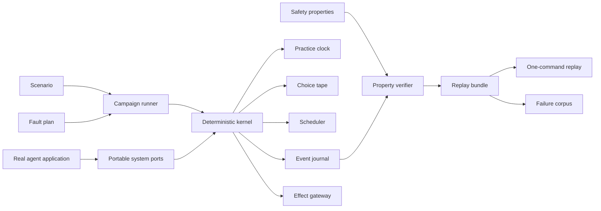

# Agent Practice Framework

> [!summary]
> Build a safe practice room for agent systems. Run the real coordination code, control time and timing, cause failures on purpose, check safety rules after every step, and save enough evidence to repeat any failure exactly.

## The idea in plain English

An agent system usually works in a demo. The hard bugs appear when ordinary things go wrong:

- a tool succeeds but its “done” message is lost;
- two workers act at the same time;
- a worker crashes after changing something;
- an old worker wakes up and still thinks it owns the task;
- a message is delivered twice;
- a projection or cache is temporarily behind;
- the model returns a different answer on the next call.

Normal tests cover examples we remember to write. This framework should explore many possible timings and failures automatically.

The loop is simple:

1. Put the real agent control code behind a few replaceable system ports.
2. Run that code with a fake clock, recorded randomness, and a controlled scheduler.
3. Insert one or more named failures.
4. Check safety properties after every important step.
5. Save the seed, schedule, failures, inputs, outputs, and trace.
6. Replay the exact failure with one command.

## Product promise

The framework should answer four questions:

1. **What broke?** Show the first step where a safety property became false.
2. **Why did it break?** Show the exact timing, message order, failure, and relevant state.
3. **Can I repeat it?** Produce a portable replay artifact and command.
4. **Did the fix work?** Run the same artifact against the changed system and require the property to pass.

## Scope

### The framework should test

- task graphs and agent handoffs;
- queue claims, leases, retries, and acknowledgements;
- duplicate and out-of-order message delivery;
- crashes before and after durable writes;
- stale workers and replaced runtime processes;
- tool timeouts and ambiguous tool results;
- exactly-once or effectively-once external actions;
- shared state and conflicting decisions;
- projection, cache, and UI-visible consistency;
- bounded concurrency, retries, cost, and runtime;
- restart and recovery from durable state;
- captured model-output replay;
- statistical quality trials using fresh model calls.

### The framework should not

- replace the application with a simplified model of the application;
- use an LLM judge as the only safety property;
- claim that fresh model calls are deterministic;
- own the application’s task acceptance or business decisions;
- hide conflicting decisions by choosing the last arrival;
- call live payment, email, deletion, or infrastructure APIs during a practice run;
- allow unbounded actors, steps, retries, faults, trace size, or model spend;
- require a particular model provider, agent SDK, database, queue, or UI framework.

## Lessons to preserve from the existing simulators

The two existing implementations point to the same reusable design:

| Existing capability | Open-source abstraction |
|---|---|
| Virtual time and deterministic timers | `PracticeClock` |
| Labeled, recorded random choices | `ChoiceTape` |
| FIFO, LIFO, actor, label, and seeded ordering | `PracticeScheduler` and `ScheduleStrategy` |
| Crash, timeout, duplicate, stale acknowledgement, and rebuild cases | `FaultPlan` |
| Ordered receipts and trace events | `EventJournal` |
| Safety and convergence checks | `Property` |
| Seed search and fixed incident corpus | `CampaignRunner` and `FailureCorpus` |
| Exact replay digests | `ReplayBundle` |
| Runtime restart and rebinding checks | `RuntimeAdapter` |
| Projection and UI consistency checks | `ProjectionProbe` |
| Independent mutation checks | `VerifierConformanceSuite` |

The most important lesson is architectural: **run real production reducers, schedulers, queue logic, projectors, and acceptance rules through deterministic adapters. Do not rewrite them inside the simulator.**

## Design principles

### 1. Real logic, replaceable edges

The system under test should use its normal control logic. Only nondeterministic edges are replaced:

- wall clock;
- timers and sleeps;
- random values and generated IDs;
- actor scheduling;
- process start, stop, and cancellation;
- queue transport;
- network and external effects;
- model calls;
- durable storage when an in-memory adapter is appropriate.

Production and practice adapters must implement the same small interfaces.

### 2. Logical actor identity is not a process

An agent or worker has a stable logical identity. A process, model session, sandbox, lease, or runtime binding is replaceable.

This distinction is required to test restart correctly:

```text
logical actor
  keeps task history and authority
        |
runtime binding, epoch 1
  process or sandbox A
        |
crash / timeout / replacement
        |
runtime binding, epoch 2
  process or sandbox B
```

The old runtime must not regain authority after replacement. The logical actor can continue without pretending it became a new participant.

### 3. Every source of variation is named

Never call a raw random function in practice code. Every choice needs a stable label:

```ts
const retryDelay = choices.int("refund.retry-delay-ms", 20, 200);
const workerOrder = choices.shuffle("refund.ready-workers", readyWorkers);
```

Labels make traces understandable and stop unrelated code changes from shifting every later random draw.

### 4. Safety properties are separate from scenarios

A scenario says what to run and what failures to introduce. A property says what must always remain true.

Examples:

- a payment idempotency key causes at most one charge;
- an accepted task has exactly one accepted result;
- a stale lease holder cannot commit;
- terminal work is never shown as active;
- an unresolved conflict cannot be reported as certified;
- actor count and parallel work never exceed configured limits;
- replay produces the same meaningful final state.

Properties should be reusable across many scenarios.

### 5. Fail at the first bad step

Checking only the final state makes debugging harder. Evaluate fast properties after every journal append, scheduler checkpoint, effect result, claim, acceptance, and projection update.

The failure report should identify:

- the first failing property;
- the trace position;
- the actor and task;
- the previous and current meaningful state digest;
- the active fault;
- the smallest relevant event window.

### 6. Control-plane replay and model quality are different tests

Model calls are probabilistic. The framework must support two explicit modes:

**Captured mode**

- Record model requests, structured outputs, tool calls, usage, and provider metadata.
- Replay the captured output to reproduce control-flow bugs exactly.
- Never imply that a fresh model call would return the same output.

**Live trial mode**

- Make fresh model calls across multiple trials.
- Report distributions: pass rate, latency, cost, tool-use errors, and semantic scores.
- Keep control-plane safety properties deterministic within each trial.

### 7. Search is bounded

Every run declares hard limits:

```ts
type PracticeLimits = {
  maxActors: number;
  maxTasks: number;
  maxParallel: number;
  maxSteps: number;
  maxVirtualTimeMs: number;
  maxChoiceDraws: number;
  maxFaults: number;
  maxRetriesPerTask: number;
  maxTraceBytes: number;
  maxModelCalls: number;
  maxCostUsd: number;
};
```

Exceeding a limit is a visible failed or inconclusive run, never silent truncation presented as success.

## Proposed architecture



### Layer 1: contracts

Small, dependency-free TypeScript interfaces and versioned artifact schemas.

This package should contain no model SDK, database client, queue client, UI code, or application-specific type.

### Layer 2: deterministic kernel

Owns:

- virtual time;
- recorded choices;
- ready-step ordering;
- checkpoints;
- fault activation;
- trace recording;
- bounds;
- exact replay validation.

It does **not** own application task planning, business acceptance, conflict resolution, or durable authority.

### Layer 3: runner

Owns:

- scenario normalization;
- seed and schedule generation;
- fixed corpus execution;
- generated campaign execution;
- property evaluation;
- failure reduction;
- report creation;
- CLI exit status.

### Layer 4: adapters

Adapters connect a real agent project to the framework:

- Node.js ambient APIs;
- queue or task runtime;
- durable journal;
- filesystem or object storage;
- subprocess and sandbox runtime;
- model capture/replay;
- external effect stubs;
- projections and UI probes.

### Layer 5: application scenarios

Each adopter owns its scenarios, fault plans, and domain properties. These should live with the application, not in framework core.

## Core public API

The API should be small enough to learn from one example.

```ts
import {
  defineScenario,
  defineProperty,
  fault,
  runCampaign,
} from "@agent-practice/core";

const refundHappensOnce = defineProperty({
  id: "refund-happens-once",
  description: "One order can produce at most one completed refund.",
  check(snapshot) {
    for (const order of snapshot.orders) {
      if (order.completedRefunds > 1) {
        return {
          pass: false,
          message: `Order ${order.id} was refunded ${order.completedRefunds} times`,
        };
      }
    }
    return { pass: true };
  },
});

const scenario = defineScenario({
  id: "refund-confirmation-lost",
  description: "The refund succeeds, then its confirmation is lost.",
  limits: {
    maxActors: 4,
    maxTasks: 20,
    maxParallel: 4,
    maxSteps: 2_000,
    maxVirtualTimeMs: 60_000,
    maxChoiceDraws: 2_000,
    maxFaults: 2,
    maxRetriesPerTask: 3,
    maxTraceBytes: 2_000_000,
    maxModelCalls: 0,
    maxCostUsd: 0,
  },
  arrange: async ({ app }) => {
    await app.orders.create({ id: "order-1", amount: 42 });
  },
  act: async ({ app }) => {
    await app.refunds.request({ orderId: "order-1" });
  },
  faults: [
    fault.after("payments.refund.succeeded")
      .once()
      .drop("payments.refund.confirmation"),
  ],
  properties: [refundHappensOnce],
});

const report = await runCampaign({
  scenario,
  seeds: { from: 1, count: 100 },
  schedules: ["fifo", "lifo", "actor", "label", "seeded"],
});
```

The fluent fault syntax is optional. Internally, faults should normalize to a plain versioned data structure.

## Essential interfaces

### Practice clock

```ts
export interface PracticeClock {
  now(): number;
  sleep(ms: number, label: string): Promise<void>;
  setTimer(input: {
    actorId: string;
    label: string;
    delayMs: number;
    run: () => Promise<void>;
  }): TimerHandle;
  clearTimer(handle: TimerHandle): void;
  pendingTimers(): readonly PendingTimer[];
}
```

No scenario should wait on wall time. The scheduler advances directly to the next timer.

### Choice tape

```ts
export interface ChoiceStream {
  float(label: string): number;
  int(label: string, min: number, maxExclusive: number): number;
  choice<T>(label: string, values: readonly T[]): T;
  shuffle<T>(label: string, values: readonly T[]): readonly T[];
  fork(name: string): ChoiceStream;
}

export interface ChoiceTape {
  readonly seed: number;
  stream(name: string): ChoiceStream;
  manifest(): ChoiceManifest;
  assertReplayComplete(): void;
}
```

Requirements:

- separate named substreams prevent unrelated features from shifting each other;
- every draw has an index, label, type, and selected value;
- draw count has a hard budget;
- manifests are canonical and content-addressed;
- replay rejects missing, extra, relabeled, or type-changed draws.

### Scheduler

```ts
export type ScheduleStrategy =
  | "fifo"
  | "lifo"
  | "actor"
  | "label"
  | { kind: "seeded"; seed: number };

export interface PracticeScheduler {
  schedule(step: ScheduledStep): void;
  checkpoint(actorId: string, label: string): Promise<void>;
  run(strategy: ScheduleStrategy): Promise<SchedulerReport>;
}
```

The scheduler controls only ready work. It must not grant leases, accept task output, decide retries, or mutate the application graph. Those remain application responsibilities.

### Effect gateway

Every irreversible or externally visible action must cross one gateway:

```ts
export interface EffectGateway {
  call<Input, Output>(request: {
    effectId: string;
    kind: string;
    actorId: string;
    taskId: string;
    idempotencyKey?: string;
    input: Input;
  }): Promise<EffectResult<Output>>;
}
```

The practice adapter records the request, chooses a scripted result, and never contacts the real service. It must model ambiguous outcomes such as “the charge succeeded but the response was lost.”

### Runtime adapter

```ts
export interface RuntimeAdapter {
  readonly kind: string;
  start(request: ActorExecutionRequest): Promise<ActorExecutionHandle>;
  cancel(handle: ActorExecutionHandle, reason: string): Promise<void>;
  close(handle: ActorExecutionHandle): Promise<void>;
}
```

The adapter runs one actor’s inner loop. The application still owns task state, budgets, durable acceptance, and conflict policy.

### Property

```ts
export interface Property<State> {
  readonly id: string;
  readonly description: string;
  readonly cadence: "every-step" | "terminal" | "both";
  check(state: State, context: PropertyContext): PropertyResult;
}
```

Property results must be structured. A boolean alone is not enough for a useful failure report.

## Fault model

Faults should be data, not scattered callbacks.

```ts
export type FaultSpec = {
  id: string;
  kind:
    | "throw"
    | "crash-actor"
    | "cancel-runtime"
    | "delay"
    | "drop-message"
    | "duplicate-message"
    | "expire-lease"
    | "return-ambiguous-effect"
    | "restart-process"
    | "rebuild-projection"
    | "corrupt-projection-for-negative-control";
  trigger: {
    checkpoint: string;
    actorId?: string;
    taskId?: string;
    occurrence?: number;
  };
  maxOccurrences: number;
  parameters?: Record<string, unknown>;
};
```

Rules:

- a requested fault must either be exercised or fail the run as unexercised;
- unsupported fault kinds fail before the scenario begins;
- the trace records fault eligibility, activation, and recovery;
- fault count and occurrence count are bounded;
- negative-control corruption can mutate verifier inputs, but never authoritative application state.

## Event journal

The journal is the debug backbone. Events should be structured and bounded:

```ts
export type PracticeEvent = {
  schemaVersion: "agent-practice.event.v1";
  position: number;
  virtualTime: number;
  actorId: string;
  kind: string;
  label: string;
  taskId?: string;
  faultId?: string;
  inputDigest?: string;
  outputDigest?: string;
  stateDigest?: string;
  details?: Record<string, unknown>;
};
```

Do not place secrets, raw prompts, hidden reasoning, large files, or unrestricted tool output directly in the trace. Store large bodies in a content-addressed artifact store and keep a reference in the event.

## Replay bundle

Every failure should produce one portable JSON bundle:

```json
{
  "schemaVersion": "agent-practice.replay.v1",
  "frameworkVersion": "0.1.0",
  "scenario": {
    "id": "refund-confirmation-lost",
    "version": "1"
  },
  "application": {
    "adapterId": "my-agent-project",
    "adapterVersion": "git:abc123"
  },
  "seed": 5370206,
  "schedule": {
    "strategy": "seeded",
    "decisionsDigest": "sha256:..."
  },
  "choices": {
    "manifestDigest": "sha256:...",
    "drawCount": 48
  },
  "faults": [
    {
      "id": "lost-refund-confirmation",
      "kind": "drop-message",
      "activatedAt": 81
    }
  ],
  "capturedModelCalls": [],
  "trace": {
    "eventCount": 214,
    "digest": "sha256:...",
    "artifact": "trace.jsonl"
  },
  "terminalStateDigest": "sha256:...",
  "properties": [
    {
      "id": "refund-happens-once",
      "passed": false,
      "firstFailurePosition": 93
    }
  ],
  "bundleDigest": "sha256:..."
}
```

Replay must verify the bundle digest, schema version, application adapter version, choice consumption, schedule decisions, fault activation count, trace digest, and meaningful terminal state digest.

## Failure search

Support two complementary sources.

### Generated search

Generate bounded combinations of:

- root seed;
- schedule strategy;
- actor count;
- parallelism;
- fault kind;
- fault position;
- fault intensity;
- workload size and mix;
- queue and retry pressure;
- process restart point;
- projection rebuild point.

Track actual coverage. A campaign should not claim it explored duplicate delivery merely because that fault exists in the catalog.

### Fixed failure corpus

Promote valuable failures into a versioned corpus:

- production incidents;
- failures found by generated search;
- historically expensive regressions;
- security boundary cases;
- minimum and maximum resource boundaries.

Each corpus case includes a reason, source, owner, added date, replay bundle, and expected property outcome.

The fast corpus runs on every pull request. Larger generated searches run nightly or on demand.

## Failure reduction

After finding a failure, try to make it smaller while preserving the same first failing property and a compatible failure signature.

Reduction order:

1. remove unrelated actors;
2. remove unrelated tasks;
3. remove faults;
4. reduce duplicate counts;
5. reduce retries;
6. reduce schedule decisions;
7. reduce input data;
8. shorten the trace prefix.

Never reduce solely by matching an error string. Match the property ID, structured failure details, and relevant state digest.

Failure reduction is valuable but should come after exact replay works reliably.

## Verifying the verifier

The framework can produce dangerous false confidence if its checks are broken.

Build a conformance suite that deliberately mutates observations:

- change a safe terminal state to unsafe;
- remove evidence that a requested fault ran;
- exceed actor or parallel limits;
- change a trace digest;
- hide an unresolved conflict;
- accept a stale runtime epoch;
- mark duplicate external actions as one;
- change a projection while keeping the durable journal unchanged.

Each mutation must make the expected property fail. If a planted mutation passes, the verification suite fails.

Also test the framework itself:

- same scenario and seed produce identical bundles across repeated runs;
- every displayed seed reproduces directly;
- replay consumes every recorded choice exactly once;
- replay rejects extra or missing choices;
- unsupported and unexercised faults fail visibly;
- trace and bundle canonicalization are order-independent;
- limits fail closed;
- cleanup never changes the primary failure;
- a failed adapter cannot publish accepted output.

## Integrating another agent project

### Step 1: choose one dangerous job

Start with a concrete action, not the whole product.

Good first examples:

- refund an order;
- send an email;
- update a customer account;
- write or delete a file;
- merge a code change;
- approve an infrastructure action.

### Step 2: list nondeterministic edges

Search the codebase for:

- `Date.now`, `new Date`, and wall-clock comparisons;
- `setTimeout`, sleeps, backoff, and deadlines;
- random numbers, random IDs, and UUIDs;
- queue claim and lease operations;
- process, worker, and sandbox launches;
- filesystem and object-store writes;
- network clients and external tools;
- model calls;
- cache refreshes and UI projections.

### Step 3: introduce ports

Wrap each edge with the smallest application-owned interface. Do not make application code import framework internals everywhere.

```ts
export type AgentSystemPorts = {
  clock: ClockPort;
  ids: IdPort;
  queue: QueuePort;
  effects: EffectPort;
  models: ModelPort;
  runtime: RuntimePort;
};
```

Production composition supplies real adapters. Practice composition supplies deterministic adapters.

### Step 4: add meaningful checkpoints

Add checkpoints only at semantic boundaries:

- before and after claim;
- before and after an external action;
- before durable acceptance;
- after acknowledgement;
- on retry decision;
- on runtime replacement;
- after projection publication.

Do not add a checkpoint to every line of code.

### Step 5: define properties before faults

Write the safety rules first. A fault campaign without properties is only a complicated demo.

### Step 6: build the no-fault scenario

Prove that:

- the normal path completes;
- the trace is stable;
- the final state is meaningful;
- repeated runs produce the same bundle;
- no live external service is called.

### Step 7: add one dangerous gap

The recommended first fault is:

```text
external action succeeds
→ process crashes or confirmation is lost
→ retry begins
```

This exposes duplicate-effect and stale-authority bugs quickly.

### Step 8: add schedule exploration

Run ready work through FIFO, LIFO, actor-sorted, label-sorted, and seeded order. Require at least several distinct actor orders while preserving the same safe terminal meaning.

### Step 9: add restart

Create a fresh runtime and queue adapter over the same persisted state. Avoid a fake restart that keeps process-local caches alive.

### Step 10: put it in CI

- pull requests: fixed corpus and a few seeds;
- main branch: larger seed search;
- nightly: broad schedules, load shapes, and live model trials;
- release: fixed corpus, changed-area scenarios, and replay compatibility checks.

## Suggested repository layout

```text
agent-practice/
  packages/
    contracts/          # Public types and versioned schemas
    kernel/             # Clock, choices, scheduler, journal, bounds
    runner/             # Scenarios, campaigns, replay, reduction
    cli/                # run, search, replay, reduce, corpus
    reporter/           # JSON, JSONL, console, optional HTML report
    conformance/        # Adapter and verifier conformance suites
  adapters/
    node/               # Node.js timers, process, and ambient API helpers
    model-tape/         # Model capture and replay
    memory-store/       # In-memory journal and artifact adapters
  examples/
    refund-agent/
    stale-worker/
    conflicting-agents/
  docs/
    concepts/
    integration/
    artifacts/
  schemas/
  LICENSE
  CONTRIBUTING.md
  SECURITY.md
  CODE_OF_CONDUCT.md
```

Keep core packages provider-neutral. Provider-specific integrations should be separate optional packages.

## CLI design

```bash
# Run one scenario once
agent-practice run scenarios/refund.ts --seed 42

# Search many seeds and schedule strategies
agent-practice search scenarios/refund.ts \
  --seeds 100 \
  --schedules fifo,lifo,actor,label,seeded

# Replay an exact failure
agent-practice replay failures/refund-double.json

# Minimize a failure
agent-practice reduce failures/refund-double.json

# Add a failure to the permanent corpus
agent-practice corpus add failures/refund-double.json \
  --reason "Lost confirmation caused a second refund"

# Run the fast CI corpus
agent-practice corpus run --profile pull-request

# Return machine-readable output
agent-practice search scenarios/refund.ts --seeds 100 --json
```

Exit codes:

- `0`: all required properties passed;
- `1`: a property failed;
- `2`: invalid scenario, bundle, adapter, or configuration;
- `3`: run was inconclusive because a hard bound was reached;
- `4`: internal framework or verifier failure.

## Reporting

The first open-source version needs excellent terminal and JSON output, not a large web application.

The terminal failure should fit on one screen:

```text
FAIL refund-happens-once

Scenario: refund-confirmation-lost
Seed:     5370206
Schedule: seeded
Step:     93 / 214
Actor:    refund-worker
Fault:    lost-refund-confirmation

Expected: at most 1 completed refund for order-1
Observed: 2 completed refunds

Replay:
  agent-practice replay .agent-practice/failures/abc123/replay.json
```

An optional HTML reporter can come later and should consume the same replay bundle rather than introducing another state authority.

## Package and compatibility policy

### Version every durable contract

Version:

- events;
- choice manifests;
- schedule decisions;
- fault specs;
- model tapes;
- replay bundles;
- property results;
- adapter capability manifests.

### Compatibility rules

- patch releases may add optional fields;
- minor releases may add new fault kinds and property result fields;
- major releases may change replay meaning or required fields;
- readers reject unknown required behavior rather than guessing;
- adapters declare the schema versions and capabilities they support;
- replay bundles pin the application adapter version.

### Conformance kit

Third-party adapters should pass a shared suite proving:

- clock monotonicity;
- timer ordering;
- schedule determinism;
- exact choice replay;
- cancellation cleanup;
- process restart isolation;
- effect containment;
- trace redaction and bounds;
- unsupported capability rejection.

## Open-source plan

### License

Use **Apache-2.0** if broad commercial adoption and explicit patent protection are priorities. Use **MIT** if the smallest possible license is more important. Apache-2.0 is the recommended default for this framework.

Before publishing, confirm that extracted code and dependencies have compatible licenses. Reimplement application-specific code behind the new neutral contracts instead of copying internal names and assumptions into core.

### Public project requirements

- clear README with the refund example above;
- five-minute quick start;
- architecture and artifact documentation;
- contributor guide;
- code of conduct;
- security policy and private vulnerability channel;
- changelog and semantic versioning;
- signed release provenance;
- dependency and license scanning;
- small benchmark suite;
- public roadmap;
- no telemetry by default;
- no network access in default practice runs.

### First three examples

1. **Lost confirmation** — an external action succeeds and a retry must not repeat it.
2. **Stale worker** — a replaced worker must not commit after its lease is lost.
3. **Conflicting agents** — two agents propose different exclusive decisions and the conflict must remain visible.

These examples teach external effects, runtime replacement, and shared-state conflict without requiring a large application.

## Implementation roadmap

### Phase 0 — contracts and proof of shape

- [ ] Create the repository and Apache-2.0 license.
- [ ] Define versioned event, choice, fault, property, and replay schemas.
- [ ] Implement canonical JSON and content digests.
- [ ] Implement `PracticeClock`.
- [ ] Implement `ChoiceTape` with named substreams and replay completeness.
- [ ] Implement `PracticeScheduler` with five ordering strategies.
- [ ] Implement bounded `EventJournal`.
- [ ] Build the lost-confirmation example.
- [ ] Prove ten repeated runs produce an identical bundle digest.

### Phase 1 — useful local framework

- [ ] Implement `FaultPlan` and checkpoint matching.
- [ ] Implement every-step and terminal properties.
- [ ] Add `run`, `search`, and `replay` CLI commands.
- [ ] Add JSON and JSONL artifacts.
- [ ] Add fixed failure corpus support.
- [ ] Add model capture/replay adapter.
- [ ] Publish adapter conformance tests.
- [ ] Integrate one external agent project.

### Phase 2 — failure reduction and CI

- [ ] Add structured failure signatures.
- [ ] Add actor, task, fault, and schedule reduction.
- [ ] Add pull-request and nightly profiles.
- [ ] Track coverage of schedule orders, fault kinds, checkpoints, and workload shapes.
- [ ] Add verifier mutation tests.
- [ ] Add replay compatibility tests across releases.

### Phase 3 — ecosystem

- [ ] Add subprocess and sandbox adapters.
- [ ] Add durable database and queue examples.
- [ ] Add optional HTML timeline reporter.
- [ ] Add plugins for popular agent SDKs without moving provider code into core.
- [ ] Add distributed process restart scenarios.
- [ ] Add statistical live-model trial reports.

## MVP acceptance criteria

The first public release is ready when:

- [ ] one command runs the refund example;
- [ ] the example uses real application control code through ports;
- [ ] virtual time means the test never sleeps on wall time;
- [ ] all random choices are labeled, bounded, saved, and replayed;
- [ ] five schedule strategies produce at least three distinct actor orders;
- [ ] the lost-confirmation fault creates a failing unsafe implementation;
- [ ] the first failing property and trace position are reported;
- [ ] a replay bundle reproduces the same meaningful failure digest;
- [ ] the fixed implementation passes the exact same replay bundle;
- [ ] a planted verifier mutation turns the report red;
- [ ] the default run makes no network calls;
- [ ] a new project can implement an adapter without importing private framework modules;
- [ ] the core has no dependency on a model provider or agent SDK;
- [ ] all durable schemas are versioned;
- [ ] documentation contains a five-minute integration path.

## Decisions to make before implementation

> [!question]
> These are project decisions, not details the kernel should guess.

- **Package name:** keep `agent-practice` as the working name or choose a final public name?
- **Runtime target:** Node.js first, or Node.js and Bun from the first release?
- **Minimum Node version:** choose one supported LTS baseline.
- **Artifact encoding:** canonical JSON only at first, or JSON plus a binary trace format?
- **Property language:** TypeScript functions only, or a serializable property DSL later?
- **Model tapes:** store full content locally or content references with a pluggable secret store?
- **Failure corpus location:** application repository, separate artifact store, or both?
- **Browser support:** CLI first, or browser-safe kernel primitives from the start?
- **Plugin system:** package-level adapters first; defer runtime plugin discovery until real demand exists.

## Recommended first 30 days

### Week 1

- Extract contracts, canonicalization, virtual clock, and choice tape.
- Write replay self-tests before adding agent-specific behavior.

### Week 2

- Implement the scheduler, checkpoints, fault activation, and event journal.
- Build the unsafe refund example and make the duplicate refund reproducible.

### Week 3

- Add properties, first-failure reporting, replay bundles, and the fixed refund example.
- Integrate one real task loop from the second agent project.

### Week 4

- Add CLI search, fixed corpus, CI profiles, conformance tests, and open-source documentation.
- Run a small private design-partner test before announcing the repository.

## Final architecture rule

> [!important]
> The framework controls time, choices, scheduling, failures, evidence, and replay. The agent application continues to own tasks, authority, business rules, accepted outputs, and user-visible decisions.

If that boundary stays clear, the framework can move between agent projects without becoming another agent platform.
